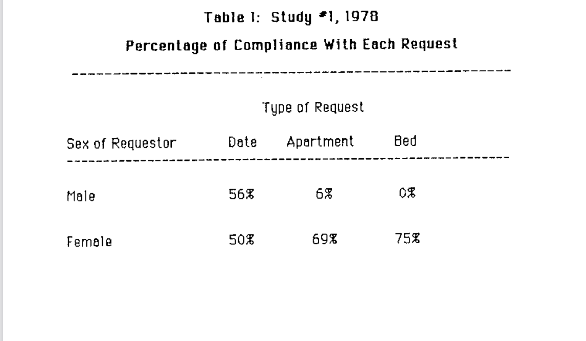
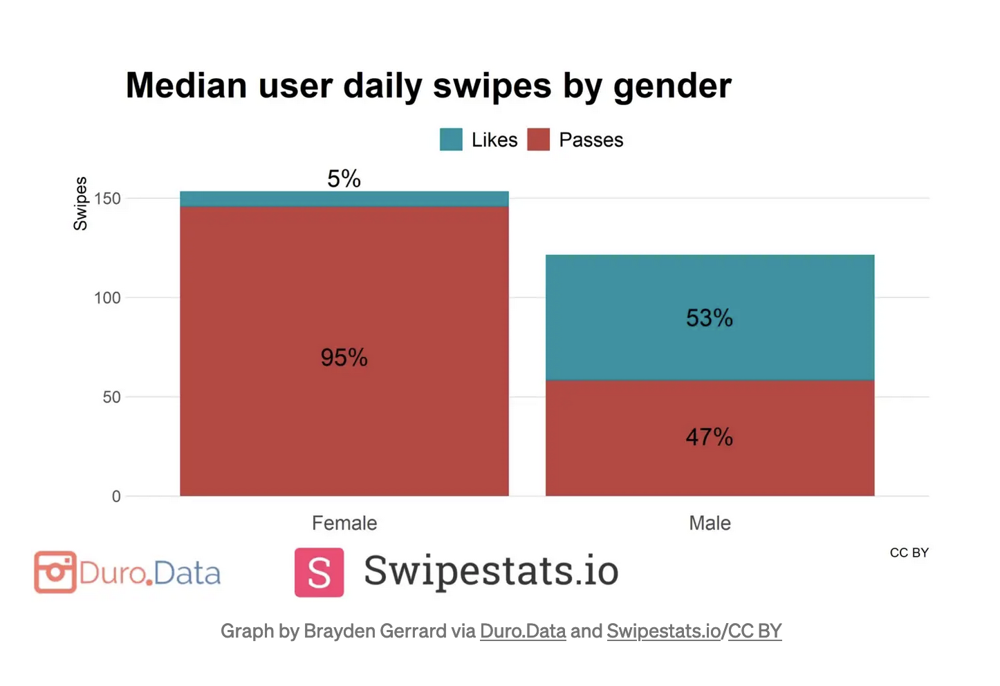

# The Modern Dating Scene

Dating has never been easier. You can download a myriad of apps and swipe through more people in an hour than you could meet in a month. In 2013, around 11% of adults reported having interacted with a dating app. In 2019, the number rose to 30%[^1]. This number skyrocketed during COVID-19, as social isolation drove young people to seek validation and excitement online. According to LiebertPub, Tinder reported 3 billion swipes in a day, OKCupid reported a 700% increase in dates, and Bumble reported a 70% spike in usage of their video calling feature[^2]. In 2021, there were over 320 million dating app users[^3]. Clearly, dating apps are only getting more popular, and there are no signs of stopping. 

But what are the consequences of online dating? The apps throw as many men and women at you as you would like to see. Each person becomes a swipe left or a swipe right. Our brains make sub-second decisions on whether we're attracted. It's an open market, and there are seemingly no consequences for rejecting someone based on first impressions. That's a pretty scary thought. A person can deem you unattractive or even outright detestable without ever talking to you. Even worse, maybe they picture you as their perfect prince or princess, leaving you to measure up to impossible expectations. Dating apps have remedied this by adding prompts and videos to encourage non-physical attraction. This gives users more information, but matching is pretty much still buying a house based purely on the façade. 

The pluses of these apps are clear. You can hop on the apps, and you can immediately find people who may be interested in dating. In college at least, it hasn't been easy for me to meet people who may be interested in a relationship. Instead of spending time on people who are definitely not right for you, it's easy to filter those people out by their profiles with (possibly) a reasonable degree of accuracy. You can retain anonymity, and you have control over who you interact with. You can find people with the same interests, same style, and same music tastes just like that. But even with these pros, there are quite a lot of cons. We cater our profiles to show the best of ourselves, portraying a reality that can sometimes be too good to be true. Carefully selected or edited photos can cause people to have body image issues. Boiling the act of dating down to a swipe can lead to antisocial behavior and unrealistic expectations. People who have tons of matches may find it difficult to isolate who they are truly interested in. The chance of having to choose between many potential romantic partners in real life is much lower. Moreover, apps with a reputation for hookup culture increase the chance of sexual misconduct, encourages irresponsible promiscuity, and eviscerates the depth of meaningful relationships. This is by no means a comprehensive list. 

# How Dating Apps Influence Society 

These are just individualistic takes on online dating. How should we view it as a society? One would expect that the number of people in relationships should have skyrocketed among the youth in recent times, but this is not the case. According to the Washington Post, over half of adults 18-34 report not having a steady partner[^4]. Marriage has declined as well. Just speculation, but it seems that dating apps don't increase the chance of steady relationships. Or, maybe, people who don't use dating apps to their advantage are getting left behind. According to a longitudinal study of relationship formation on Tinder, the authors suggest that "Tinder users have a higher likelihood of forming romantic relationships longitudinally, but that this increased likelihood can be explained by Tinder users’ personality and substance use characteristics"[^5]. Maybe it isn't so clear. But what is clear is that the modern dating scene isn't enough to increase romantic interest among a growing population. 

## Male vs. Female Dating
Furthermore, one big assumption so far is that women and men view dating the same way (for the sake of a majority, I will be talking about relationships from the heterosexual viewpoint). They clearly don't, from both a biological and sociological standpoint. In a famous study from around 40 years ago, they found a staggering difference between men's and women's receptivity to sexual advances[^6]. The story goes something like this (edited for simplicity): 

> In different colleges, the experimenters have a set of attractive men and women who go around campus asking this set of questions:
> 1. Would you go on a date with me?
> 2. Would you come back to my apartment with me?
> 3. Would you have sex with me? 
> Here were the results:
>
> 
>
> About half of both the male and female students agreed to go on a date. 69% and 6% of the male and female students agreed to go back to the apartment of the requestor. 65% of the male students agreed to sleep with the female students, and **precisely ZERO** of the female students agreed to sleeping with the male students. These results were corroborated by a different study. 
>
> <small>*There have been studies that critique the methodology of this experiment, although there is still truth to the conclusions. This is study is used mainly for effect.*</small>

These results are probably not too surprising. But, why does such a dichotomy exist? One reason is that women take more risks in sexual encounters than men do-- the chance of pregnancy is a long-term and severe burden for casual relationships[^7]. As a result, women are *much* pickier (and rightfully so) about their sexual partners than their male counterparts. But, this is mostly *just* for sexual encounters, which is probably why the percentage of women and men that agreed to dates were much closer together. But already, we can predict the different behavior of men and women on "hookup" apps, like Tinder. Some journalists from Cosmopolitan created fake male and female profiles on Tinder and ran an experiment. The female profiles matched with over 10% of users while the male profiles only matched with 0.6%[^8]. This statistic suggests that women are choosier about their partners or that there are way more men on Tinder, but the answer is likely somewhere in between. From just the observation of one man in a big world, it's been pretty clear that men chase women much more than the other way around. 

## Male vs. Female Attraction
It has been shown time and time again that women and men are not equally attracted to the same traits. Stephen Whyte from The Centre for Behavioural Economics, Society and Technology found that there is a "greater male priority for attractiveness and physical build, compared to females, relative to all other traits" while "females rate age, education, intelligence, income, trust, and emotional connection (...) higher than males"[^9]. I think we can *qualitatively* say that some of these things *feel* true. 

From my own observations (slightly exaggerated):
- Girls tend to like older guys | Guys will just date whoever shows up
- Girls don't tend to date guys dumber than them | Guys will literally date a brick 
- Girls tend to like guys with money | Guys will date the homeless girl down the street
- Girls judge emotional connection a lot | Guys will date the hot chick, who cares if she's abusive

Obviously, both men and women value all of these traits, but the traits above tend to be the biggest differentiators between them. Men are much more likely to be lured in purely from attractiveness than women. In the dating scene, this would manifest as men swiping right on the profiles of a lot of attractive women. For a lot of men (I assume), that is enough of a barrier to cross for them to seek something more. On the other hand, maybe women would look for markers of intelligence, education, and emotional trust more deeply. Considering that most dating apps are visually and physically focused, I would guess that women would swipe right less often due to the lesser amount of information in a profile. From the data we've seen so far, this seems like a reasonable conclusion to draw. 

> As an aside, I read about a study that found that for each 16-point IQ increase in women, they are 40% *less* likely to get married. For each 16-point IQ increase in men, they are 35% *more* likely to get married[^10]. This corroborates Whyte's findings and demonstrates that women tend to date up hierarchies of competence, while men tend to date down hierarchies of competence (or that intelligence doesn't matter as much). This is known formally as **hypergamy**.

> Another aside about this dichotomy between men and women. A higher preference for physical attraction and higher sexual desire also show why pornography is more tailored towards men. It also shows us why OnlyFans can only really work for female creators. How many women subscribe to see NSFW media from men? 

Let's not leave on empty conclusions. Let's look at some data. 

At an individual level, men will swipe right on 53% of women while women will swipe right on 5% of men[^11]. That is a 48-point difference! Loosely speaking, women on Tinder find only the top 5% of men desirable, while men on Tinder find over half of women desirable. Talk about settling for anyone, 🥱. This also means a staggeringly low minority of men will find a large amount of success on Tinder. Taken to the extreme, a minuscule minority of men will have *all* of the success on Tinder. This also means that the average woman on Tinder will find moderate levels of success. This reinforces the idea that women will find much more validation on these dating apps than men, although men are likely much more desperate for it. 

This dichotomy changes how men and women view and interact with dating apps (although these conclusions are mostly drawn from Tinder data, most of the ideas and trends extend to other dating apps as well). Women will likely get a lot more attention than men, and less attractive women will get much more attention than the average man. Essentially, only hyper-attractive men will find a ton of success on most dating apps. This can be quite socially damaging, as many men will have an unrealistic perception of their own attractiveness. Simply, dating apps don't work the same for women as they do for men. This isn't even a criticism of dating apps. It's just a reality check and should probably influence how you perceive and conduct yourself on dating apps. 

# The Bigger Picture
Dating apps are just one symptom of what I now call "The Dopamine Revolution." In this digital age, almost everything around us is algorithmically selected to fit our tastes. From your TikTok feed to YouTube to Instagram to your dating apps, each company is trying to find the best way to keep you hooked. Each swipe on TikTok, each Youtube video, each Instagram Reel, each potential new date: all of them are feeding you one tiny spoon of dopamine. The more you use; the more they understand you; the more they can tailor the content towards you. 

It's so easy, too. A whole sea of dopamine is in your pocket. All you have to do is reach for it. We're in a time like no other. Delayed gratification can hardly exist when there is such easy access to gratification. Instead of working hard to get a girl to like you, you can just hop on a dating app (if you're lucky) and have attractive girls you've never met swarm to you. Instead of waiting all day until you get home to search for a piece of information in some encyclopedia, you can just search for it on Google in an instant. There's no more wait. 

So, what's the takeaway here? Dating apps are here to stay, whether we like them or not. You probably already know whether it's your cup of tea. You can use them as a powerful resource in the digital age, or ignore them and live your life the way nature intended. This goes for all the other social media platforms. You can use them as a resource to better your life or you can have them ruin you. You do you. But, at the end of the day, you should evaluate how the things around us influence the way you perceive and interact with reality. If the Dopamine Revolution has conquered you, then find ways to get up again. I hope the information I presented can help you decide whether dating apps have helped or harmed your world-view and the way you approach online dating in the future. Although it's clear that I have a more pessimistic take, even I can still recognize the massive benefits of using dating apps. 

## The Inspiration
The reason I wrote this post anyway was that I, for the first time, have (partially) created a dating profile on Hinge. I have always been somewhat opposed to making an account, but I thought, why the hell not? Answering the prompts was quite difficult, yet a lot of fun. It was also humbling how there are literally no good photos of me 🥺. I can't say whether I will end up using it, but if I do, I expect 1 million matches/likes a day. After all, I am an alpha male, among the top 0.0001% of all men and the puny wimps that dare call themselves men. Don't even wish me luck on this app-- I don't need it. Andrew Tate, good luck in jail. I am the master now.  

## Additional Reading + Videos
- "Are Women Always More Selective in Mate Choice Than Men?": https://www.psychologytoday.com/us/blog/the-scientific-fundamentalist/200908/are-women-always-more-selective-in-mate-choice-men
- "Pros and Cons of current dating apps": https://medium.com/gogaga/pros-and-cons-of-current-dating-apps-83b6fd47498f
- "Tinder Experiment Proves How Brutal it is For Average Guys": https://www.youtube.com/watch?v=35fiNZTVVtU
- "How Dating Apps are Keeping You Single": https://www.youtube.com/watch?v=X31izD4du38&t=750s
- "Sex and Dating Apps" Podcast: https://www.youtube.com/watch?v=-6ZyQKiwMQw&t=2879s

# Citations
[^1]: "The Virtues and Downsides of Online Dating." Pew Research Center, https://www.pewresearch.org/internet/2020/02/06/the-virtues-and-downsides-of-online-dating/.
[^2]: "How COVID Has Changed Online Dating—And What Lies Ahead." Mary Ann Liebert Inc., https://www.liebertpub.com/doi/10.1089/cyber.2021.29219.editorial
[^3]: "25 Online Dating Statistics & Trends in 2023."  Cloudwards.net, https://www.cloudwards.net/online-dating-statistics/
[^4]: "It’s not just you: New data shows more than half of young people in America don’t have a romantic partner." Washington Post, https://www.washingtonpost.com/lifestyle/2019/03/21/its-not-just-you-new-data-shows-more-than-half-young-people-america-dont-have-romantic-partner/
[^5]: "Tinder Use and Romantic Relationship Formations: A Large-Scale Longitudinal Study". Frontiers in Psychology, https://www.frontiersin.org/articles/10.3389/fpsyg.2020.01757/full
[^6]: "Gender Differences in Receptivity to Sexual Offers." Journal of Psychology and Human Sexuality, http://www2.hawaii.edu/~elaineh/79.pdf
[^7]: "Are Women Always More Selective in Mate Choice Than Men?" Psychology Today, https://www.psychologytoday.com/us/blog/the-scientific-fundamentalist/200908/are-women-always-more-selective-in-mate-choice-men
[^8]: "There Is 1 Crucial Difference Between How Men and Women Use Tinder." Cosmopolitan, https://www.cosmopolitan.com/sex-love/news/a62015/difference-men-women-tinder/
[^9]: "Sex differences in sexual attraction for aesthetics, resources and personality across age." National Library of Medicine, https://www.ncbi.nlm.nih.gov/pmc/articles/PMC8133465/
[^10]: "Childhood IQ and marriage by mid-life: the Scottish Mental Survey 1932 and the Midspan studies." Journal: Personality and Individual Differences, https://www.sciencedirect.com/science/article/abs/pii/S0191886904003137
[^11]: "Why Do Women Have the Upper Hand on Tinder?" The Bolt Italic, https://thebolditalic.com/the-two-worlds-of-tinder-f1c34e800db4

