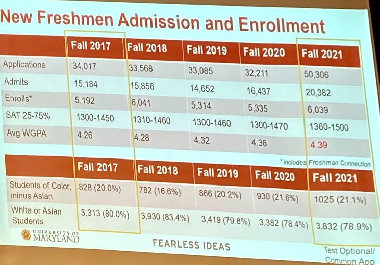
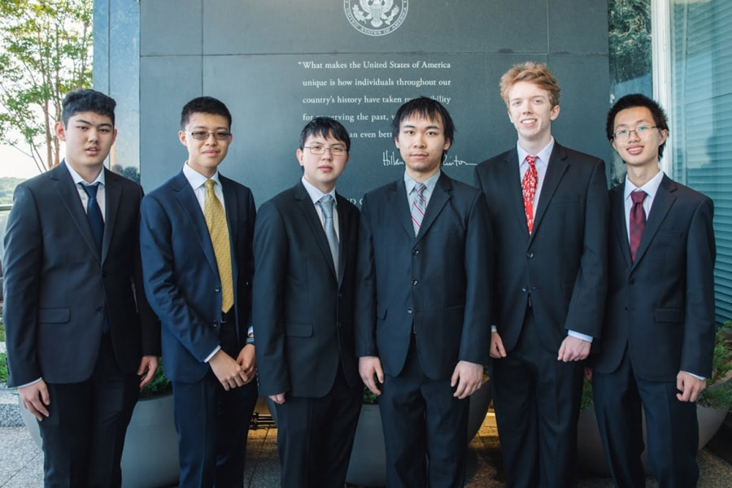

This article has been six years in the making. Affirmative action was the catalyst for my interest in politics, profoundly shaping my worldview and challenging the way I view society. I wanted to share my thoughts about the issue many times over the years. However, I was aware that my perspective on affirmative action was relatively uncommon within my friend group, social circle, and school. I would draft up responses to articles only to leave them hidden on my computer, fearful that I would be ostracized by my peers who disagreed with me. Ultimately, I never published anything and chose to write solely about things that were uncontroversial in nature. But, after years of self-reflection and gathering the courage to express my views, I believe now is a good time for me to share my thoughts on affirmative action and its impact on society. 

I wanted to preface the article by clarifying that my intention in writing this blog post is not driven by personal experiences as an Asian individual, nor by a sense of victimhood. My stance on the issue would be the same no matter the color of my skin. I write this piece to tackle this issue head-on in order to contribute to the conversation and challenge existing narratives. I open the floor to discussion of the issue, and more importantly, I open myself up to being wrong. Let’s get started.

# Introduction

You are likely aware of the recent landmark Supreme Court decision, *Students for Fair Admissions v. Harvard*, where the court ruled that race-based affirmative action programs in college admissions violate the Constitution.[^1] Specifically, the court held that it violated Title VI of the Civil Rights Act of 1964 as well as the Equal Protection Clause under the 14th Amendment.

This legal battle began in November of 2014 when the Students for Fair Admissions (SFFA) filed a lawsuit against Harvard College on the grounds that Asian American students were rejected admission unfairly. When the case went to trial in 2018-2019, a federal district court ruled in favor of Harvard, stating that Harvard University did not intentionally discriminate against Asian American students. The SFFA appealed this decision in 2020, where the U.S. Court of Appeals affirmed the district court’s ruling, upholding its conclusion from 2019. The SFFA appealed this decision once more to the Supreme Court in 2021, where it agreed to hear the case. On June 29, 2023, the Supreme Court issued the ultimate decision (by a vote of 6-2) in favor of the plaintiffs, reversing the decision by the federal district court.

The lawsuit initially only tackled a small facet of the issue of affirmative action, where the plaintiffs alleged that Asian students were unfairly discriminated against in favor of white students. As the case rose through the courts, it ultimately became much more consequential, leading the Supreme Court to rule definitively on the entire issue of affirmative action. However, this was not the first court case on affirmative action. Let’s examine the history that preceded *SFFA v. Harvard.*

# Affirmative Action: A Brief History

Affirmative action is a policy created by the US government in the 1960s to address historical discrimination against disadvantaged groups, particularly women and racial minorities. The policy was designed to promote equal opportunities in education and employment and to increase diversity in these areas.

The first affirmative action policies were administered by the Kennedy Administration in 1961. Under Executive Action 10925, President Kennedy ordered that government contractors take into consideration of affirmative steps to “realize more fully the national policy of nondiscrimination…[and to] ensure that applicants are employed and that employees are treated during employment without regard to their race, creed, color, or national origin.”[^2] Between 1964-1965, the Johnson Administration called for expanded opportunities for minorities, passing the historical Civil Rights Act, expanding affirmative action to women, and mandating that federal contractors make plans to hire women and minorities.

The ideas of affirmative action were soon ported over to the educational sphere, where race soon became a factor in academic admissions. Many universities voluntarily adopted policies in order to increase racial representation within their student bodies.[^3] Initially, many schools enacted quotas—saving a fixed number of spots within programs for students of certain demographic groups. They awarded scholarships to certain students to attract more minorities to attend their programs as well. However, affirmative action began to face significant opposition in the 1970s and 1980s, with critics arguing that it was discriminatory against white students and that it promoted unqualified candidates over more qualified ones. In response, the Supreme Court issued several rulings that limited the scope of affirmative action.

## *California v. Bakke* (1978)

The first major court case since the inception of affirmative action was the court case between the University of California and Allan Bakke.[^4] Bakke sued the university after being “twice denied admission to the medical school even though his MCAT scores, GPA, and benchmark scores were "significantly higher" than those of some minority applicants recently admitted.”[^5] He alleged that the affirmative action policies violated Title XI of the Civil Rights Act of 1964 as well as the equal protection clause under the 14th Amendment (identical to *SFFA*). Although there was no majority opinion, the Court ruled that race should be a permissible criterion in evaluating admissions decisions. The Court furthered that a strict quota system was indeed in violation of the 14th Amendment. The ultimate decision managed to "minimize white opposition to the goal of equality (by finding for Bakke) while extending gains for racial minorities through affirmative action.”[^6]

## *Grutter v. Bollinger* (2003)

In 1997, Barbara Grutter sued Lee Bollinger of the University of Michigan after being denied entrance into its Law School.[^7] The university admitted to using race as a factor of consideration in admissions as it was a means to increase diversity among its student body. In an ultimate decision of 5-4, the Court held that the 14th Amendment did not prevent the University of Michigan’s narrow-tailored use of race in admissions because it had a compelling interest in increasing educational benefits. It furthered that no admissions rejection is simply based on the variable of race and that decisions are complex enough that race could be meaningfully considered. There is nuance to this conclusion, however. In the majority opinion, Justice Sandra O’Connor also put forth the idea that “race-conscious admissions policies must be limited in time”, proposing that these measures may be deemed unnecessary in 25 years.[^8]

## ***Fisher v. the University of Texas*** (2013, 2016)

In the 2013 case Fisher v. University of Texas at Austin, the Court ruled that universities must demonstrate that their use of race in admissions decisions is narrowly tailored and necessary to achieve a compelling interest.[^9] The court did not overturn any affirmative action policies but rather clarified standards that universities must meet if they chose to consider race in their admissions. This case was split into two hearings, one in 2013 and one in 2016. In *Fisher II* (2016), the Court revisited the case and issued a new ruling, where it held (on a 4-3 opinion) that universities passed the strict scrutiny test—where tailoring affirmative action towards the goal of diversity served enough of a compelling government interest as to not violate the 14th amendment.[^10]

# The Ultimate Ruling of *SFFA v. Harvard*

This brings us to today. The Supreme Court held that affirmative action policies in college admissions violate Title VI of the Civil Rights Act of 1964 and the Equal Protection Clause of the 14th Amendment of the Constitution. Here are their relevant snippets:

> "No person in the United States shall, on the ground of race, color, or national origin, be excluded from participation in, be denied the benefits of, or be subjected to discrimination under any program or activity receiving Federal financial assistance."[^11]
>
> -- <cite>Title VI, Civil Rights Act of 1964</cite> 

> "All persons born or naturalized in the United States, and subject to the jurisdiction thereof, are citizens of the United States and of the State wherein they reside. No State shall make or enforce any law which shall abridge the privileges or immunities of citizens of the United States; nor shall any State deprive any person of life, liberty, or property, without due process of law; nor deny to any person within its jurisdiction the equal protection of the laws."[^12]
>
> -- <cite>Equal Protection Clause of the 14th Amendment</cite> 

The ultimate decision for *SFFA v. Harvard* was a 6-2 decision in favor of the SFFA and a 6-3 decision for *SFFA v. The University of North Carolina*. The majority opinion consisted of Justices John Roberts, Clarence Thomas, Samuel Alito, Neil Gorsuch, Brett Kavanaugh, and Amy Coney Barrett. The dissenting opinions consisted of Justices Sonia Sotomayor and Elena Kagan.[^1] Justice Ketanji Brown Jackson dissented in the case of *SFFA v. UNC* but was recused from the Harvard case due to her being a former alumnus.

In the majority opinion, Justice Roberts claimed that the Equal Protection Clause applies non-discriminately with “no regard to any difference of race, color, or nationality.”[^13] He furthered that in order to grant all individuals equal protection under the law, “[t]he guarantee of equal protection cannot mean one thing when applied to one individual and something else when applied to a person of another color.” He wrote that affirmative action policies are unable to clearly define and measure the goals that warrant the use of race (as outlined in *Grutter* and *Fisher*), and therefore should not be able to withstand strict scrutiny under the Equal Protection Clause. Justices Kavanaugh, Thomas, and Gorsuch submitted concurring opinions but also joined the majority opinion in full.[^1]

In the dissenting opinion by Justice Kagan and Sotomayor, they wrote that “ignoring race will not equalize a society that is racially unequal.”[^14] They make the point that an equal society must acknowledge historical and present discrimination in order to fight against inequality. They claimed that the dissolution of affirmative action policies will “dee[m] race irrelevant in law,”[^15] which promotes “the illusion that racial inequality was a problem of a different generation.”[^14]

# Arguments Against Affirmative Action

Ultimately, I firmly believe that the Court made the right decision. The arguments against affirmative action ring truer with a much stronger logical backbone. Even though affirmative action was introduced out of a place of compassion and empathy for the dispossessed, the fundamental ideology that backs its goals is discriminatory, counterproductive, and ineffective. In the following sections, I aim to elaborate on why this is the case.

## Affirmative Action is itself Racist

Affirmative action in its purest sense aims to delineate people by pure sex- or race-based identities, boiling people down to their immutable characteristics. This is racism in its purest sense—attributing abilities and qualities to a group purely by their race.

Everyone can clearly see the wrong in statements such as “Asians are bad drivers” or “all Mexicans are drug dealers.” But, why do we allow similar generalizations within college admissions? Colleges see your race as a *deterministic predictor* of what kind of person you are. By simply selecting a checkbox with your race or ethnicity, they claim to be able to say something conclusive about your character or quality. They are assigning a score to your name before they know anything about you; if you submitted nothing on your application except for your race, they claim to have the ability to assess you solely on this single categorical marker.

Isn’t this just as racist as the comments above? Even if race was just one factor among others, it doesn’t diminish the problematic nature of its inclusion. For example, I can evaluate strangers I meet based on their intelligence, personality, and beauty. But if I jump to a conclusion based on the color of their skin, that would make me a racist—and rightfully so. Therefore, that means the same rules must apply to college admissions.

### Analyzing the Dissent

These race-based generalizations are pervasive within Justice Ketanji Brown Jackson’s dissent. Her opinion makes clear that she sees people as members of groups rather than as individuals. She begins her dissent with the following text:

> "Gulf-sized race-based gaps exist with respect to the health, wealth, and well-being of American citizens. They were created in the distant past, but have indisputably been passed down to the present day through the generations. <mark>Every moment these gaps persist is a moment in which this great country falls short of actualizing one of its foundational principles</mark>—the “self-evident” truth that all of us are created equal.”[^16]
>
> -- <cite>Ketanji Brown Jackson, Dissenting Opinion</cite> 

This small snippet of text clearly demonstrates that her decision was plainly based on disparities that exist between groups. Much of her dissent is predicated on the fact that there are economic, wealth, and social disparities between different communities between races—information that she uses to conclude that such disparities must be the result of historical discrimination. She is not completely wrong. There is no doubt that the disparities that exist today are in part the result of generational disadvantages that accumulated over time. But, to attribute *all* disparities to race *is unequivocally wrong.*

Under this logic, one would conclude that nearly 72% of all NBA players being black is the result of racist selection criteria.[^17] Similarly, one would assume that the reason 93% of prisoners are male (and 95% of those incarcerated for violent crime) is due to sexist police officers.[^18] These assumptions are not correct. Race and sex are only one part of the equation, not the primary driving factor. However, she uses this flawed logic to conclude that all disparities can be solely attributed to race alone. As a result, she reduces all races into their generic stereotypes, where the average is used to represent all members of a group. This can be seen in this particular anecdote:

> “Imagine two college applicants from North Carolina, John and James. Both trace their family’s North Carolina roots to the year of UNC’s founding in 1789. Both love their State and want great things for its people. Both want to honor their family’s legacy by attending the State’s flagship educational institution. John, however, would be the seventh generation to graduate from UNC. He is White. James would be the first; he is Black. Does the race of these applicants properly play a role in UNC’s holistic merits-based admissions process?”[^16]
> 
> -- <cite>Ketanji Brown Jackson, Dissenting Opinion</cite> 

This story is flawed in demonstrating her point. Justice Jackson boils down white and black individuals into these caricatures where it is only possible for white people to be advantaged and black people to be disadvantaged—a clear and cut case of racial stereotyping. What if she had compared the son of LeBron James, a billionaire NBA All-star, to the white son of a drug-addicted abusive father? Why does James’s race contextualize his situation better than his status as a first-generation college applicant? The simple reason is that the anecdote was deliberately tailored in order to support her argument. While her situation could be very real, you cannot assume that *all* white families are somehow more advantaged than *all* black families just because one’s average household income is higher than the other.

Justice Sotomayor makes a similar fallacy as Justice Jackson in the following statement:

> "Acknowledging that there is something special about a student of color who graduates valedictorian from a predominantly white school is not a stereotype. Nor is it a stereotype to acknowledge that race imposes certain burdens on students of color that it does not impose on white students."[^19]
>
> -- <cite>Sonia Sotomayor, Dissenting Opinion</cite>

Without reason, Justice Sotomayor immediately values a black valedictorian more than a white valedictorian without any other contextualization of the two hypothetical candidates. There may be a difference in their experiences, but they can be explained through individual circumstances rather than a pure and deterministic evaluation of their racial profiles. Despite this, Justice Sotomayor decides to stereotype their situations with no justification while claiming that she is not stereotyping. Justice Clarence Thomas explains it beautifully:

> "Even if some whites have a lower household net worth than some blacks, <mark>what matters to J[ustice] J[ackson] is that the average white household has more wealth than the average black household</mark>… Individuals are the sum of their unique experiences, challenges, and accomplishments. What matters is not the barriers they face, but how they choose to confront them. And their race is not to blame for everything—good or bad—that happens in their lives. <mark>A contrary, myopic world view based on individuals’ skin color to the total exclusion of their personal choices is nothing short of racial determinism.</mark>"[^20]
>
> -- <cite>Clarence Thomas, Concurring Opinion</cite>

**This is a reminder that pure affirmative action judges you based on your race and only your race.** There is no reason that James cannot explain his situation of growing up in adversity in his college essays, which would encapsulate more about his character and his struggle as a student. The information about his upbringing explains more about his situation than his race ever could. As Justice Thomas writes,

> “If an applicant has less financial means (because of generational inheritance or otherwise), then surely a university may take that into account...[w]hat it cannot do is use the applicant’s skin color as a heuristic, assuming that because the applicant checks the box for “black” he therefore conforms to the university’s monolithic and reductionist view of an abstract, average black person.”[^20]
>
> -- <cite>Clarence Thomas, Concurring Opinion</cite>

### The Endless Pursuit of Statistical Parity

Even with an airtight justification for affirmative action policies, the logic that drives its race-based measures is flawed. By viewing groups by their statistical measure, there is no way to ever achieve affirmative action’s supposed goal. Justice Thomas formulates,

> "<mark>If social reorganization in the name of equality may be justified by the mere fact of statistical disparities among racial groups, then that reorganization must continue until these disparities are fully eliminated, regardless of the reasons for the disparities and the cost of their elimination.</mark> If blacks fail a test at higher rates than their white counterparts (regardless of whether the reason for the disparity has anything at all to do with race), the only solution will be race-focused measures. If those measures were to result in blacks failing at yet higher rates, the only solution would be to double down. In fact, there would seem to be no logical limit to what the government may do to level the racial playing field—outright wealth transfers, quota systems, and racial preferences would all seem permissible. In such a system, it would not matter how many innocents suffer race-based injuries; all that would matter is reaching the race-based goal."[^20]
>
> -- <cite>Clarence Thomas, Concurring Opinion</cite>

## Racism Disguised as Empathy

Some people will agree that affirmative action is a necessary evil to compensate for discrimination against historically disadvantaged groups. This doesn’t work for multiple reasons.

1. Don’t fight fire with fire

On a purely moral front, how would you possibly justify discriminating against people in the present to make up for the past? You’re using the problem as a means to solve the same problem. How can you look people in the eyes and tell them that they’re a necessary sacrifice for a past that they were not responsible for?

Wouldn’t this cause the presently afflicted groups to deserve some similar sort of reparations 50 years from now? How long does the cycle go on? You could say, we’ll only go on for as long as necessary until the problem is solved (as proposed in *Grutter v. Bollinger*). Unfortunately, that magical barrier is hard if not impossible to define. There will never be a time when historical inequality is completely diminished and racism is eradicated. By claiming discriminatory policies are necessary for the time being, you are dehumanizing the individuals who are negatively affected by these policies. You are telling Asian families that their children are just numbers on a piece of paper—that they should deal with racism until the representation of Asians in college drops below some arbitrary percentage. You no longer see the people you affect as people, but rather as mere rocks in your path, which you can callously kick aside in pursuit of your delusional utopia.

2. Who should benefit from affirmative action?

So many people argue that historically disadvantaged groups should be the beneficiaries of affirmative action. But, if you truly believe this, then why are Asians not part of the in-group? It’s not like Asian Americans were sipping champagne with Andrew Carnegie during Jim Crow. You can look to Japanese internment, the Chinese railroad workers, and the Chinese Exclusion Act as clear examples of historical discrimination against Asian Americans. They should get a piece of the affirmative action pie. Instead, they are the group most discriminated against by affirmative action.

Why is this? It’s because many Asians are successful in the United States. Asian Americans on average make up the highest income brackets and perform well academically.[^21] [^22] As a result, they have been cast out as part of the minority coalition in academic settings. If colleges want to pursue this line of reasoning, then they must concede that affirmative action has nothing to do with historical discrimination but rather with how well a group performs relative to the rest of the population. In this world, the only goal is to  reduce the variation between all groups for no apparent reason other than the statistical differences between them. Now, this would be quite the racist admission.

 > 
 > Surprising example: Asian students are grouped with white students on the University of Maryland’s admissions statistics. It just shows how colleges will use different groups as pawns to further a particular narrative.[^23]

3. Eligibility Requirements

Let’s say we decide to allow affirmative action for those who suffer from a legacy of racism. Who gets to be part of this group?

There exist people who are racially eligible, but not eligible based on the above criterion. For example, a boy whose father immigrated from Nigeria in 2000. He should be a beneficiary of affirmative action, but his family does not suffer from a history of American racism. What about someone who is of mixed race? Half of his ancestors suffered from racism, but the other half didn’t. Should we give him 50% affirmative action? How about 38%? There’s no clear line that we can draw. Once colleges think of all of their applicants as members of a race, they don’t truly care about what historical racism their applicants faced. They only care about the numbers. If colleges want to argue that they must consider groups that still face racism in the U.S., then they have to invite Asians back to the affirmative action party, as well as anyone who has ever experienced any form of racism. And, who would even decide what trauma from racism is even eligible for consideration?

### Ultimate Conclusion

You can look to any of the three reasons to understand why this *reverse racism*, which should simply be called racism, cannot be justified. As the common saying goes, "[t]wo discriminatory wrongs cannot make a right.”[^24]  We should not rely on present discriminatory measures to correct historical wrongdoings. If we choose to repeat the past, then we only prolong the problem indefinitely, stacking corpses along the way. The honest path, no matter how difficult, is the only way we can move forward.

## Asians, We Totally Care About You

There have been multiple people who try to spin affirmative action as somehow beneficial to Asian Americans. But, this is gaslighting on the next level. It doesn’t even matter that I’m Asian, just listen to some of the arguments:

> 1. “We are outraged that the Supreme Court has chosen to ignore long-standing legal precedent in favor of supporting racial inequity that harms all people of color, including Asian Americans[.]"[^25]  -- <cite>John C. Yang, President and Executive Director of Advancing Justice</cite> 
> 
> 2. “[T]he Supreme Court's majority ignores our long history and present reality of systematically denying people of color, particularly Black Americans, equal access to education... Racism and anti-Blackness are inescapable in our country, and race-conscious admissions are a crucial tool in expanding opportunities for students of color that reckon with those realities. For Asian Americans, this ruling will particularly harm Pacific Islander, Native Hawaiian, and Southeast Asian communities who continue to face significant barriers to higher education."[^25]   -- <cite>Aarti Kohli, Executive Director of Advancing Justice – Asian Law Caucus</cite> 
>
> 3. "There is no question that the Asian American community continues to struggle against potent and dehumanizing stereotypes in our society. It is precisely because racial discrimination persists in our society, however, that the use of race in college admissions to achieve racially diverse classes is critical to improving cross-racial understanding and breaking down racial stereotypes... Indeed, the record shows that some Asian American applicants are actually “advantaged by Harvard’s use of race,”... and “eliminating consideration of race would significantly disadvantage at least some Asian American applicants""[^19]   -- <cite>Sonia Sotomayor, Dissenting Opinion</cite>

What? People are literally telling Asians that affirmative action is for their own good. That somehow, being held to higher standards than the rest of the student population, is fair. That’s some real manipulation here. Moreover, many people go out of their way to convince Asians that somehow they are benefitting from affirmative action. It’s some real pandering bullsh*t and a clear example of institutions leveraging the Asian minority status for their own personal gain. Even if 100% of Asians supported affirmative action, that still doesn’t make it right.

Furthermore, almost none of these arguments have anything to do with Asian Americans. The arguments are always around how colleges discriminate against all minorities *other than* Asian Americans. No authors, even Asian ones, try to even contemplate why Asian Americans do not face the same historical barriers to education. In some cases, they selectively say that removing affirmative action harms some subgroups of Asian Americans. Why not consider all Asians? So, it’s okay to discriminate against some of the Asians? Don’t you realize that affirmative action is an institutional culprit of blatant discrimination against “some” Asians? It seems that no one wants to acknowledge that some Asian students are suffering for the benefit of other races.

There is nothing wrong with Asians supporting affirmative action. In my mind, most are advocating out of a place of compassion for disadvantaged students. Many of my friends support affirmative action, and I see absolutely nothing wrong with that. Clearly, Asians are not some hive mind with identical attitudes toward life, and hence, should not be treated as such. I have heard many of my Asian peers say that they are willing to atone for past racism by having harsher standards in college admissions. They are willing to take the hit for the benefit of society. I think that’s a personal decision and a reasonable decision at that. But, just because you are okay with it doesn’t mean other people are as well. So, how about all of you fill out a waiver to the colleges you all applied to consenting to be held towards affirmative action-based standards? Leave the rest of us out of it.

> I realize that within this section, I’m choosing to see people as members of a group. But, this is a direct consequence of affirmative action choosing to see people by their group identity. All persons should be treated in the same manner, but the explicit discrimination towards some groups forces me to talk about the disparate effects on the group level.

### Asians Who Don’t Agree with me are White Supremacists

On the day the Supreme Court decision was announced, I saw a handful of articles (i.e. somehow **more than one**) like this one: [“Asian American Conservatives Have Become Key Allies of White Supremacy”](https://www.thenation.com/article/society/asian-american-conservatives-white-supremacy/) by Princeton Graduate Student Promise Li.[^26] 

If I have to explain to you why statements like this are wrong, I think you should seriously seek some help. Articles with this type of narrative are nauseously disgusting and evil. It’s the elementary school tactic of labeling everybody who doesn’t disagree with you as a pejorative so that you don’t have to deal with the arguments themselves. To Mr. Li, everyone who disagrees with him must be a racist, misogynistic, bigoted, sexist, homophobic white supremacist. Mr. Li probably doesn’t know that white supremacists are *supremacists*, so becoming allies with Asians would be quite the interesting strategy. Not only does the article not address a single argument that the anti-affirmative action movement promotes, it decides to label every dissenter as a Trump-supporting, torch-carrying, serial killing right-wing nationalist. He labels the cultural phenomenons that lead Asian Americans to success as attempts to align with “whiteness" with absolutely no evidence to back his claims whatsoever.

I hope he realizes that he himself is treating Asians as pawns for his own beliefs; Asians should simply side with his arguments without a second thought. His naive ignorance causes him to lash out like a literal child because he simply cannot fathom the possibility that many Asians disagree with his worldview. His characterizations are racist, unproductive, and ostracizing. It’s unbelievable how it’s even possible to come up with a conclusion like this, but this is the world we live in.

Feel free to read through the article if you want to lose brain cells. There is not a single reasonable argument within his tirade that I would even think of engaging with. If you want to see full stupidity on display, give the link a click. If you think I’m being overly harsh, you’re probably right. But, I would argue that people like this don’t deserve rational criticism.

> One interesting thing of note is that some of the most vocal Asian affirmative action supporters are the ones that are the least affected (anecdotally)—the Harvard-Stanford-Yale alumni who had everything go their way (deservingly so). But, I will also note that it makes it really easy for them to say things like “affirmative action is necessary.” We get it, you got into Harvard anyway. Pat yourself on the back.

## Putting a Band-aid on a Bullet Wound

How does lowering the standards for certain groups help them? Through affirmative action, colleges set different expectations for different races for them to be admitted to the university.[^27] Is it worth admitting less qualified students to your program to simply boost racial diversity within the university?

This situation would not make sense in almost any other situation. Let us go back to the NBA example once again. What if the NBA employed affirmative action policies preferred Asian college basketball players, where they were willing to draft players that were on average 5 inches shorter and scored half as many free-throw shots? Not only would you clearly be setting up the drafts for failure, you would sink the entire teams in the process. It would make the fans think all Asians are terrible athletes and given preferential treatment. Who are you even helping in this situation? You don’t help Asian players and you don’t please the fans. But, you can happily claim that your teams are diverse and that you are encouraging young Asians to pursue basketball. This obviously makes no sense.

Affirmative action programs also actively harm their beneficiaries. A commonly discussed theory is mismatch theory, which suggests affirmative action policies, particularly in higher education admissions, may lead to negative outcomes for students who are beneficiaries of such policies.[^28] In other words, less qualified students accepted to elite institutions find it difficult to perform on par with the average student. The theory also suggests that these students would be near the top of less prestigious institutions and would have prospered there instead. For example, Thomas uses this particular line of reasoning: “Take science, technology, engineering, and mathematics (STEM) fields, for example. Those students who receive a large admissions preference are more likely to drop out of STEM fields than similarly situated students who did not receive such a preference.”[^20] Other sources cite other as evidence for mismatch theory:

> 1. "UCLA law professor Richard Sander found that after racial preferences were banned, there was a 55% increase in the number of black and Hispanic freshmen who graduated in four years from the University of California and a 51% rise in black and Hispanic students who earned degrees in STEM."[^29] 
>
> 2. "It is difficult to imagine a less friendly and welcoming introduction to the collegiate experience than being tossed into the mix at some hyper-competitive grist-mill school like Harvard or the University of Chicago, 200 SAT points behind the ability curve, while surrounded by potentially hostile peers skeptical of your right to be there…this reality explains much of the relative lack of black and Hispanic success at many top U.S. universities."[^30]
>
> 3. Interview with Thomas Sowell about how affirmative action harms students. https://www.youtube.com/watch?v=VVvnTByzTmA 

There’s a lot of controversy online that debates the validity of the argument by citing studies that conclude the contrary, and it would be impossible to address all possible claims. However, we can simply evaluate the argument logically. If applicants of a particular group can get into let’s say, Harvard, with an average SAT score of 1400, would you expect them to perform as well as students of another group that must achieve an average SAT score of 1500? Conceding that affirmative action is necessary *guarantees* that you accept the tenet that you hold certain groups to lower standards (the same logic applies if you replace SAT scores with GPA). And to think that has zero effect on the performance of said students is to ignore the process that you engage in by enacting affirmative action policies. Many studies show that mismatch theory neglects to consider academic factors other than test scores.[^31] Even if this were true, it ignores that many other students with higher test scores had to have the same qualities in order to get into the same school. It’s unlikely that schools balance affirmative action benefits with external academic qualities, since that would essentially nullify their effects. 

One other big misconception about mismatch theory is that it doesn’t state that affirmative action picks are *unqualified* for a given school. There are many people who do not get into Harvard that would be able to graduate and survive. It is saying that they are *mismatched* with the school. Studies that argue that affirmative action picks still graduate at high rates at elite institutions fall for this misconception, since simply graduating does not mean the student was a good fit for the school. Thomas Sowell explains it the best:

> "Under these conditions, many black students discover too late that the "opportunity" to go to a big-name school turns out to be a trap. <mark>It is not a question whether black students are "qualified" but whether they are *mismatched*.</mark> For example, the average black student at the Massachusetts Institute of Technology has a higher S.A.T. score in math than 90 percent of all American students. These black students can hardly be considered "unqualified." <mark>But, although these students' scores are in the top 10 percent among Americans in general, their scores are in the *bottom* 10 percent among the extraordinary students at M.I.T.</mark> Despite much lofty talk about the "irrelevance" of test scores, mismatching of this magnitude does have its effects. More than one-fourth of the black students fail to graduate at M.I.T., and those who do have significantly lower grades than the other students."[^32]
>
> -- <cite>Thomas Sowell</cite>

Ultimately, it’s not a good thing to place your students at a disadvantage to pursue some arbitrary goal. They will feel inferior and suffer when they could instead be prospering in a better environment. Instead of helping students succeed, our elite institutions are doing the exact opposite.

> I understand that people debate the validity of the SAT. But whether we like it or not, the scores have been shown again and again that they are good predictors of academic success. That’s why it is a *standardized* test.[^33] [^34] [^35] [^36]

### Planting Doubt in the Minds of Students

I came across this bit of information about Justice Sonia Sotomayor on [Twitter](https://twitter.com/eigenrobot/status/1678769442518605827):

> Sotomayor attended Princeton University. She has said she was admitted in part due to her achievements in high school and in part because affirmative action made up for her standardized test scores, which she described as "not comparable to her colleagues at Princeton and Yale."
>
> In her third year, she filed a formal complaint against the established Washington, D.C., law firm of [Shaw, Pittman, Potts & Trowbridge](https://en.wikipedia.org/wiki/Shaw,_Pittman,_Potts_%26_Trowbridge) for suggesting during a recruiting dinner that she was at Yale only via affirmative action.[^37]

In this case, I think Justice Sotomayor behaved reasonably. It’s quite rude and racist to unduly accuse someone of being a beneficiary of affirmative action. Even if it were true, it’s definitely not something anyone should say to someone’s face. Even though the law firm is to blame for the insensitive comment, it’s the fault of affirmative action to put her in such a position, to begin with.

Affirmative action acts as a sort of aid mechanism to give some students an advantage in college admissions. I wouldn’t want to know that I benefitted from affirmative action because it would make me question whether I truly deserved my admission to a particular college. It’s even more of an insult to extraordinary students who by all objective metrics earned their place in the university. They proved themselves on paper, so why would they need pity from the university that they didn’t even ask for?

At the end of the day, there is no reason to be angry at the beneficiaries of affirmative action. They are not at fault. I can only blame the institutions that allowed affirmative action to survive for this long.

### Race and Generalization

Justice Thomas points out something that I did not even consider initially—that race is very much a social construct. He writes:

> "<mark>[R]ace is a social construct; we may each identify as members of particular races for any number of reasons, having to do with our skin color, our heritage, or our cultural identity. And, over time, these ephemeral, socially constructed categories have often shifted.</mark> For example, whereas universities today would group all white applicants together, white elites previously sought to exclude Jews and other white immigrant groups from higher education. In fact, it is impossible to look at an individual and know definitively his or her race; some who would consider themselves black, for example, may be quite fair skinned. <mark>Yet, university admissions policies ask individuals to identify themselves as belonging to one of only a few reductionist racial groups.</mark> With boxes for only “black,” “white,” “Hispanic,” “Asian,” or the ambiguous “other,” how is a Middle Eastern person to choose? Someone from the Philippines?… Whichever choice he makes…the form silos him into an artificial category. Worse, it sends a clear signal that the category matters."[^20]
>
> -- <cite>Clarence Thomas, Concurring Opinion</cite>

Indeed, race is not strictly defined in society. It’s a constantly morphing categorization of individuals based on shifting cultural associations, skin color, and ancestry. As a result, the stereotypes assigned to different races are definitionally arbitrary. Given that group membership is loose, stereotypes and generalizations become even more harmful and unwarranted.

### Stereotypes and Expectations: Hypocrisy at its Finest

Although affirmative action programs swore to eliminate stereotypes, they ended up enforcing even stronger ones. By intrinsically categorizing students by race, their policies plant deterministic expectations onto the different racial groups. For example, if Harvard admitted potato-shaped aliens with a GPA one standard deviation lower than their average applicant, it would directly associate potato-shaped Harvard students with lower GPAs. Without racially-tailored policies, these associations would not exist.

It’s not hard to see why these associations are harmful. If you go see a cardiologist for life-saving surgery, the last thing you want to think is that he or she was an affirmative action pick with an MCAT score of 50 points less than the average medical student. These are not nice assumptions to have. But, affirmative action would be to blame for the expectations, more so than the individual having the thoughts. Lowering the standards for certain racial groups “reinforces the idea that people of certain races are only capable of succeeding in certain occupations.”[^38]

Ultimately, affirmative action tells black and Hispanic students that they cannot succeed by themselves. It tells them that they will always be disadvantaged to the point where they cannot do anything but rely on preferential treatment rather than their own abilities and efforts. It tells them that they are less capable than their white and Asian counterparts and cannot compete on par with them without handouts. I cannot emphasize the tragic consequences this has on the mindsets of young, driven, and ambitious students. You may argue that affirmative action picks are just as capable in Harvard as their peers. But, if that was the case, why were they affirmative action picks? Why would affirmative action programs be necessary, then? I do not think any of these statements are true, not even in the slightest. Ironically, these are the assumptions that underlie affirmative action, and many of its supporters do not realize it.

The way to counter these modes of thought is to see people as individuals, who are capable of doing great things with the proper motivation and environment. This is not to say that everyone is born with the same amount of privilege, luckiness, or favorable factors. But, it allows us to tailor solutions at the individual level, which is the only way. You cannot solve problems at the race-level because you assume that all the individuals within are homogenous. That is why problems tend to be better solved from a bottom-up approach. The more specific your target group, the more you can understand the problem, and the better the solutions can be.

There is still value in addressing problems that exist at a group level. There are similarities within cultures and communities that allow for group-based action. But, there is no blanket assumption you can make that should allow a college to deterministically make decisions about race. For example, If you want to address criminal behavior in your community, there are messages that can be sent across—messages that have nothing to do about race but may be more relevant to one race statistically. Social change is possible without explicit (or implicit) discriminatory measures. To address the dissenting party, you are correct in saying “deeming race irrelevant in law does not make it so in life” (as claimed within Sotomayor’s dissent). But, just the same, deeming race relevant in law does not make it so in life.

# Considerations of Other Arguments

## Precedent in the Court

Precedent, also termed *stare decisis*, is the legal principle that states that established legal cases should be considered and evaluated when considering related subsequent cases. In other words, the Supreme Court should try to preserve the integrity and conclusions of former court cases. Many proponents of affirmative action argue that overturning pro-affirmative action cases goes against precedent. This argument falls apart for a few reasons:

1. Precedent is not always good

Although it makes sense to preserve established opinions by the court, it should never be guaranteed. The Supreme Court will always look to established court cases in order to form their opinion, but there should be no reason to affirm former opinions if there are no good reasons to.

The primary example people look to is *Brown v. Board of Education*—which overruled *Plessy v. Ferguson*—a landmark decision that declared racial segregation unconstitutional. This was obviously the right decision, as we can all recognize the evil and racism in *Plessy*, which enabled institutional racism for decades during the 20th century. Had the courts ruled over the notion of precedent, then that would be terrible, unjustified, and ridiculous. The same thing goes for the recent affirmative action case. Citing precedent is not a valid argument unless you can explicitly say what should be upheld about previous decisions.

2. Hypocrisy

Most people only really care about precedent if the court is doing something they don’t like. It seems like people use precedent simply as a weapon to try to diminish the opinion of the court rather than countering its arguments rationally. Instead, rebuttals against Court decisions should purely be logical to foster legitimate discussions.

3. What is it even overturning?

In *Grutter v. Bollinger*, Justice O’Connor wrote in her majority opinion that “race-conscious admissions policies must be limited in time,”[^8] stating that affirmative action would be unnecessary in 25 years. Other than making an exception to the 14th Amendment by allowing discrimination to correct pass discrimination, this decision was still questionable. The opinion did not identify what limits should be enacted and what “unnecessary” would even entail. It was just an arbitrary statement that would have little to no consequence on policies that followed, until now. Since its decision in 2003, twenty years have since passed, with no clarification of what standards the majority opinion was referring to (even with the addition of *Fisher I* and *II*). As a result, the current Supreme Court has decided to rid all race-based discrimination under affirmative action, which is what *Grutter* proposed should happen eventually. It is a clear overturn of *Grutter*, but also one that was expected and deemed proper within the confines of the original text. Hence, the argument for precedent cannot be applied here regardless.

## Conflation Between Race and Other Variables

A super common fallacy within the affirmative action debate is the conflation of race with other variables. Just because something affects more people of one race does not mean race is the deciding variable. Allow me to demonstrate.

For the sake of argument, let’s say that the United States decides to fully ban the consumption of pumpkin spice lattes (PSLs) in coffee shops. We find out later that in the affected population, 70% are Taylor Swift fans. Is it reasonable to assume that the government is discriminating against Taylor Swift fans? The answer is no. The fact that the ban primarily affects Taylor Swift fans has nothing to do with the ban itself. In a different universe, it would have only affected wannabe SoundCloud rappers. No prescription in the law targeted the Swifties.

Now, let’s say you decide to put into place a policy that gives $100 to Swifties as reparations for taking away their favorite drink. Not only are you giving $100 to a bunch of Taylor Swift fans that don’t even drink PSLs, you’re not providing the 30% of non-Swiftie PSL consumers their necessary reparations. Clearly, we can see how this new policy is not solving the problem.

The same logic applies to many other situations. The reason Asians overperform academically in the United States is due to a common culture of emphasizing education and hard work enforced by immigrant parents.[^39] Two reasons for underperformance within the African American community is due to single motherhood and income inequality.[^40] [^41] [^42] And these variables CANNOT be attributed to the color of one’s skin. People of all kinds exist. An Asian American student raised in a fatherless home in poverty is likely going to struggle more, just as an African American student would thrive if born in an education-focused household with educated parents. You can swap the variables and produce the same outcome. Some of these factors are just *more common* within different communities and for reasons that can be fixed. To assume it is due to their race is racist. 

> Here is an example where the author conflates wealth with race. The past clearly has consequences on today. But, this doesn't mean you get to make an entire assumption based on race just because of one statistical indicator. 
>
> "Wealth makes it easier for families to relocate to better school districts, purchase test preparation books and classes, and pay or help pay college tuition. But centuries of systemic racism and intergenerational transfers have provided white households with far more wealth than households of color, even after controlling for income. In fact, middle-income white households typically have [twice as much wealth](https://americanprogress.org/issues/race/reports/2018/12/05/461823/job-not-enough/) as their Latinx counterparts and [three times more wealth](https://americanprogress.org/issues/race/reports/2018/02/21/447051/systematic-inequality/) than their black counterparts. As a result, students of color (especially black students) are more likely than similarly situated white students to attend [underfunded](https://americanprogress.org/issues/education-k-12/news/2012/08/22/32862/students-of-color-still-receiving-unequal-education/) and [high-poverty](https://www.theatlantic.com/education/archive/2016/02/concentration-poverty-american-schools/471414/) K-12 schools."[^43]

But, you might be asking, historical subjugation of African Americans caused them to have lower incomes. And you may be correct. But, it does not mean a black person is poor *because* he is black. That makes all the difference. When you employ affirmative action, you assume that people are poor because they are black, and you assume that Asians succeed because they are Asian. Going by this conclusion, schools should focus on *all* low-income individuals, not just black and Hispanic students. It’s easy to make this mistake, so be careful when you are making or dealing with these kinds of arguments.

## Discussing the Model Minority Stereotype

The “model-minority myth” is brought up in almost every debate as a counter to Asian American-related arguments against affirmative action. Let’s examine some of the arguments:

> - "The model minority myth promotes the idea that Asians (specifically East Asians or light-skinned Asians) are polite and law-abiding, achieving enormous success within the American framework despite our non-white identity. <mark>We’re meant to serve as “proof” that non-white folks can make it in America through hard work and hard work alone…We’re duped into believing that we will be allowed all of the privileges of white supremacy, that we can be “honorary whites,” as long as we uphold systems and institutions of whiteness.</mark> Southeast Asian communities face incredibly high rates of poverty, incarceration, and deportation. And even middle-to-upper class East and South Asians often face difficulty getting into positions of leadership at their companies or moving past lower-rung positions…<mark>The model minority myth is not just one of Asian success; but also one of Black and Brown failure.</mark> It’s a myth that systematic racism isn’t real."[^44]   -- <cite>Samantha Cody, Montgomery Blair HS and Princeton Alum</cite>
>
> - "The plaintiffs in the Harvard case invoke the “model minority myth,” which portrays all Asian Americans as highly successful, both academically and professionally, to advance and support their argument that Asian American students are hurt by race-conscious admissions…However, presenting the Asian American community as one homogenous group harms all Asian Americans—especially those who do not fit the model minority stereotype. High national attainment rates for Asian Americans as a single collective obscure very low college graduation rates and inequitable college access among certain Asian American ethnic subgroups."[^45]

I find it so ironic how affirmative action proponents are so willing to stereotype black and Hispanic students as underperforming, low-income, and disadvantaged and get so angry when a positive stereotype is ascribed to Asians. For example, Justice Jackson loves to attribute the median black and white incomes as representative of their race as a whole.[^16] But when it comes to using Asian average performance as representative of the entire race, it suddenly becomes taboo.

In all three cases, it’s ridiculous to assume that the average is representative of the whole. Obviously, not all Asian Americans are 1600-achieving, STEM-pursuing math olympiad champions. There are people on both sides. That’s literally why it’s called an average. However, these people are offended that there are people who look up to Asian achievement because they are ignoring all the struggling Asian communities.

This compassion and empathy is so hollow it’s unbelievable. It’s almost laughable that the authors can say things like “Southeast Asian communities face incredibly high rates of poverty, incarceration, and deportation” and “presenting the Asian American community as one homogenous group harms all Asian Americans—especially those who do not fit the model minority stereotype.” Are you so blind that you don’t see that affirmative action treats your treasured Asians exactly the same way? Unlike simply just thinking there are good cultural aspects within the Asian community, affirmative action indiscriminately treats all Asians as the same “homogeneous group.” After you checked off that lovely “Asian” checkbox in the ethnicity section, Harvard does not give a flying f*ck whether you are Vietnamese, Chinese, Korean, or the literal reincarnation of Genghis Khan. All that matters to them is that you are Asian, a beneficiary of a racist system that preferentially allows your kind to succeed.

### What Drives Model Minority Achievement

> I will loosely use Asians to refer to all model minorities even though there are more, since they are the most commonly discussed ones.

When people talk about Asians being model minorities, I do agree that it can be harmful by setting up expectations for how Asians behave—mostly on the individual level. It becomes a problem when people make racist comments to Asians asking why they aren’t good at math.

However, this isn’t the point that the model minority theory tries to make. It’s a discussion about what sorts of behaviors allow many to succeed. One common theme between many Asian families is the emphasis on education, hard work, academic ambition, and pursuing high-income majors (typically STEM)[^39]. This emphasis is primarily driven by Asian Americans with immigrant parents who needed to work incredibly hard in order to move to the United States. Moreover, Asian countries tend to emphasize education more so than the United States—which also explains the generally poor academic performance of United States compared to Asian countries.[^46]

Asian families also have a “strong emphasis on family. They are more likely to be intermarried with other racial groups, their children are more likely to live in households with two married parents and they place a higher priority than the general public on having a successful marriage.” It has been demonstratively shown that children raised by married parents “do better at school, develop stronger cognitive and non-cognitive skills, are more likely to go to college, earn more, and are more likely to go on to form stable marriages themselves.”[^47] As a result, stable(r) families is a clear contributor to Asian success. Given the rise of single motherhood and dissolving marriages in the United States, this factor is a clear contributor to the disparity of academic achievement between groups.

There are more variables that exist, but these are some of the main ones. Articles that promote the model minority myth never even take these factors into account. They simply just claim that there are underachieving Asian students and disadvantaged Asian subgroups that exist. Even if true, the authors of these articles collectively miss the point. They don’t even take a moment to consider why Asian achievement is much higher on average; instead, choosing to zero in on a logical straw man instead. Authors like Samantha Cody, a Princeton graduate and former alumnus of my high school, make unwarranted and racist statements, suggesting that Asian success is solely attributed to Asians benefiting from the privileges of white supremacy and that they can be considered 'honorary whites' as long as they uphold systems and institutions of whiteness. There is no evidence to support these claims; to attribute Asian success as the result of being preferentially treated by whites is incredibly short-sighted and ignorant. However, she and many others try to have their cake and eat it too, claiming that Asians are simultaneously allies of white supremacist and victims of an oppressive American regime. Clearly, both cannot be true.

### What is the Takeaway from Model Minorities?

The takeaway is that people who wish to succeed academically should embrace the qualities that lead to success. Things like emphasizing education family, and career is not limited to Asians. There are loads of white, black, and purple families who embrace the same values and succeed. The attribution to the Asian community is just because of the prevalence of success, which—if you read the previous section—is not due to race (rather, Asian Americans are born to immigrant parents that had to embrace those values in order to move to the U.S.). At an individual level, you can do the same thing. It’s an actionable item that actually allows people to change their lives for the better.

The reason why Cody can make a blanket statement like “[t]he model minority myth is not just one of Asian success; but also one of Black and Brown failure” is because she does not recognize that not all qualities are equally represented across groups. She only thinks that Asians achieve because of preferential discrimination and that the black and Hispanic communities should simply fight some arbitrary racist evil out there rather than strive forward. This is not how you fix a pervasive problem. As a society, should encourage individuals to make meaningful changes that can help themselves and their families. If enough people embrace values like family, education, and career, then societal change will inevitably happen.

The fact that Asian Americans are able to succeed despite their historical discrimination should say something. They have overcome significant challenges and achieved remarkable accomplishments. This is not unique to Asians. There are loads of successful stories from all races. Instead of seeing these people as exceptions to the norm, people should see them as role models to emulate. This doesn’t mean each individual faces the same level of adversity. But, it does mean that it is possible to overcome generational setbacks. And it all begins on an individual level, where one must consciously choose to make the right decisions.

### Asian Achievement is not a Fact

Success is not embedded into the genes of Asian Americans—a point I hope you understand that I never made. A primary thread among many Asians is that their immigrant parents had a strict emphasis on their academic careers as they grew up. A logical hypothesis would be to assume that Asian academic performance declines as they become “more American.” Unsurprisingly, this hypothesis is true.

> "[A] general pattern of deteriorating educational outcomes across successive immigrant generations. In particular, we find that first generation immigrants – beyond a transition period – perform better in reading and math tests than do second generation immigrants, and second generation immigrants perform better than third generation immigrants. We also find that recent immigrants are significantly more likely to graduate from high school than more established generations, and are better prepared for college upon high school graduation. This pattern also holds true for student misbehavior and truancy, and for both Asian and Hispanic immigrants, and remain[s] unchanged even after controlling for observed student, family and school attributes[.]"[^48]

If it’s reasonable to assume that if Asian Americans let go of the principles that allowed them to succeed, then anyone else can embrace those same principles in order to succeed.

## Why Do We Prioritize Racial Diversity?

This is a good question. When it comes to diversity, colleges seem only to focus on racial diversity. But, why is this? The color of your skin doesn’t say anything about you. The only unifying characteristic of all black, white, and Asian people is their race. There is so much variation between groups that attributing any sort of homogenous experience to any one group shouldn’t be possible. That doesn’t mean racial diversity isn’t necessary. If you diversified on almost any other more interesting metric, racial diversity would be intrinsically represented. It’s literally the most basic metric you can even diversify upon.

### “Achieving” Diversity

Even if we were to emphasize racial diversity, what would even be a good metric to evaluate it? In all educational and corporate environments, it’s always some arbitrary evaluation where someone somewhere says, “Wow, this group is diverse enough.” Why should any group always be representative of the population? Must we have 60% whites, 6% Asians, 19% Hispanics and Latinos, and 30% blacks in every situation or scenario? Not only is this unlikely, it’s also impossible. It assumes that people within groups have the same interests, motivations, and life circumstances to end up accurately representing society. This does not even account for differences between groups (racial or otherwise) or even statistical randomness. In every occupation, school, or basket-weaving club, there will inevitably be differences, and there does not exist a metric out there where you can confidently say that these groups are racially diverse enough.

Is racial diversity even necessary? Let’s consider an example: the NBA. Why don’t people complain about not diverse the NBA is? The last time I checked, there aren’t enough Asians. There is a huge amount of African American representation. Isn’t that racist? Clearly not. How about prisons? 93% of prisoners are male. Let’s make that a bit more equal. Oh, wait, right. There are reasons for the varying representation. The standards are the same for everyone, and there are differences in reality.

Realize, just because there are differences between groups, doesn’t mean you can arbitrarily assign stereotypes or generalizations to different ones. There is a huge amount of variation within groups, and the similarities are **not attributed to skin color.** I don’t like math because there is some genetic code within my Chinese DNA that forces me to like math. There is no genetic protein that makes LeBron James, Kobe Bryant, and Dwayne Wade like basketball.

### Purpose of Education

What is the purpose of attending college? First and foremost, it’s for students to obtain a well-rounded understanding of a particular field. Needless to say, this should be the basis under which universities should operate. The basis in *Grutter* that enabled colleges to violate the 14th Amendment was under the premise that “[they] must be able to establish a compelling reason to racially discriminate.”[^49] And that compelling reason has always been “to increase education through diversity.” In a purely legal sense, this standard has always been too vague to measure and not specific enough to suffice.

As Justice Thomas states,

> "Even in *Grutter*, the Court failed to clearly define “the educational benefits of a diverse student body.”…With nearly 50 years to develop their arguments, neither Harvard nor UNC—two of the foremost research institutions in the world—nor any of their amici can explain that critical link."[^49]

Over the years, colleges have scrambled to come up with goals that diversity could help achieve. Thomas notes that in Harvard’s diversity report, “only one of [its] goals—“producing new knowledge stemming from diverse outlooks,”…bears any possible relationship to educational benefits. And for 20 years after *Grutter* was decided, the top university in the United States has failed to establish how student test scores increased as a result of its efforts toward racial diversity. And it was this guise that was somehow justification for blatant institutional discrimination.

### Other Forms of Diversity

Why don’t colleges brag about their reports on intellectual diversity, diversity of lived experiences, or ideological diversity? These differences say a lot more about the individual, representing their values, personality, and individuality. It allows students to truly learn about people from different backgrounds and identities, fostering a deeper understanding of society and the world. If we are looking to increase students’ perspectives, let them mingle with people with different worldviews and backgrounds. Instead, if a college saw a group of ten racially diverse friends with identical life experiences and mindsets, it would deem the group sufficient towards this goal.

[Not to feed a fed horse](https://www.peta.org/teachkind/lesson-plans-activities/animal-friendly-idioms/), but Justice Thomas elaborates on this point eloquently:

> "More fundamentally, <mark>it is not clear how racial diversity, as opposed to other forms of diversity, uniquely and independently advances Harvard’s goal.</mark> This is particularly true because Harvard blinds itself to other forms of applicant diversity, such as religion… <mark>It may be the case that exposure to different perspectives and thoughts can foster debate, sharpen young minds, and hone students’ reasoning skills. But, it is not clear how diversity with respect to race, *qua* race, furthers this goal.</mark> Two white students, one from rural Appalachia and one from a wealthy San Francisco suburb, may well have more diverse outlooks on this metric than two students from Manhattan’s Upper East Side attending its most elite schools, one of whom is white and other of whom is black."

## Why Only Ivy Leagues?

It seems like affirmative action supporters only focus on the most prestigious universities in the United States. Why is this? Most of the arguments for affirmative action apply to all 3000 universities, not just your Ivies. But, for some reason, everyone wants to focus on Harvard, Stanford, MIT, and Yale. There are so many other universities that provide students with high-quality education and great opportunities—options that are usually cheaper and better suited for many applicants. If you wish to argue that education is necessary to end cycles of poverty and build up future generations, I completely agree. But, why must you focus on only schools with acceptance rates lower than the interest on my savings account? There are so many universities that would welcome them with open arms. Instead, we focus all of our efforts on sending underqualified applicants to Harvard.

## Legacy

Most arguments bring up legacy admissions, most of them stating the unfair nature of nepotism and preferential treatment. I fully agree. But, legacy admissions and affirmative action are completely separate issues. Even if you say that legacy admissions affect people more, that doesn’t mean affirmative action is okay. We can get rid of both.

You could argue that there are more white legacy students and fewer black legacy students because of generational discrimination. That might be true. But, you are conflating race and legacy, which you cannot do. You could say that black applicants have an unfair advantage because their parents were “more likely” to be in the NBA. If the NBA preferred taking the children of NBA stars, then they are evaluating each scout based on their parent’s membership in the NBA. Not because of their race. And don’t forget, I don’t even support legacy admissions.

## Say it in an Essay

Given that we’ve made it this far, let’s review what affirmative action actually does. Let’s take the [Google definition](https://www.google.com/search?q=irrespective):

> The practice or policy of favoring individuals belonging to groups regarded as disadvantaged or subject to discrimination.

This is a good reminder that affirmative action allows schools to make direct evaluations based on race irrespective of individual circumstances. We’ve established that this is wrong. So what can you do to convey that you’ve succeeded even though you have encountered obstacles in your life that most people haven’t? The same answer as before: your college essays! That was always the method for people to convey how they defied the odds or surpassed their limitations and expectations. And people were able to convey their struggles or accomplishments without reference to their race. You can even choose to say how race has impacted your life within your essay (which the decision does not prohibit). This is all fair game because it forces colleges to consider you as an individual, not some stereotypical representation of the race you checked off on your application.

## Affirmative Action is not Perfect

Some people will say that even though affirmative action is not perfect, it’s the best option we have. This is a clear fallacy. Even if affirmative action was the best option we had, it is wrong. And nothing should be allowed to morally justify it.

I also fundamentally disagree that it is the best option we have. If your best option is to rely on racial discrimination, then you have clearly not evaluated enough options. There is no simple solution to solve the problem of underperformance in certain communities. I am not here to offer one, either. But, I can tell you with 100% certainty that affirmative action is not, and cannot be the solution.

# Conclusion

Almost all opinions I have expressed above are ones I have developed and fine-tuned over the past six years of my life. But until the Supreme Court decision came out, I had never seen anyone articulate the points as well as Justice Clarence Thomas does in his concurring opinion. I would argue that his perspective carries significant weight, given that he grew up in the segregated South and experienced firsthand the injustices and discrimination faced by African Americans during that time. I encourage all of you—whether you agree with him or not—to give his concurrence a read.

Through observing the evolution of the Supreme Court case, I realized that my opinion on this matter was not as uncommon as I had assumed.[^50] Although this information made it easier for me to confidently write this piece, I also understand that the popularity of an opinion does not necessarily determine its validity. As I continue to realize my worldview, I aim to forge my opinions on the basis of truth and virtue. 

I am very glad to have finally written this. I have encapsulated almost everything I wanted to say about the issue, and in doing so, I have finally freed myself from the fear of expressing my views openly. I understand that not everyone will agree with my perspective, but that is the beauty of an open exchange of ideas. In the process, I hope I have at least enlightened you on the complexity of the affirmative action debate. Now that my glass ceiling has been shattered, I’m excited for what might come next. 

> A huge thank you to Mohammad and Iris for helping me edit ❤️. 

# Sources
[^1]: "Students for Fair Admissions v. Harvard." *Wikipedia.* https://en.wikipedia.org/wiki/Students_for_Fair_Admissions_v._Harvard
[^2]: "Affirmative action in the United States." *Wikipedia.* https://en.wikipedia.org/wiki/Affirmative_action_in_the_United_States
[^3]: Carlton, Genevieve. "A History of Affirmative Action in College Admissions." *Best Colleges*. https://www.bestcolleges.com/news/analysis/2020/08/10/history-affirmative-action-college/
[^4]: "Regents of the University of California v. Bakke." *Wikipedia*. https://en.wikipedia.org/wiki/Regents_of_the_University_of_California_v._Bakke
[^5]: McBride, Alex. "Regents of University of California v. Bakke (1978)." *Thirteen*, 2006. https://www.thirteen.org/wnet/supremecourt/rights/landmark_regents.html
[^6]: "Regents of the University of California v. Bakke." *Oyez*. https://www.oyez.org/cases/1979/76-811
[^7]: "Grutter v. Bollinger." *Oyez*. https://www.oyez.org/cases/2002/02-241
[^8]: "Grutter v. Bollinger." *Wikipedia*. https://en.wikipedia.org/wiki/Grutter_v._Bollinger
[^9]: "Fisher v. University of Texas (2013)." *Wikipedia*. https://en.wikipedia.org/wiki/Fisher_v._University_of_Texas_(2013)
[^10]: "Fisher v. University of Texas (2016)." *Wikipedia*. https://en.wikipedia.org/wiki/Fisher_v._University_of_Texas_(2016)
[^11]: "Title VI, Civil Rights Act of 1964." *Office of the Assistant Secretary for Administration & Management*. https://www.dol.gov/agencies/oasam/regulatory/statutes/title-vi-civil-rights-act-of-1964
[^12]: "Meaning of Person in the Equal Protection Clause." *Constitution Annotated*. https://constitution.congress.gov/browse/essay/amdt14-S1-8-9-1/ALDE_00000835/
[^13]: Students for Fair Admissions, Inc. v. President and Fellows of Harvard College. 600 U.S. __ (2023). https://www.supremecourt.gov/opinions/22pdf/20-1199_hgdj.pdf, p. 4
[^14]: Students for Fair Admissions, Inc. v. President and Fellows of Harvard College. 600 U.S. __ (2023). p. 17
[^15]: Students for Fair Admissions, Inc. v. President and Fellows of Harvard College. 600 U.S. __ (2023). p. 25
[^16]: Students for Fair Admissions, Inc. v. President and Fellows of Harvard College. 600 U.S. __ (2023).  Jackson, J., dissenting. p. 209-211
[^17]: Gough, Christina. "Share of players in the NBA from 2010 to 2022, by ethnicity." *Statista*, Aug 2022. https://www.statista.com/statistics/1167867/nba-players-ethnicity/
[^18]: Carson, Ann. "Prisoners in 2018." *U.S. Department of Justice*, Apr 2020. https://bjs.ojp.gov/content/pub/pdf/p18.pdf
[^19]: Students for Fair Admissions, Inc. v. President and Fellows of Harvard College. 600 U.S. __ (2023).  Sotomayor, S., dissenting. https://www.supremecourt.gov/opinions/22pdf/20-1199_hgdj.pdf, p. 187-199
[^20]: Students for Fair Admissions, Inc. v. President and Fellows of Harvard College. 600 U.S. __ (2023).  Thomas, C., concurring. https://www.supremecourt.gov/opinions/22pdf/20-1199_hgdj.pdf, p. 88-100
[^21]: "List of ethnic groups in the United States by household income." *Wikipedia*. https://en.wikipedia.org/wiki/List_of_ethnic_groups_in_the_United_States_by_household_income
[^22]: Shafer, Leah. "The Other Achievement Gap." *Usable Knowledge*, 17 Apr 2017. https://www.gse.harvard.edu/news/uk/17/04/other-achievement-gap
[^23]: Venkatraman, Sakshi. "Univ. of Maryland slammed for separating Asian students from 'students of color' in graphic." *NBC News*, 19 Nov 2021. https://www.nbcnews.com/news/asian-america/univ-maryland-slammed-separating-asian-students-students-color-graphic-rcna6151
[^24]: Students for Fair Admissions, Inc. v. President and Fellows of Harvard College. 600 U.S. __ (2023).  Thomas, C., concurring. p. 50
[^25]: "Asian Americans Advancing Justice Denounces Supreme Court Decision on Affirmative Action." *Asian Americans Advancing Justice*, 29 Jun 2023. https://www.advancingjustice-alc.org/news-resources/news/asian-americans-advancing-justice-denounces-supreme-court-decision-on-affirmative-action
[^26]: Li, Promise. "Asian American Conservatives Have Become Key Allies of White Supremacy." *The Nation*, 6 Jul 2023. https://www.thenation.com/article/society/asian-american-conservatives-white-supremacy/
[^27]: King, Ryan. "Supreme Court affirmative action case showed ‘astonishing’ racial gaps." *New York Post*, 29 Jun 2023. https://nypost.com/2023/06/29/supreme-court-affirmative-action-case-showed-astonishing-racial-gaps/
[^28]: Ariens, Michael. "Mismatch: How Affirmative Action Hurts Students It’s Intended to
Help, and Why Universities Won’t Admit It (book review)Help, and Why Universities Won’t Admit It (book revie)." *Digital Commons at St. Mary's University*, 2014. https://commons.stmarytx.edu/cgi/viewcontent.cgi?article=1273&context=facarticles
[^29]: Riley, Naomi. "Why the end of affirmative action is good for black science students." *New York Post*, 8 Jul 2023. https://nypost.com/2023/07/08/ending-affirmative-action-is-good-for-black-science-students/
[^30]: Reilly, Wilfred. "The End of Affirmative Action Is Good News for Black and Hispanic Students." *National Review*, 8 Jul 2023. https://www.nationalreview.com/2023/07/the-end-of-affirmative-action-is-good-news-for-black-and-hispanic-students/
[^31]: Hawkins, Stacy. "Mismatched or Counted Out? What's Missing From Mismatch Theory and Why it Matters." *Journal of Constitutional Law*, Feb 2015. https://scholarship.law.upenn.edu/cgi/viewcontent.cgi?article=1567&context=jcl
[^32]: Sowell, Thomas. "Choosing A College", Ch. 7. *Leadership U*, 12 Jun 1996. https://www.leaderu.com/alumni/sowell-choosing/chpter07.html
[^33]: Hood, John. "Test scores help predict student success." *The Carolina Journal*, 6 Jun 2022. https://www.carolinajournal.com/opinion/test-scores-help-predict-student-success/
[^34]: Frey, Meridith. "What We Know, Are Still Getting Wrong, and Have Yet to Learn about the Relationships among the SAT, Intelligence and Achievement. Journal of Intelligence", 7(4), 26, Dec 2019. https://doi.org/10.3390/jintelligence7040026
[^35]: "The SAT as Predictor of Success in College." *Manhattan Review*. https://www.manhattanreview.com/sat-predictor-college-success/
[^36]: "National SAT® Validity Study—An Overview for Admissions and Enrollment Leaders." *CollegeBoard*, 2019. https://satsuite.collegeboard.org/media/pdf/national-sat-validity-study-overview-admissions-enrollment-leaders.pdf
[^37]: "Sonia Sotomayor." *Wikipedia*. https://en.wikipedia.org/wiki/Sonia_Sotomayor
[^38]: "Affirmative action reinforces stereotypes." *The Daily Illini*, 11 Oct 2012. https://dailyillini.com/uncategorized/2012/10/11/affirmative-action-reinforces-stereotypes/
[^39]: Arnold, Neetu. "Learning From Asian-American Success." *City Journal*, 30 Jun 2022. https://www.city-journal.org/article/learning-from-asian-american-success
[^40]: Lu, Yuan-Chiao et al. “Inequalities in Poverty and Income between Single Mothers and Fathers.” International journal of environmental research and public health vol. 17,1 135. 24 Dec 2019, doi:10.3390/ijerph17010135
[^41]: Sawhill, Isabel. "Are Children Raised With Absent Fathers Worse Off?" *Brookings*, 15 Jul 2014. https://www.brookings.edu/articles/are-children-raised-with-absent-fathers-worse-off/
[^42]: Prince, Zenitha. "Census Bureau: Higher Percentage of Black Children Live with Single Mothers." *Afro*, 31 Dec 2016. https://afro.com/census-bureau-higher-percentage-black-children-live-single-mothers/
[^43]: Maxwell, Conor. Garcia, Sara. "5 Reasons to Support Affirmative Action in College Admissions." *Center for American Progress*, 1 Oct 2019. https://www.americanprogress.org/article/5-reasons-support-affirmative-action-college-admissions/
[^44]: Cody, Samantha. "Magnet Programs, Segregation, and the Anti-Blackness of the Asian Model Minority Myth." *Medium*, 10 Jun 2020. https://medium.com/@samanthaxcody/magnet-programs-segregation-and-the-anti-blackness-of-the-asian-model-minority-myth-7790df0fb00a
[^45]: Guan, Sylvia. "Gaps in the Debate About Asian Americans and Affirmative Action at Harvard." *Center for American Progress*, 29 Aug 2018. https://www.americanprogress.org/article/gaps-debate-asian-americans-affirmative-action-harvard/
[^46]: Hefling, Kimberly. "Why Asian teens do better on tests than US teens." *The Christian Science Monitor*, 3 Dec 2013. https://www.csmonitor.com/USA/Latest-News-Wires/2013/1203/Why-Asian-teens-do-better-on-tests-than-US-teens
[^47]: Howard, Kimberly. Reeves, Richard. "The marriage effect: Money or parenting?" *Brookings*, 4 Sep 2014. https://www.brookings.edu/articles/the-marriage-effect-money-or-parenting/
[^48]: Wahala, John. "Study Reveals Education Decline Across Immigrant Generations." *Center for Immigration Studies*, 6 Jul 2016. https://cis.org/Wahala/Study-Reveals-Education-Decline-Across-Immigrant-Generations
[^49]: Students for Fair Admissions, Inc. v. President and Fellows of Harvard College. 600 U.S. __ (2023). Thomas, C., concurring. p. 71-72 
[^50]: Gramlich, John. "Americans and affirmative action: How the public sees the consideration of race in college admissions, hiring." *Pew Research Center*, 16 Jun 2023. https://www.pewresearch.org/short-reads/2023/06/16/americans-and-affirmative-action-how-the-public-sees-the-consideration-of-race-in-college-admissions-hiring/