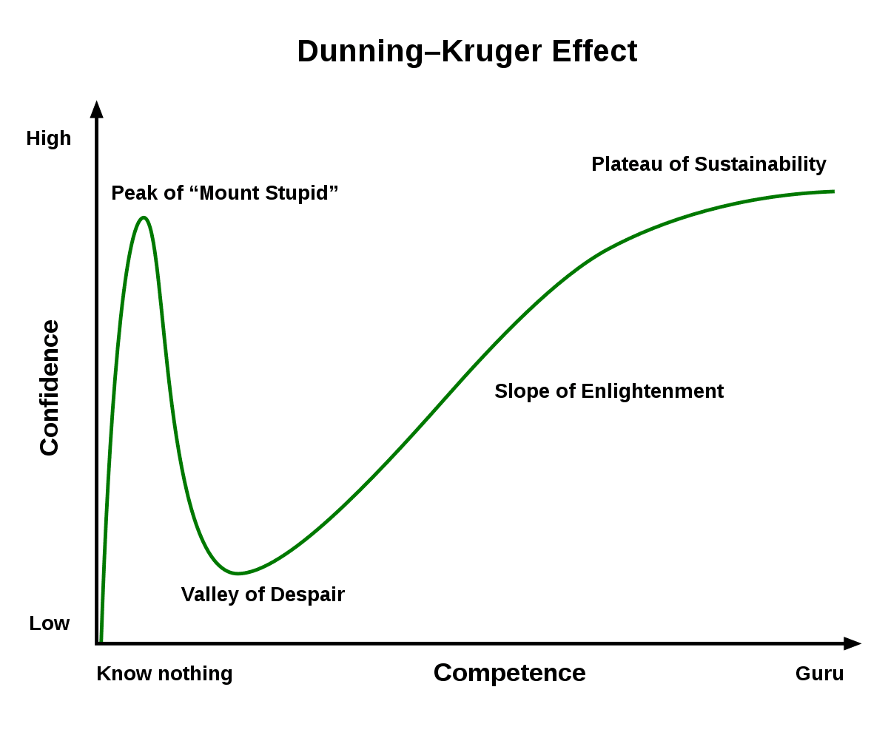

It's about time I finally joined the Flat Earth Gang, as an anonymous Twitter user TheCryptoElf has shown me the way. 

Just kidding. I'm here to address a common argument flat-Earther's make. Fans of mine would scream that addressing this topic is beneath me, but my fatass is here to stamp my foot on the ground and show that the explanation I have for you today is not-so-trivial and quite counter-intuitive. Today, I'm somehow here to defend the flat-Earthers (not really), to tell my non-existent audience that there are lots of facts we take for granted. I'll probably end this discussion with some philosophical nonsense about ego or something to make myself seem intelligent. 

*Stop stalling, asshole*. Okay, let's begin. 



TheCryptoElf brings up a pretty interesting point. What does he mean when he says "\[p\]ut a helicopter in air just in one place and it should be somewhere else in a few hours"? Assuming he still has at least one braincell left, we'll assume he means that if you just vertically lifted a helicopter to...say 1000 feet in the air--and that the Earth is a rotating ball of mass underneath--the ground should move significant distances over time, such that when the helicopter lands again, it will be in a completely different location. At first, this seems to make some sense...I mean why the heck would a flying object rotate with the ground?

Well, you probably got your answer to this question in your first physics class (If you're Asian, 3 years old at Kumon; high school, if you're not). Regardless, let's do some physics review. How fast does the surface move on a spherical object as big as the Earth? Well, let's buy the spherical Earth theory for a moment, as hard as it might be for you. The Earth has a "measured" radius of approximately 6,400km. It does one rotation (360 degrees) in one day. How fast is the surface moving? Using some simple math from Kumon, we know that the formula for surface speed is:

$$s = r\omega$$

For the simpletons, I will explain these complicated letters. \\(s\\) is the tangential speed, \\(r\\) is the radius of the Earth, and \\(\omega\\) is the angular speed. Angular speed?!! Tangential? What black magic! They savior is here. Allow me to explain. The tangential speed is simply the speed at the Earth's surface. You would imagine it depends on how big something is (the radius) and how fast that thing is spinning (angular velocity). Let's calculate. 

$$s = (6400\text{km})\cdot(360\text{deg}/1\text{day})$$

With some quick maths (and also considering that 360 degrees is \\(2\pi\\) radians), we get this speed to be around 1,000mph. That's pretty fast! So a helicopter flying vertically overhead for just one hour could get you from NYC to Florida. What an efficient mode of travel! Also, we're clearly not moving at 1000mph, which means the Earth is flat! TheCryptoElf wins! Not so fast, buddy.

# Dunning-Kruger Effect in Full Force
Fortunately, a lot of the enlightened spherical-Earthers came to sanity's defense with marvellous tweets like this:


A brilliant response to the brilliant TheCryptoElf. Clearly, he forgot that gravity exists, the wonderful "force" (or maybe travelling straight lines through curved spacetime?!) that keeps our feet on this beautiful Earth. Let's marvel at another "gotcha" tweet:



What a sick burn! Clearly, TheCryptoElf never learned about Newton's simple gravitation laws in school! Pathetic! So funny, how TheCryptoElf is clearly on the peak of Mount Stupid, while jetstothewest and actgeot are on the Plateau of Enlightenment! Or...are they?

Unfortunately, the jesters replying with quips about how TheCryptoElf doesn't understand gravity are also riding the tops of Mount Stupid, because shouting "gravity" doesn't explain this helicopter bullshit either. Let's analyze this "gravity" concept a little bit to see why it doesn't explain the helicopters. 

## Thank the Apple, Newton

Newton provided us with a convenient equation that gives us the gravitational force exerted by any object that has mass (colloquially, "weight"). The more "massive" something is, the more the force. The Earth, being much more massive than every human on Earth except you...has a much stronger field, which is why it seems like you're attracted to the Earth and not the other way around. However, the Earth is attracted to you, but the value is so small that you can practically ignore it. Let's calculate: with G (gravitational constant) being measured to be approximately \\(6.67 \times 10^{-11}\\) and plugging some numbers online (if you believe them), the acceleration it exerts on you near the surface is around 9.8 meters per second per second, or 32 feet per second per second in freedom units. On the otherhand, an average adult male has a mass of 90 kilos with an exerts a gravitational acceleration on Earth of about \\(1.465 \times 10^{-22}\\) meters per second per second. To imagine how small this is, if you accelerated this much driving your car, it would take 370,000 years to drive 10km (6 miles) to go to the nearby Hooters. 

Ok, it would have to make sense that the Earth pulls you much more than you pull it. So, why bring this up? The more important thing about this model of gravity is the direction in which gravity pulling you. 

Through some clever symmetry analysis or some 3D force calculations (probably with calculus), you can show that the force on your body from Earth points to the center of the Earth. This would have to be right, otherwise we would not be able to stand on the ground. That force is what keeps us from joining the Russians at the ISS. The ground exerts a force on your body, essentially canceling out the force of gravity so you don't just fall through the Earth (i.e. the normal force), which disappears everytime you jump up from the ground (until you land back on it).

A helicopter floating in mid-air has rotors that provide lift that counteracts the gravitational force, allowing it to "float" in midair. Its "normal" force is the lift, although it must have had more lift (upward acceleration) than gravity in order to fly up into the air, until it became stationary (i.e. floating).

Yeah, so if gravity just keeps your feet on the ground or keeps your helicopter from floating into space...that doesn't really explain why the ground doesn't just rotate beneath the helicopter. Even more, it doesn't explain why your body stays on the ground either. Why isn't the ground rotating under your feet? Friction? Somehow, I don't think friction is the force spinning you 1000mph because your shoes would have to be made of the hardest and most heat-resistant material the Universe can conjure. 

Yeah, so gravity doesn't explain this at all. The people who thought themselves superior to TheCryptoElf should sit down. Just because you know you are right about a spherical Earth doesn't mean you can explain it. Sometimes, not everything can be explained away so simply. 

# The Real Explanation
Funnily enough, the true explanation does revolve back to our good friend Newton. And more funnilier enough, it does rely on his theory of gravitation, just not in the way that you think it might. It actually has to do with his first law of motion--the law of inertia--that eloquently states:
> every object will remain at rest or in uniform motion in a straight line unless compelled to change its state by the action of an external force.
Oh, so brilliant. He's simply saying that something moving in the same direction will stay moving at the same speed and direction unless something else changes it. That's a little bit abstract, so allow me to elaborate.

Let's say you were sliding down the street at a constant 5mph. You will stay sliding down the street at 5mph unless you turn (going a different direction, maybe at a different speed), speed up or slown down (e.g. with your hands or by someone pushing you), or you hit a brick wall and stop suddenly. However, you can't possibly imagine sliding at a constant 5mph on Earth because there are so many "external forces", as Newton mentions, to constantly thwart your ambitions of gliding down Main Street at a Mach 10 for eternity. Those things being friction, air resistance, and brick walls. Sliding on the ground usually means air resistance or ground friction will constantly be slowing you down. Brick walls will bring your dreams to a halt. However, on some idealized environment without these things, glide along forever you will. Just think about a low-friction surface like ice. You can glide for a long time without doing anything until the small amount of friction from the ice eventually slows you down (or you fall over). 

This same principle applies to rotational motion. A rotating object (with **rotational** inertia) will spin at the same angular speed in the same direction unless compelled to change its state by the action of an external force. So your beyblade will spin at 100 rotations per minute (rpm) forever unless something either speeds up the rotation or slows down the rotation--those same culprits being this like friction, drag, bumps on the ground, or that damn brick wall again. Don't believe me? How does your 2015 Chinese sweatshop-manufactured fidget spinner work? You spin it once, it has no electricity or power, and it spins for minutes at a time. What slows it down? A combination of friction from the metal interior, air resistance, and your inability to let it spin to 5 minutes straight without interrupting it. 

So, the Earth is spinning at that 360 degrees / day rate because there's nothing out there to slow it down. There's no air in space, and there's no ground to cause any friction. So, who's gonna stop that big fat rocky ball from spinning? Exactly, no one. That's what we called an empowered planet. 

## Huh? We already Know the Earth Spins!
Yeah, the real explanation comes now. Believe it or not, you're spinning too. Not just from that MDMA you took a few hours ago; you're spinning with the Earth like you're its empowered fidget spinner attachment. Who said you get a pass? At this moment, you yourself are rotating with the earth at 1000mph. So, if you and the Earth are both rotating at the same speed, would you be able to tell you're rotating? 

TheCryptoElf pack would scream, yes! If I was rotating 1000mph on a carnvial, surely I'd be able to feel the wind ripping me apart and the dizziness of the world turning into a blur! Yeah, but what if the air is also rotating with you?! What if on Earth, it's not just you rotating with the Earth, but everyone else, the air, the trees, the bees, the fidget spinners, the beyblades, and the brick walls alike? Who said the air is exempt, and why did you think it was to begin with? And with everything rotating on the Earth together, there are no visual objects to turn into blur--everything is part of the same system!

This may feel unsatisfactory, but stick with me. Air is affected by rotation and gravity the same as me and you. That's why we can thrive in our dense-ass atmosphere--the rising air, the winds, the rain, the climate--all have to do with air spinning with the Earth, rising and falling from gravity. Air is subject to the same kind of rotational inertia as me or you. It being a gas changes very little, and it would be a pretty big problem if the air was a standstill while our asses were flung around the planet at 1000mph. 

You already realize this. When you're driving in a car, do you feel the air in the car zipping across your face at 90mph down the 55mph freeway? No, because that damn air is moving 90mph with your carbon-emitting ass on the inside. The inside of the car moves the air along with you, which is why you can't feel any difference. Once you open the window or the roof if you're a fancy convertible-owning schmuck, then you'll feel the glory of 90mph air blowing the tears of disappointment out of your eyes. 

So, going back to the original tweet by TheFigen that started this whole discussion. If you're bitchass is moving on top of the car on the diving board, you're moving at the same speed as the car (say, 60mph). The second you jump, you're still moving 60mph forward and unless there's so much wind that it can throw your ass backward 5+ feet in the span of 0.3 seconds, you will unfortunately land in the pool instead of 6 feet underground. If your kid in the backseat of your car jumps on her little seat, is she getting flung backwards? Is the only thing stopping her the seat? Wouldn't she hit the seat with 100 pounds of force to keep her moving with the car? Yeah, I thought so. The next time you go on a cruise moving at 30mph and jump on the ground, does the ground move underneath you, or do you land in the same spot...why would that change whether you were inside versus outside? There is a difference, given that the air outside isn't confined and is blowing past your deaf ears at 30mph, but fortunately for you, it's not nearly strong enough to knock you overboard if you're not acting like a jackass. 

So, to answer the helicopter question, the helicopter was spinning with the Earth on the ground. The helicopter rises up 1000 feet in the air, but is still spinning with the Earth (which had nothing to do with being on the ground, rather rotational inertia) within the air, which is also spinning with the Earth. When it goes back down, it will just land where it lifted off the ground. The ground does not rotate underneath, because you are spinning at the same rate as the ground. Gravity has almost nothing to do with this, other than the fact that the helicopter must fight it to stay afloat.

# This Feels Unsatisfactory! Why Are We Rotating?
Yeah, it kind of does, doesn't it? Why is the Earth rotating, and why are we rotating with the Earth? Well, the Earth is measured to be some 4 billion years old, forming out of the birth of our Sun. The Earth has been spinning for those 4 billion years, back when it was a molten rock with no life on the surface. Everything subsequently created on Earth has always spun with the Earth. The atoms that composes you are atoms from the nascient Earth or meteorites that have spun with the Earth for essentially eternity. Everything on Earth created after Earth essentially...must spin with the Earth, because there was never a choice not to. You spin with the solar system and the Milky Way Galaxy, too...and you had no choice over those things, either. 

# The Plateau of Enlightenment
There is a whole suite of complications that the explanation above barely touches. Let me slightly elaborate on some of them here.

1. The reason Earth spins is because we theorize that it coalesced out of spinning gas and dust out of the disk of our birthing Sun, which gravitationally collapses to form a spinning disk as its most stable configuration--out of which the rocky planets and gas giants can crystallize from. That's why Earth has a rotation, and why all the other planets do as well. 
2. Earth's rotation is actually slowing ever-so-slightly every day. That means Newton lied about rotational inertia! No, that's not the case. Gravitational perturbations from other space objects like the Moon, Sun, etc. (external forces) poke at Earth's rotation rate, slowing it down slowly to a more stable configuration.
3. Newton's Theory of Gravity is just a theory. Surprisingly, TheCryptoElf was right about this one. It is just a theory--a framework used to describe reality. Newton's theory describes gravitational theory shockingly well like 99% of the time, and in 99.99% of the things we need to worry about. However, it's been shown Einstein's General Theory of Relativity describes reality even better, which doesn't describe gravity as a force, but rather as mass and energy creating distortions in 4D spacetime. Objects under the influence of gravity travel in straight lines (geodesics) through this spacetime, which manifests itself as a force-like behavior in observation. Does this sound like hooey? Yeah, it fucking does alright. But, it's just the most accurate theory we've conjured up this far. Could there be a simpler, unifying, perfect theory sometime in the future? Maybe. 
4. Earth's atmosphere doesn't all spin at the same rate. Earth's lower atmosphere on average travels with the surface, with the obvious exception of wind patterns. The upper atmosphere spins slightly faster due to super-rotation, which is theorized to be caused by diurnal bulge or collision with high-energy particles from space. 
5. Earth isn't even a perfect sphere. It has a slight oblong shape from its rotation and gravity. 

# What Can We Learn?
Time to mansplain some takeaway items here.

If I had to be serious for a moment, I think we often take the information we are given in life for granted. The questions that flat-Earther's ask are good questions that had to be pondered for hundreds if not thousands of years--questions that I don't think most people can answer well. Even now, I don't think the average person can convince a flat-Earther that the Earth is round. 

I'm not saying the flat-Earthers are in any way reasonable. They are asking questions that aren't easily explained away but have been figured out through and through. They're regressing to problems solved 500 years ago because they do not know the solutions or do not understand them. They refuse to have any faith in the system--believing that the system is set up to lie to them--which is why they will dismiss every photo of Earth as fake or photoshopped. Yeah, they're insane. 

On the contrary, most people handily accept the reality that the Earth is round without a second thought, which is fine. People can only dedicate so much time to so many things, and it's more useful to most people to build on the knowledge passed down to us than contemplate such a triviality. However, simply accepting truths can overinflate people's egos, where they think understanding a small amount of some things means they know everything. Like in the Twitter exchange, everyone was equally as confident and equally as wrong. Sometimes, it's worth prodding your brain about certain givens--you don't know how flexible some ideas are until you are willing to give them a nudge. If Einstein assumed Newton's theory was "correct," he would have never discovered the General Theory of Relativity. 

Science is an forever-evolving field, where the things we believe today may completely be usurped in years time, filled with politics, data wrangling, and error. Science is not a perfect science; it adapts, often through the insights of those who identify the limitations of existing theories, or the collective effort of many to uncover its flaws. While the flat-Earther's may be at one end of that extreme, those who blindly accept contemporary truths as gospel may just as well be on the other extreme. Balancing trust in the system is essential: with too little trust, progress becomes impossible; with too much trust, systems stagnate and fail to evolve.

# Miscellaneous 
## An Ode to Life
I wanted to show my appreciation for what we have. In this moment, we're surrounded by hundreds or thousands of super complicated things that nobody could have dreamt of a hundred years ago that can't be studied in a lifetime. You simply reading this blog involves:
- A display with millions of pixels created from organic substances that renders at least 60 times per second
- An internet connection using a 7-layer protocol, probably using TCP, encrypted via 256-bit SSL algorithm, that transferred thousands of miles of internet cable in a few seconds
- A wifi router that has a connection tracker, mcirochip, radio antennae, modem connection to internet provider, that can communicate with a Wifi chip that it's not directly connected to on your phone or laptop
- A web browser that renders HTML, CSS, and Javascript on your screen that allows you to look at seemingly infinite tabs with infinite connectivity, streaming billions of bytes of data
    - A compiler to compile the HTML, CSS, and Javascript
- An operating system with millions of lines of code that allows you to interact with your computer
    - The compiler that allows the operating system to be written
- A hard disk that can store billions of bytes of data
- A RAM stick that can store billions of bytes of temporary data
- A microprocessor that can compute a billions or more operations per second
- A keyboard that can track a thousand keys a second
- A mouse that can track your exact finger location or a screen that knows where you tap at all times
- A battery that can keep your device charged for a good part of a day
- A connection to the power grid that delivers 120V to dozens of ports within your home or office
- And much more.

Jesus fucking Christ. 

## Backstory
I thought about this problem a lot as a freshman in high school. I was thinking, "why do we spin with the Earth"? I thought the answer was trivially, gravity but noticed that gravity doesn't make you spin. No one online seemed to have answered this question, and I was left there pondering the actual reason. It is not intuitive to me that "we spin because we spin with Earth" was the right answer. Newton's law of inertia is not trivial given the cause-and-effect and observations of our reality. No one has ever seen a person slide down the street at a constant 5mph without some powered device. And even more so, no one's seen anything this big spin without a spinning source. And most of all, who caused the Earth to spin in the first place? A ball of gas and dust 5 billion years ago gravitationally collapsed into a rotating disk and somehow turned into what we see as the green-blue marvel of the Earth we see today? It makes sense now, but not as some sort of trivial conclusion. 

## Rage-Baited
Was TheCryptoElf ragebaiting? Probably. Did I fall for it? Probably. 

## Were some people in the comments right?
Yes, they were. 

## Do I hate flat-Earthers?
No. I am one. 

## Did I unfarily select a few of the people who pointed to gravity as the reason?
Yeah, I did. But, they had the most likes, so I used that as a metric for popular support. 