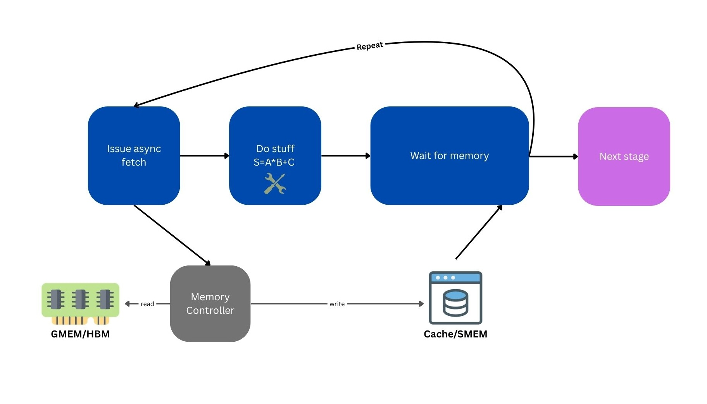
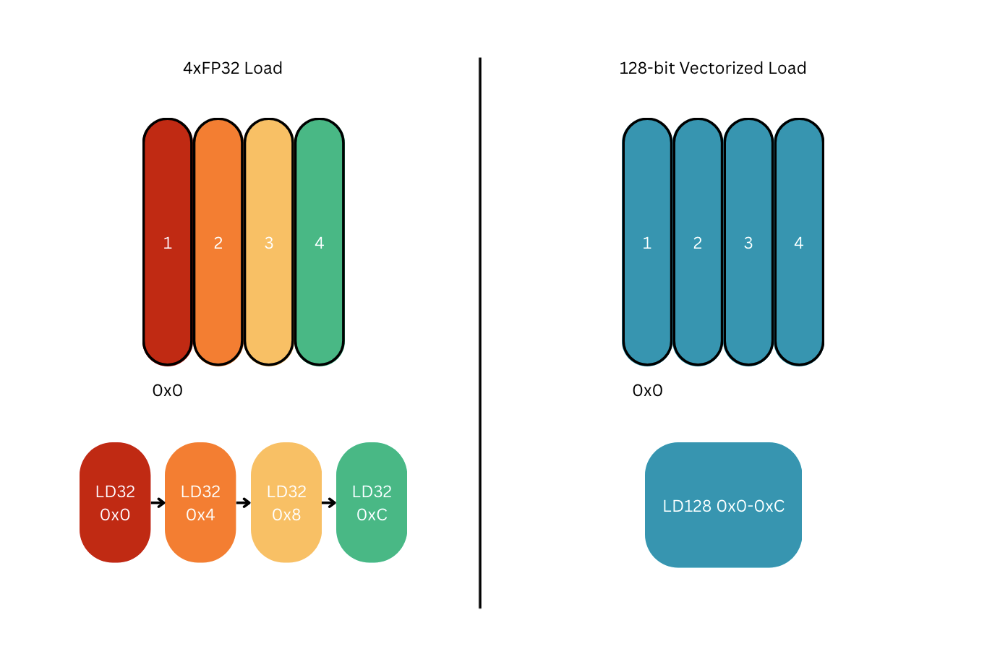
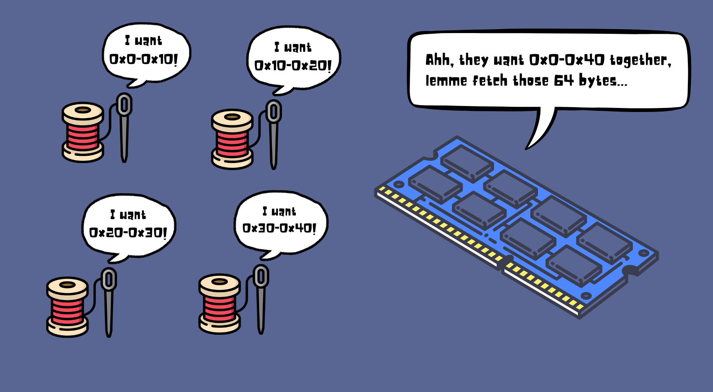
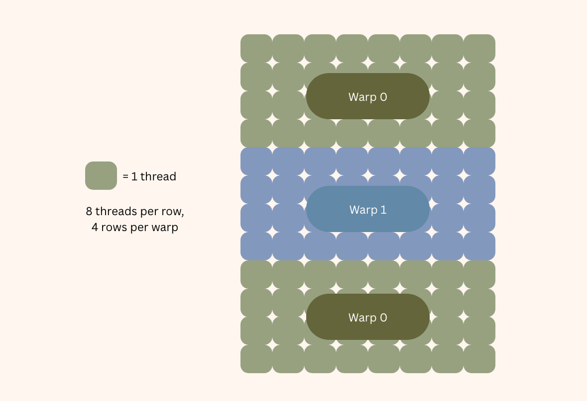
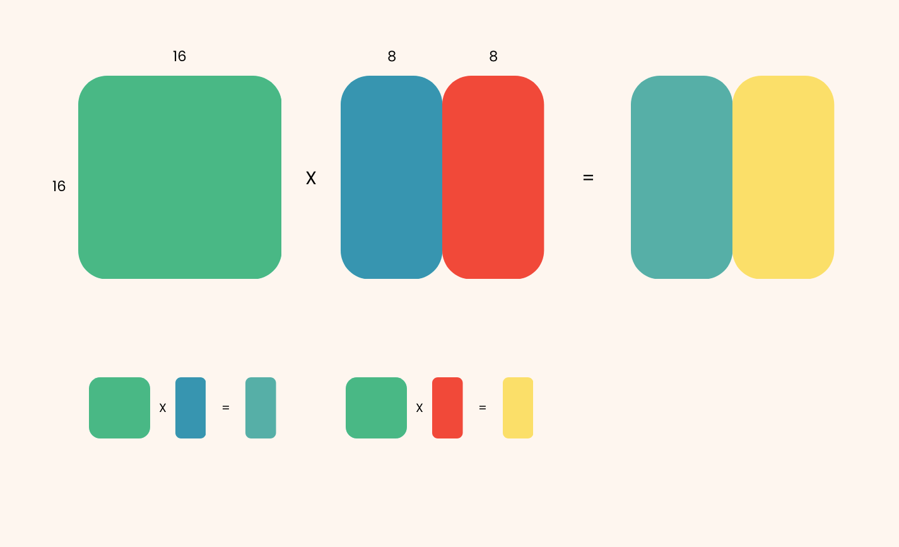
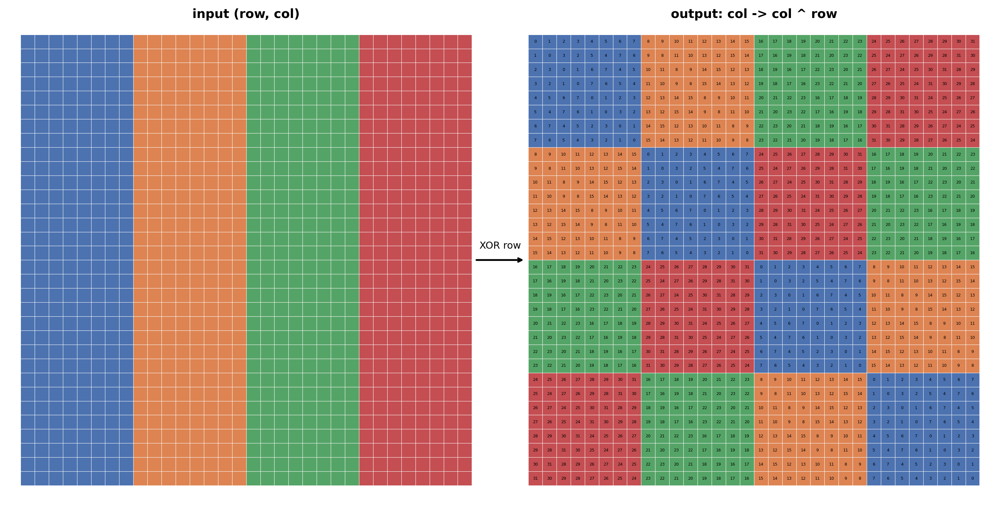
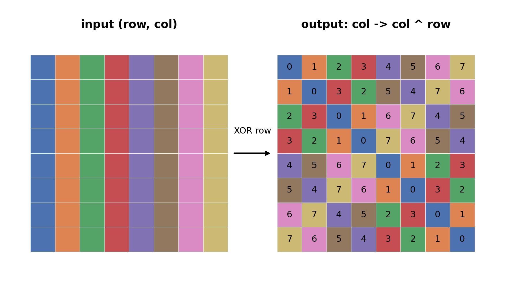
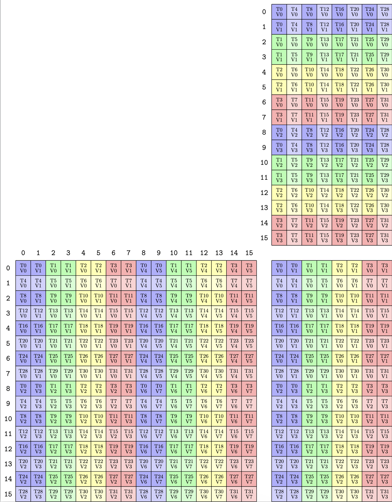
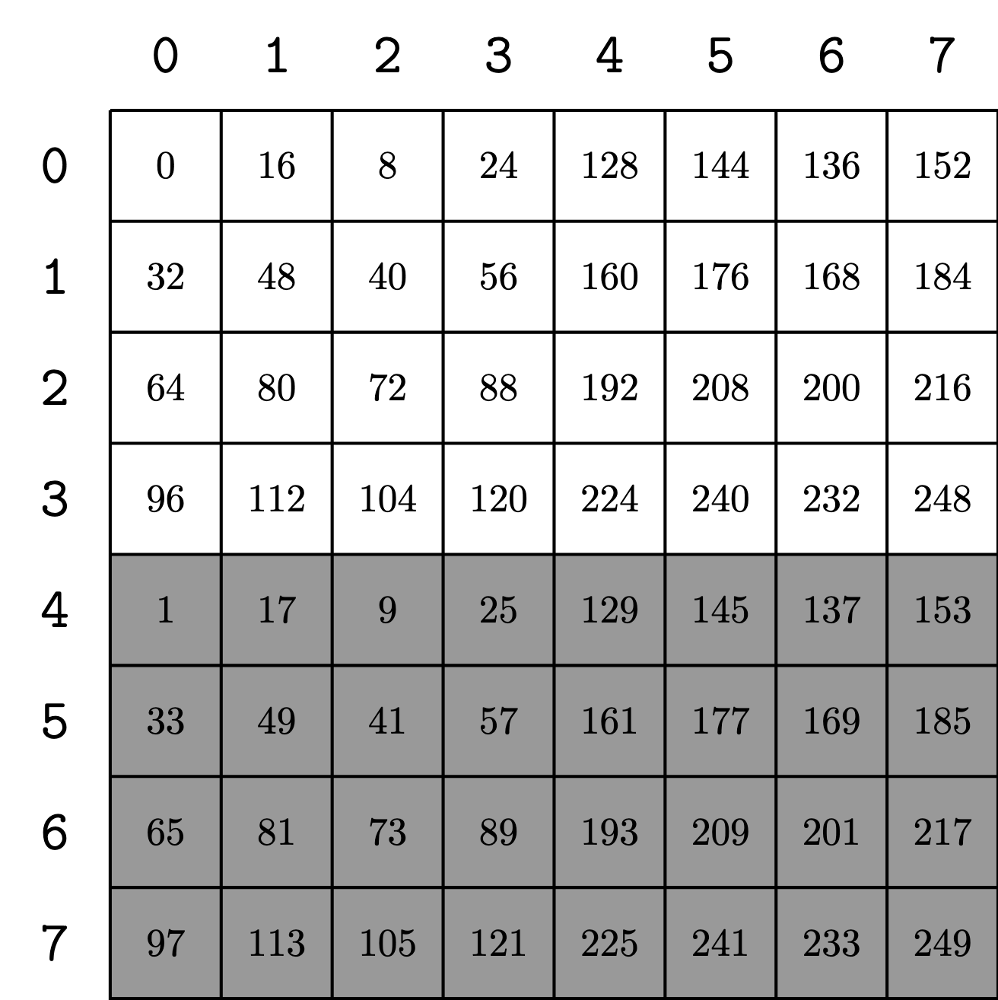

I made the unfortunate decision to read through the FlashAttention-v2 paper maybe a month or two back. Its name was tossed around work enough to pique my curiosity, and I found myself forking through the details one lazy afternoon. It read similar to one of those simple yet foundational ML papers back in the day--something like ResNet or BatchNorm. The math was almost trivially understandable to anyone who has even touched a few models in the last decade, and the algorithm seemed relatively understandable to my untrained eye. I had not even touched a GPU kernel before, and I felt some semblance of hubris given that my naive computer engineering degree allowed me to understand an algorithm of such importance.

I made the unfortunate mistake of thinking I actually understood the algorithm in its entirety. At a surface level, sure, but such triviality only exists in the abstract. It was akin to me thinking that I could build a microwave simply because I know how it works. However, I was not amateur enough as to simply read the paper, I wanted to implement it myself like the engineer that I am. I had heard Triton was making waves in the GPU sea, and I decided to take a venture into its wake. I started by making some simple kernels: a softmax here, a SwiGLU there. One or two hours of barely any code, and I was done. Easy peasy. In fact, I wrote the full flash attention kernel within two or three days during the work week and achieved similar-ish performance to pytorch's native implementation on smaller sequence lengths within this time. I replicated Tri Dao's work in a fraction of the time, and I didn't even optimize my kernel that much along the way. I was feeling unstoppable.

I made the unfortunate oversight of trying to rewrite the kernel using CUDA. Obviously, two days of work with only a few sweats of confusion wasn't enough to satiate my hunger. I felt as though Triton had taught me nothing of GPU programming, and I wanted more. In the throne room of luxury and convenience, I sought the caves and the jungles. With a few more drops of sweat and maybe a few tears, I finished a few elementary kernels in CUDA. Piece of two-layer cake. But, I wanted that 12-layer wedding cake. I sought to recreate flash attention in its full glory, and it seemed like I was equipped to do so. Over the course of the next week or two, I would complete a first draft iteration of FlashAttention-v2 using a somewhat outdated WMMA API, achieving...only 20% of native FA2 performance. Clearly, this old WMMA abstraction wouldn't cut it. I looked at Dao's source code, and it looked nothing like the verbose mess of for loops and somewhat-understandable code in my repository.

I made the unfortunate blunder of rewriting my kernel with CuTe in C++. As with any performance library, I had to rewrite the entire kernel using a poorly documented library with complex syntax and abstracted BS that somehow is way faster. What I thought would be a somewhat simple task turned out to be a nightmare in understanding. It's a path I'm sure any low-level developer had to cross at some point in their journey, and I am certain they have seen the fear in the eyes of the avoiders and the stockpile of bodies along the way. After many pools of sweat, many hairs pulled, and many neurons disintegrated, I finally found success. But, I was not filled with glory, confidence, or peace. In the end, I could only feel relief and a massive sense of responsibility to aid any traveler who dare wish to traverse this same path.

# FlashAttention-v2
If you're reading this, I will assume you already have a solid understanding of the attention mechanism and at least the basics of the FlashAttention algorithm itself. If not, I recommend reading the original flash attention paper[^5] to build your understanding of the algorithm before coming back. Or, you could just read the article as is, because you will probably piece it together through the struggle of trying to understand. It would be helpful for you to at least know the pseudocode/baseline algorithm for FA2, and it would be even better if you have maybe tried simulating it in pytorch (or your framework of choice) or maybe even implemented it in Triton.

If you've never touched CUDA, you should at least try to understand its SIMT programming nature and maybe implement some basic level kernels using this thread-level view. Try to build your understanding of how CUDA works and a solid understanding of NVIDIA's GPU architecture, from threads to warps to thread blocks to SMs and beyond. I will talk about a lot of these concepts as if you at least have a basic understanding of them. I will be as comprehensive as I can, but it will be an uphill battle should you try to read this blog in its entirety without some background knowledge.

Most of this blog will concern how high-level concepts like "online softmax" or "gemm" actually translate to production-grade code. The algorithm itself is not particularly difficult, but the implementation details at the CUDA level can become a nightmare, particularly to beginners. Tri Dao originally wrote FA2 using CuTe (CUDA Templates), a core component within NVIDIA's CUTLASS library that abstracts away tensor layouts and thread-data mapping for high-performance GPU computing. Although this may seem nicer than doing it from scratch, there are a lot of intricacies and difficult-to-understand design choices that make reading it somewhat of a nightmare. It's higher-level than your typical C program with normal for loops and variables, but it's still practically as close to bare metal as most people will ever get. So, even though you will understand CUDA and FlashAttention much better, honestly it will mostly allow you to understand CuTe, why it exists, and how people actually use it.

Fortunately, since the release of Blackwell (B200), NVIDIA released CuTe's Python DSL--a python library you can use to write the same code without all the annoying crap that's baggaged with C++. The use case is pretty much unchanged, but it makes debugging and templating much more palatable, and the compile times are enormously faster. Moving forward, CuTe 3.X in C++ will probably be somewhat of a relic of the past, but as a learning exercise, nothing beats the absolute struggle of working with the most annoying and explicit version of whatever you're trying to learn. Let's get started.

# Overview
## Design Choices
We're going to make some basic design choices to make this learning exercise simpler on the implementation side. A lot of the source code involves edge cases and optional configuration settings (RoPE, QK smem sharing, etc.) that aren't practical for learning the fundamentals of FA2 and CuTe. Our choices are as follows:
- A100: the GPU I had access to and the industry standard when FA2 was released. Hopper and Blackwell have even more complicated algorithms due to hardware improvements and optimizations
- fp16: supported on A100 tensor cores, pretty basic default for most kernel ops for training
    - fp32 accumulation, reduces precision drift, more accurate FLOPs for softmax and scale
- Clean basic out-of-the-box attention mechanism: no causal masking, RoPE, dropout, etc.
- head_dim: focus on 64 and 128 block size, although 32 may be covered, though I didn't specifically check
- Assume sequence length is a power of two, more specifically a multiple of the Q block size.
- We expect $Q, K, V$ to be in row-major order.

## Some Naming Conventions
If you look at the FA2 source code, you might notice they have some weird naming conventions. Some of them are standard CuTe/CUTLASS, some carry over from other things. Here are some patterns:
- Starts with k: compile-time constant, e.g. `kBlockM`, `kHeadDim`
- $M, N, K$: All of general matrix-multiply (GEMM) parameters are in this order for a $(M, K) \times (K, N)$ matrix-multiply. Hence, the shape of Q is `(kBlockM, kHeadDim)` and the shape of K, V is `(kBlockN, kHeadDim)`.

## Basic Structure
First, attention itself:

$$\begin{aligned}
P &= \frac{QK^T}{\sqrt{d_h}} \\\\
S &= \text{softmax}(P) \\\\
O &= S \cdot V
\end{aligned}$$

Or in pytorch for those who haven't read a math equation in a while:
```python
P = Q@K.T/torch.sqrt(d_h)
S = torch.nn.functional.softmax(P, dim=-1)
O = S@V
```

Let's establish the specifics of the FA2 algorithm at a high level.
- Our grid is `batch/head` x `q_tile`. The batch/head dimensions are independent and can be grouped. The `q_tile` determines which tile of Q we get, and we make it the last dimension for better cache locality between thread blocks.
- Q is of shape `(kBlockM, kHeadDim)`. The main computation on any thread block revolves around the Q tile. This Q tile does not change for the duration of the thread block. We iterate over the relevant K, V tile per thread block to get an output tile. Each q tile maps to exactly the same size output tile, which is necessary as we need to manifest a whole row of P to do the softmax.
- We load each tile from global memory (GMEM) to shared memory (SMEM) for staging. When we need to do our GEMM, we load from SMEM to the register file as we loop over K and V.
- Our GMEM->SMEM copying are all async (`cp.async` on Ampere). Q technically doesn't really have to since it doesn't overlap that much compute but is a micro-optimization.

The overall pseudocode for a tile Q is:
1. Define GMEM, SMEM, register files, hardware copy/GEMM instructions, and mappings
2. Load Q tile from global memory to SMEM. This is only done once, as Q tile doesn't change.
3. Prefetch 0th K-tile.
4. Loop start: Wait for K-tile to arrive. Then, prefetch the next V-tile.
5. Issue GEMM for $P = QK^T$ tile.
6. Wait for V-tile to arrive. Then, issue next K-tile prefetch if we're not on the last iteration.
7. Compute $S=\text{softmax}(P)$ and softmax statistics and update accumulator/output tile.
8. Issue GEMM for $O = SV$ tile.
9. Loop back to 4 until row is complete.
10. Scale final output by $l=\text{expsum(P)}$
11. Copy output from SMEM back to GMEM. Ampere doesn't have any direct SMEM->GMEM instructions so we stage this copy through registers.

Only 11 steps and they're all pretty simple in concept...Let's take a deeper look into the implementation details.

# CuTe, the Basics
Bombarding you up front with all the design choices in CuTe/CUTLASS will only confuse you, and the best way to learn is honestly by necessity. However, having some basic info is still probably required, so I will bombard you with some sadness before we move onto the "cool" stuff.

## Background
CuTe is essentially a templating engine that allows you to manipulate memory using tensors, shapes, layouts, data types, and strides, sort of similar to pytorch's `torch.Tensor` object. Unfortunately, it's not nearly as friendly. But, if you're familiar with any deep learning library, these concepts should click pretty quickly. It allows you to declare a general "shape" once and if you template it with a fp32 vs fp16, you can just pass the relevant parameters to your kernel template.

However, you are still responsible for all of the sizes. It may be able to extract fp16 from a 128-bit load, but you'll have to figure out that 128-bits is 8 fp16 numbers. It just handles the typing on your behalf and lets you index stuff more easily. This will click later.

## Layouts, Shapes, and Strides
Ah yes, back to tensor school. A shape and stride is precisely the same concept as in PyTorch. A layout is just a composition of a shape and a stride.

```cpp
#include <cute/tensor.hpp>
// runnable just like this without GPU
auto layout = Layout<Shape<_8, _16>, Stride<_1, _8>>{};
auto layout_1 = make_layout(make_shape(Int<8>{}, Int<16>{}),
        make_stride(_1{}, _8{}));
print_layout(layout);
// this is the shape of a torch.tensor([[0]*8 for _ in range(16)]).T
```

A shape of (8, 16) with stride (1, 8). Pretty simple. Both declarations are identical. So what's with the freaky underscores?

## Statically vs. Dynamically Typed
Any standard C++ integer passed into a layout, shape, or stride is dynamically typed, i.e. its value is only known at runtime (e.g. int, const int, static int). Even CUDA's `constexpr int` is treated as such by CuTe. Any time you index into a tensor, the library will compute

```cpp
A[i][j] = i*stride_row + j*stride_column
```

Each index operation is a multiply and add, which can be quite costly. Instead, when we can, we opt to use for statics: type wrappers used by CUTLASS to allow the value to be known at compile time. It's just a C++ compiler trick that allows CuTe to compute all indexing during compilation rather at runtime, saving the GPU from having to do so while its running. Obviously, you can only do this if sizes are predetermined, either because they are definite, templated, or constant. So instead of passing in `make_stride(2, 4)`, we can pass in `make_stride(Int<2>{}, _4{})`. Functionally, these are the same, but any subsequent indexing done will be done at compile time for the latter.

Layouts *do* take in dynamic integers as well. They should be used *if they are only known at runtime*.

Some syntax quirks:
```cpp
// identical, CuTe provides most power of twos by default as shorthand
Int<8>{};
_8{};

// Functions take in objects, types only use types
auto l1 = Layout<Shape<_8, _4>, Stride<_1, _4>>;
auto l2 = make_layout(make_shape(_8{}, _4{}), make_stride(_1{}, _4{}));
// type
Int<8>;
// object/struct
Int<8>{};

// can have both dynamics and statics in same layout
auto shape = make_shape(2, _4{});
auto stride = make_stride(Int<256>, 64);
```

Read more here:

## Tensors
Tensors are just a pointer wrapped in a layout. The underlying data is just a pointer, usually of contiguous data, and the layout determines how we interact with it. Pretty much exactly the same as a `torch.Tensor`. However, we manage the layout: we can change it to whatever we want, however we want, but we are ultimately responsible for the tensor's integrity.

```cpp
static int x[] = {1, 2, ..., 32};
auto l_row_major = make_layout(make_shape(_8{}, _4{}),
    make_stride(_4{}, _1{}));
// row major view
auto t_row_major = make_tensor(x, l_row_major);

// column major view
auto l_col_major = make_layout(make_shape(_8{}, _4{}),
    make_stride(_1{}, _4{}));
auto t_col_major = make_tensor(x, l_col_major);

// tensor indexing
// i, j = 2, 3
int n_row = t_row_major(2, 3); // 12
int n_col = t_col_major(2, 3); // 15
```

## Row and Column Major
In row-major formats, data is stored row-contiguous (C, C++ style), i.e. `A[0][1]` and `A[0][2]` are contiguous in memory.

In column-major formats, data is stored column-contiguous (Fortran, CUBLAS style), i.e. `A[0][1]` and `A[1][1]` are contiguous in memory.

The way to tell is by the stride; for any 2D matrix with stride $(a, b)$, the matrix is row-major if $b=1$ and column-major if $a=1$. In CuTe, any layout without a provided stride is **column-major** by default.

For FA2, Q, K, and V are all **row-major.** Although somewhat arbitrary, most consumer applications or libraries like Pytorch or JAX are row-major by default, so this is the most obvious configuration for consistency. Furthermore, Ampere tensor ops seem to be oriented around row-major instructions, so it's also a choice in simplicity.

## Composed/Hierarchical Layouts
The last bit of confusing layout algebra is hierarchical layouts. CuTe lets us compose layouts into multiple dimensions. For example, a layout of shape `Shape<_8>` can be composed to be `Shape<_4, _2>` or `Shape<_2, _4>`. We can iterate over the 8 block in groups of 1, 2, 4, or 8. The strides determine which direction we do so (row or column major). This is no different than normal layout re-interpretation from the [tensor section above](#tensors), but CuTe allows us to nest layouts for extremely granular layout interpretation.

```cpp
// (_8, _4): (_1, _8)
auto l1 = make_layout(make_shape(_8{}, _4{}));
// ((_2, _4), _4):((_1, _2), _8)
auto l2 = make_layout(make_shape(make_shape(_2{}, _4{}), _4{}));
```

In `l2`, we iterate through the inner (left) shape in groups of 2, column major by default. In this case, the composed layout is purely decorative. We can still address a tensor with layout `l1` or `l2` with two coordinates `(i, j)`. CuTe maps the translation underneath. However, you can split a for loop on the inner dimension of `l2` into a nested for loop, but otherwise, it's not accomplishing much in terms of utility. However, we'll see it become a powerful tool during the [MMA tiling reshape](#fragment-reshape), where we cannot simply flatten a 3D tensor into a non-composed 2D tensor.

```cpp
int *a = {0, ..., 31};
// [0, 1, 2, 3, ..., 7]
// [8, 9, 10, 11, ..., 15]
// [16, 17, 18, 19, ..., 23]
// [18, 19, 20, 21, ..., 31]
Tensor t1 = make_tensor(a, l1);
Tensor t2 = make_tensor(a, l2);

int v1 = t1(3, 2); // 19
int v2 = t2(3, 2); // 19
int v3 = t2(make_coord(1, 1), 2);
```

## Colex Indexing
CuTe uses column-major indexing, which is their way of consistenly enforcing 1D->N-dimensional indexing across layout algebra. If we index tensor `t(idx)` for a tensor of shape `(M, N)`, the index split becomes:

```python
i = idx % M
j = idx / M
```

Again, this is the opposite of the C/C++/Pytorch row-major standard. As long as you remember this column-major indexing system, everything will be fine. If not, then you'll probably end up scratching your head for hours. This means for many composed layouts, you'll likely have to flip the order for composed shapes for the indices to be row-major adjacent. If you think this sucks, I agree. This is probably *the* most annoying part of learning CuTe because things do not align with your expectations. Unfortunately, the only way to learn is via trial by fire.

# CuTe, Copy, then Cry
## A100 (Ampere) Specs
The entire point of FA2 or even GPU optimization in general is to maximize compute by overlapping it with memory loads. Here are the memory and card specs of A100 GPU (Ampere):

| Storage Level | Latency (Clock Cycles) | Magnitude Slower than Registers |
| :--- | :--- | :--- |
| **Registers** | ~1 cycle | — |
| **Shared Memory (SMEM) / L1** | ~20–30 cycles | ~25x |
| **L2 Cache** | ~200 cycles | ~200x |
| **HBM2e (Main Memory)** | ~400–600+ cycles | **~500x+** |

| Feature | Specification |
| :--- | :--- |
| **Total SMs** | 108 (SXM4) / 128 (Full Die) |
| **CUDA Cores per SM** | 64 (FP32) |
| **Max Threads per SM** | 2048 |
| **Max Warps per SM** | 64 |
| **Max Blocks per SM** | 32 |
| **Registers per SM** | 65,536 (32-bit) |
| **Max Registers per Thread** | 255 |
| **Max Shared Memory per SM** | 164 KB |
| **Max Shared Memory per Block** | 163 KB |
| **L1 Cache (Combined with SMEM)** | 192 KB total pool per SM |
| **L2 Cache** | 40 MB or 80 MB |

## GMEM->SMEM (Async Copying)
A rule of thumb is to have approximately **150-200 FLOPs per byte loaded from HBM**. Although this particular number is quite arbitrary depending on your kernel or GPU, it's a universal theme to overlap loads/stores with your actual compute.

Since NVIDIA introduced the Ampere architecture, we can now take advantage of asynchronous copying from GMEM->SMEM to help us overlap our tile fetches with compute. Before, you might have had to wait hundreds or thousands of cycles for your bytes to hit your SMEM; on Ampere, we can issue some loads and immediately begin doing useful work while the memory loads in the background.

The async design pattern is quite simple:



We'll cover how we apply this pattern to Q, K, V later on. There are some small CuTe details to be aware of, but the overal idea is exactly the same.

Although you might think we can kind of async set and forget, there are two important concepts we need to be aware of that could potentially crush our performance if we're not careful:

### Vectorized and Coalesced Loads

Those two concepts are **vectorized loads** and **coalesced loads**. They are very similar in meaning and are often a point of confusion, so let's break them down here:

- **Vectorized Loads**: A *thread* loading as much data as it can in one *instruction*. Since we're working with fp16, we could naively load one 16-bit number at a time. However, all NVIDIA chips today support a 128-bit load instruction *per-thread*: `LDG.E.128` (and it's SMEM counterpart `LDS.E.128`), which can load 8 fp16 numbers in one go. Memory transactions are funny in that a 16-bit load and 128-bit load take the same amount of time, so if we load 16-bits at a time, we immediately slash our performance by 8x. So instead, when we can, we load 128 bits at a time and decompose it into 8 halfs (1 fp16 = 1 half).
- **Coalesced Loads**: A *group of threads* loading as much data as it can in one *transaction*. GPUs never fetch from HBM just one byte at a time; they can fetch a whole 32, 64, or 128-byte chunk in one go (i.e. the **transaction size**). When this thread group loads a contiguous 128-byte chunk, the memory controller will clear the entire block of data at once. Furthermore, this block fully saturates a L2 cache line, making any subsequent cache accesses more efficient. If all 32 threads in the warp are each fetching some random chunk scattered across memory, then the memory controller would issue 32 separate transactions, immediately crushing your performance, hopes, and dreams. Note: the coalescing is the maximum bandwidth of the memory controller itself--it has no relation to instructions or how many threads are participating in a load or store. It simply means whether we ask for a 128-byte chunk at once or not. You might notice how 32 threads and 128-bit *instruction* loads is 512 bytes, four times the bandwidth. We'll cover how this works in the next section.

> **Tip**: You should think of vectorized loads in terms of instructions--Can each thread load 128-bits at one time with my data format/layout? 
>
> You should think of coalesced loads in terms of contiguity--can I load 128 bytes from HBM at a time?  





> Both vectorized and coalesced loads expect the data to be contiguous (e.g. 128 bits and 128 bytes, respectively). If your data are scattered, you might not be able to leverage the full benefit of vectorization and coalescing. However, it's possible that loading 64 bytes or 64 bits at a time could be good enough for your purpose. If memory becomes a bottleneck, you can always consider reformatting the data, or loading out of order, as long as your downstream compute handles the data correctly.

> **Memory coalescing only applies to GMEM/HBM**, while vectorization applies to both GMEM and SMEM, although in slightly different ways. In both cases, we're reducing instruction pressure and increasing our instruction-level parallelism (ILP). We'll cover more details about bank conflicts and swizzling in our [SMEM->register section](#smem-registers) later. 

### Copy Atoms
There are a boatload of copy PTX instructions in CUDA--you can fetch 32 bytes, 64 bytes, one byte, synchronous or asynchronous alike. CuTe neatly packages these copy instructions into a core piece called an `Atom`. These "atomic" pieces are the core hardware instructions that you eventually pass to the `copy` function so it knows what instruction to use to copy your data.

Ampere has a specific asynchronous `Copy_Atom` with the architecture name `SM_80`: `SM80_CP_ASYNC_CACHEGLOBAL<bit_size>` or `SM80_CP_ASYNC_CACHEALWAYS<bit_size>`. The `cache_global` and `cache_always` map to the PTX instructions `ld.global.cg.u32` and `ld.global.ca.u32`; `cache_global` loads straight from L2 to the destination, skipping over L1 cache, while `cache_always` also loads the data into L1. Most kernels will use `cache_always` by default because of improved spatial and temporal locality across threads. But, in FA2, we never reference Q, K, or V again once they are loaded into SMEM--therefore, we can bypass the L2 cache, which is slightly faster. It also reduces thrashing at the L1 level and allows more important data to stay in-cache. In practice, this is a micro-optimization and relatively not that important.

The `bit_size` supports up to 128-bit loads. **Bits**, not bytes, as these atoms viewed through the **thread perspective**. Hence, our atom loads a total of $128 \text{ bytes} \cdot 32 / 8 = 512 \text{ bytes}$. This means each 128-bit fetch across the 32 threads in a warp takes $512/128 =4$ memory transactions in four "phases" (more on this later). For our purposes, we want that full coalesced 128-bit power using `cache_global`. We can define the `Copy_Atom` with the following code:

```cpp
#include <cute/atom/copy_atom.hpp>
using GmemCopyAtom = Copy_Atom<SM80_CP_ASYNC_CACHEGLOBAL<cute::uint128_t>,
    cute::half_t>;
```
We use the cute namespace types for robustness, and our source data type is fp16 (`cute::half_t`). Each thread therefore loads $128/16=8$ halfs.

#### How do 32 threads load 128 bits each?

We have 32 threads in each warp loading 32 128-bit chunks in tandem, which is 512 total bytes or 128 words[^2] or 4x32 bank accesses (see [bank conflicts section](#bank-conflicts-and-smem-layout) below). The GPU cannot physically load 512 bytes in one go, so the async proxy issues the load/store in **four phases**, 8 threads at a time (called a quarter-warp).[^3] In phase 1, threads 0-7 load the first 8 128-bit chunks. In phase 2, threads 8-15 do the next 8, and so on and so forth. In each phase, each quarter warp issues a contiguous 8x128-bit or 128-byte coalesced copy, which targets all 32 banks without any conflicts. So by design, our async copies perfectly copy our data using the full HBM bandwidth.

### Tiled Copy
Even though each thread copies 128 bits, each thread block is usually working with a variable amount of threads/warps. Given the 4 tensor cores per SM, 4 warps per block is typically a good choice for FA2. This means we have to determine how to copy each Q, K, V tile using these 128-bit async copies.

CuTe uses `Tiled_Copy`, which "tiles" the memory you are trying to copy (in this case, GMEM) in a structured way over your entire memory region. It outlines the "tiling strategy" that your threads will follow.

> Note that the "tiling" here is not the same tile as the Q, K, V tile. It's tiling the memory layout, while our Q, K, V are tiles of our algorithm. Unfortunately in our case, it's tiling...our tiles.

```cpp
// layouts are not filled in yet
using MyTiledCopy = decltype(make_tiled_copy(
    Copy_Atom<Atom, T>{}, // Atom
    Layout<Shape<>, Stride<>>{}, // Thread layout (who)
    Layout<Shape<>>{} // Value layout (what per thread)
));
```

The tiled copy function `make_tiled_copy` takes in the atom, the thread layout, and the values given to each thread. Our `Copy_Atom` is 128-bit wide chunk of 8 fp16 numbers, which is 8 values per thread. Given our row-major inputs, the output layout has to be: `Layout<Shape<_1, _8>>{}`. The layout is the *thread layout*, i.e. how you want to distribute your threads per tile. Assuming `kNThreads=128`, we have to give each thread a 128-bit chunk. The stride determines which 128-thread tile of memory comes next. The easiest strategy is to simply spread the tiles across along columns and then the rows, essentially filling it from the top (see image below).

> Funnily enough, this gets slightly tricky here because of bank conflict optimization. Dao uses the same tiled copy setup for Q, K, V despite them having slightly different dimensions. We'll revisit this when we talk about bank conflicts, but for now, assume our smem block is of shape `(_, kBlockKSmem)`, where `kBlockKSmem` is the column width for all 3 tensors. We can compute the layout as:

```cpp
// pseudocode; assume static constexpr ints
int halfs_per_128bit_load = sizeof(uint128_t) / sizeof(half_t);
int threads_per_row = kBlockKSmem / halfs_per_128bit_load;
int num_thread_rows = kNThreads / threads_per_row;
int num_thread_cols = threads_per_row;
```

For `kBlockKSmem=64`, each row is 64 halfs or 8 128-bit loads, so 8 threads per row. With 128 threads, we cover $128/8=16$ rows per tile. The stride is simple: the column stride should move by static `_1{}` for the next 128-bit load. The row stride should move by the entire `num_thread_cols` chunk to the next row. Hence, our `Tiled_Copy` is:

```cpp
// Since these are constexpr, we use statics!
using TiledCopyQKV = decltype(make_tiled_copy(
    GmemCopyAtom{},
    Layout<Shape<Int<num_thread_rows>, Int<num_thread_cols>>,
            Stride<num_thread_cols, _1>>{},
    Layout<Shape<_1, _8>>{}
));
```



The way to think about this is that this `Tiled_Copy` is the tiling strategy for your source memory (GMEM in this case). All 128 threads load the first 128 contiguous 128-bit chunks, finish, then move onto the next 128 chunks until the entire GMEM section is copied. Even though this example is for a GMEM source, `Tiled_Copy` works between GMEM, SMEM, and per-thread registers. It doesn't know what anything is, it's just the floorplan, and we're responsible for providing the expected input.

### Tiled Copy, Source and Destination
Our `Tiled_Copy` determines how our source is tiled, but we now have to configure the destination. The layout of the destination is determined by the destination tensor's tensor layout. The `Tiled_Copy` simply places the threads data in the "same place" it was loaded from. The destination layout can essentially be anything as long as it is compatible with the `Copy_Atom`. Since we have 128-bit loads/stores, the destination tensor layout must accept aligned 8-half blocks (more on this in swizzling). For now, we can ignore what the output tensor is. `Tiled_Copy` has a specific pattern for copying between a source and a destination: a thread view, partitioning step, and then finally, the copy.

```cpp
// defining tiled copy
typename Traits::GmemTiledCopyQKV gmem_tiled_copy_QKV;
// what thread are we? let's get the slice of the data
// that belongs to thread tid
auto gmem_thr_copy_QKV = gmem_tiled_copy_QKV.get_thread_slice(tid);
// partition thread Q gmem SOURCE tensor
Tensor tQgQ = gmem_thr_copy_QKV.partition_S(gQ);
// partition thread Q smem DEST tensor
Tensor tQsQ = gmem_thr_copy_QKV.partition_D(sQ);
// copy op: (tiled_copy, source, dest)
cute::copy(gmem_tiled_copy_QKV, tQgQ, tQsQ);
```

In this example, assume `gQ` and `sQ` are correctly-defined GMEM and SMEM tensors. We first define our tiled copy blueprint. Then, we get the thread slice of this tiled copy, which translates our global tiled copy object to the values this thread actually fetches. Then, we partition the source and the destination, laying the thread blueprint on the source and destination tensors. Finally, we issue the copy operation.

> Example: Thread 0 takes the 0th (first) 128-bits, halfs 0-7. Then, it takes the 128th 128-bit chunk. Then the 256th, 384th, until the source is tiled. The intermediate thread tensor has shape `((1, 8), M, N)` where M, N represent the tile and 1, 8 is the value layout. It may not be this exactly, but it doesn't really matter as we don't usually have to work with the intermediate partition.

### GMEM and SMEM Tensors
Saved the easiest step for last. Let's define the `gX` and `sX` tensors for GMEM and SMEM.

CuTe provides us with a convenient API to retrieve the proper tensor tile from the source. It has the unfortunate side effect of being somewhat convoluted and ugly, but hey, it works.

```cpp
// Assume we have a params struct that contains our source parameters
// like pointers, dims, and strides

// gmem
Tensor mQ = make_tensor(
    make_gmem_ptr(reinterpret_cast<const cute::half_t *>(params.q_ptr) +
        batch_idx * params.q_batch_stride +
        head_idx * params.q_head_stride),
    make_shape(params.seqlen_q, params.head_dim),
    make_stride(params.q_row_stride, _1{}));
Tensor gQ = local_tile(mQ, make_shape(Int<kBlockM>{}, Int<kHeadDim>{}),
                        make_coord(m_block, 0));
// smem
Tensor sQ = make_tensor(reinterpret_cast<cute::half_t *>(smem),
    SmemLayoutQ{});
Tensor sK =
    make_tensor(sQ.data() + size(sQ), SmemLayoutKV{});
```

This looks awful but the mechanism is quite simple. Each thread block operates on a unique block Q for some unique batch/head. We compute the batch and head index and offset into the Q tensor by the batch and head stride, arriving at that particular batch/head's Q tensor. CuTe has primitives like `make_gmem_ptr` and `make_smem_ptr` to tell the underlying engine to issue the correct PTX instructions for copying between GMEM, SMEM, and the register file. We provide it a layout so we can easily call `local_tile(tensor, tile_layout, coord)` to retrieve the tile of interest, in this case, the `mth` block of Q. It takes in a `Coord` which is the `(i, j)`-th tile according to `tile_layout`.

We could easily have made the mQ pointer point to the start of the batch/head dimension and local tile into BH as well as `m_block`. The output PTX would be exactly the same--it's simply a matter of personal preference. The K and V gmem tensors iterate over all blocks along the d_h dimension, so their coord is given an underscore `_` to signal this to the compiler.

```cpp
Tensor gK = local_tile(mK, make_shape(Int<kBlockN>{}, Int<kHeadDim>{}),
    make_coord(_, 0));
```

## SMEM->Registers
We will issue a second `Tiled_Copy` to copy from our SMEM to the registers. The copy pattern is mostly the same, but instead of simply transferring memory from SMEM to the registers, we must format the SMEM and registers for the tensor core matrix multiply-add (MMA) instructions.

Our first MMA GEMM is between Q and K. Since they are both in row-major format, the copy will work quite easily without much overhead. We will get into the tensor core instructions quite shortly, but for now, all we need to know is that Ampere natively supports 16x8x16 (MxNxK) MMAs out of the box. Each tensor op has shape $(16\times 16) \times (16\times 8) = (16\times 8)$.

$$C = A\times B + C$$

Each warp does one MMA in one tensor core cycle and the warps synchronize with one another to produce the final accumulated output. Each MMA is mapped to one warp, where A, B, and C are stored in **fragments** across all 32 threads in registers. NVIDIA selects the register mapping for each architecture, which is conveniently defined in CuTe via the `MMA_Atom`, which we will discuss more later. For now, all we know is that each thread must hold its share of A, B, and C (Q, K, accumulator) via the `Tiled_Copy`.

```cpp
using SmemCopyAtom = Copy_Atom<SM75_U32x4_LDSM_N, cute::half_t>;
```

Our copy atom this time leverages the `LDSM` PTX instruction: Load from Shared Memory with the "N"ormal row-major/no-transpose layout. It moves 4 words = 128 bits per instruction, similar to our async load from before. However, this instruction is specialized to copy from shared memory to the correct registers for MMA, vectorizing per-warp loads and bypassing bank conflicts. However, unlike for GMEM->SMEM, our tiled copy has to be aware of the MMA layout as well as the relevant thread fragments, which differ between fragments A, B, and C.

### Tiled MMA
Getting deja vu yet? This time, we define the tiling for the MMA GEMM. We define the following Tiled MMA atom:

```cpp
// TN means transposed-normal for AxB. It's a historical convention
// that you can search up.
// Practically, it means both A and B are row-major
using TiledMmaAtom = MMA_Atom<SM80_16x8x16_F32F16F16F32_TN>
```

You might wonder, why 16x8x16 and not 16x16x16? Again, it's a hardware design choice made by NVIDIA engineers. There are a few reasons why:
1. Less register pressure: B and C fragments are both 16x8, reducing the total register footprint by 16x16 per warp.
2. More register re-use. Each A tile is used twice per B and C tile, reducing the number of simultaneous register reads.
3. Best "area of efficiency". NVIDIA certainly tested many combos and somehow found this size to be optimal.

This is by far not an exhaustive list, and tensor core shapes change generation-to-generation for a multitude of reasons. It's best to just use it as-is instead of wondering all day why it is this way. The TiledMMA atom conveniently defines which threads get which chunks and which registers are used for the MMA (TODO: printing). We now define the full `Tiled_MMA`:

```cpp
using TiledMma = TiledMMA<MMA_Atom<SM80_16x8x16_F32F16F16F32_TN>,
    Layout<Shape<Int<kNWarps>, _1, _1>>,
    Tile<Int<16 * kNWarps>, _16, _16>>;
```

We chose 128 threads or 4 warps because each SM has 4 resident tensor cores, a sensible choice in order to maximize MMA throughput. For the layout, we tile across the M-dimension, which we take a slice from the left column of Q, and move across the K dimension. This allows each warp to compute a full output row. This makes it easy and efficient to warp-synchronize the online softmax statistics, such as the max and the expsum later down the line. Each tile is `kNWarps` stacked on top of each other; for a 16x8x16 MMA atom, our tile shape becomes $(M, N, K) = (16\cdot\text{kNWarps}, 16, 16)$. 

> Note that $N$ is 16, not 8, because we must aggregate across adjacent N-atoms to produce one $16x16$ output tile due to the 16x8 asymmetry 



(TODO: MMA layout, shape)

### Tiled_Copy A, B, and C
This time, we need to make a different tiled copy for A, B, and C since the fragment registers are specific to each component per atom. The code patterns is mostly the same, with some SMEM->register specifics.

First, we create the register fragments for each thread according to the tiled MMA:

```cpp
// create tiled MMA
auto tiled_mma = TiledMma{};

// partition the fragments
auto thr_mma = tiled_mma.get_thread_slice(tid);
Tensor tSrQ = thr_mma.partition_fragment_A(sQ);
Tensor tSrK = thr_mma.partition_fragment_B(sK);

// C does not need a slice of memory since
// it is write-only. We can skip all the thread slicing
// and partitioning and just get the fragments in
// one go
Tensor acc_s = partition_fragment_C(
    tiled_mma, make_shape(Int<kBlockM>{}, Int<kBlockN>{}));
```

Next, we create the tiled copy and partition SMEM for the copy transaction.

```cpp
// create Q, K tiled copy
auto smem_tiled_copy_Q = make_tiled_copy_A(SmemCopyAtom{}, tiled_mma);
auto smem_tiled_copy_K = make_tiled_copy_B(SmemCopyAtom{}, tiled_mma);

// thread slice of MMA
auto smem_thr_copy_Q = smem_tiled_copy_Q.get_thread_slice(tid);
auto smem_thr_copy_K = smem_tiled_copy_K.get_thread_slice(tid);

// partition SMEM
// tSsQ = thread Score smem Q
auto tSsQ = smem_thr_copy_Q.partition_S(sQ);
auto tSsK = smem_thr_copy_K.partition_S(sK);
```

Before the actual copy and GEMM, notice how we don't partition the destination registers. The registers must be known at compile-time and are already predefined for each thread. Registers are not even memory addressable the same way as GMEM or SMEM are. The Atom already knows the destination registers per thread; there is nothing to partition. Instead, we often have to retile the register to reconcile the LDSM and the MMA atom.

```cpp
Tensor tXrQ = smem_thr_copy_Q.retile_D(tCrQ);
Tensor tXrK = smem_thr_copy_K.retile_D(tCrK);
```

Retiling doesn't change the underlying registers, it simply allows us to map the 32x4 LDSM load to the specific fragment registers. By default, the 32x4 LDSM instruction is unaware of the underlying tensor op. We retile the fragments so that these u32 map to half_t and align their tile shapes to ensure the eventual copy is correct. (TODO: image). In the final writeback of our output, we'll see how we have to retile the register source when moving data from registers->SMEM.

## Register Copy and MMA
Unlike the GMEM->SMEM transaction where we copy the whole tile in one go, we can pseudo-pipeline the fragment loads while doing the GEMM loop across dimension K. For the TiledMMA, we MMA over dim-K, loading the next tile fragment every iteration. This interleaves the `LDMATRIX` instruction with some compute and probably saves a bit of time due to mem controller and tensor core overlap (functional units can execute independently). But mainly, by explicitly telling the compiler when it needs to have certain fragments ready, we can conserve register pressure by only having them available when they are needed. In our case, if we prefetch the next block every iteration, we only really need two register fragments available at any time.

### MMA Shape
The tiled MMA tensors (`tSsQ`, `tSsK`) have shape (MMA, MMA_M, MMA_N) (TODO: atom layout).
- MMA: shape/number of elements per thread. For our tiled MMA, it's 8 elements per thread for Q and 4 elements per thread for K, V, and the accumulator. The output of our SM80 16x8x16 atom has `MMA=(2,2)`, which means each thread holds 4 values in the shape $(2, 2)$. MMA_M is the number of tiles along M and `MMA_N` is the number of tiles along N for tensor with shape (M, N). In this case, `M=kBlockM` and `N=K=kHeadDim` for `tSsQ`. By explicitly constructing the loop ourselves, we ensure the GEMM tiles across K for each output tile and that each warp holds all of the values of its output row tile.

We index these K-tiles via `register(_, _, i)` to grab the relevant K-fragment per loop iteration. The TiledMMA handles the the M and N dimension. 


Here's the full GEMM block:

```cpp
// load initial Q, K fragments (0)
cute::copy(smem_tiled_copy_Q, tSsQ(_, _, _0{}), tXrQ(_, _, _0{}));
cute::copy(smem_tiled_copy_K, tSsK(_, _, _0{}), tXrK(_, _, _0{}));
// compile-time static, registers only live per iteration
#pragma unroll
for (int i = 0; i < size<2>(tSrQ); i++) {
    // prefetch next Q, K block
    if (i < size<2>(tCrA) - 1) {
      cute::copy(smem_tiled_copy_A, tSsQ(_, _, i + 1), tXrQ(_, _, i + 1));
      cute::copy(smem_tiled_copy_B, tSsK(_, _, i + 1), tXrK(_, _, i + 1));
    }
    // MMA on frags
    cute::gemm(tiled_mma, tSrQ(_, _, i), tSrK(_, _, i), acc);
}
```

## Bank Conflicts and SMEM Layout
Ok, we have to address the elephant in the room. I've gone this far without talking about the SMEM layout, which is critical if we don't want to kill all of our performance from suboptimal SMEM access patterns. If we simply stored data in SMEM in the same format as GMEM, we would quickly run into serious memory-bound issues due to **bank conflicts.** If you've made it this far, you hopefully know what these are already. However, if you don't:

> Bank Conflict: when **multiple threads in the same warp** simultaneously request memory within the same bank in shared memory but across distinct addresses, we say there is a bank conflict. [Source](https://modal.com/gpu-glossary/perf/bank-conflict)

In order to enable highly parallel bandwidth in shared memory, NVIDIA stores the underlying data in 32-banks. For each warp, only one thread can ask for a value from the same bank per cycle. If two or more threads try to access the same bank at the same time, the memory controller has no choice but to serialize the transactions, i.e. each thread takes turn reading from memory. If 5 threads access bank 13 at the same time, this means the memory transaction will take *5 times as long* as if they read 5 different banks.

 It's a hardware design choice influenced by power consumption, wiring, latency, and speed. If you somehow figured out how to access any piece of data in SMEM concurrently for free, then you should be instantly nominated for the Turing Prize or sent straight to a psychiatric ward. Unfortunately, dealing with bank conflicts is just a part of GPU programming.

Each of these 32 banks are 4-bytes wide--consecutive 4-byte chunks are stored in consecutive banks. For example, in a fp32 array: `float x[] = [0.f, 1.f, 2.f, 3.f]`, 0 would be in bank 0, 1 in bank 1, etc. If you had 32 threads in a warp simultaneously accessing 32 float32s in tandem, then you'd be accessing all 32 banks separately at a time, which is conflict-free. This "ideal" use case is by design.

```cpp
int bank = (byte_address / 4) % 32;
```

However, much of the time, we aren't just linearly traversing our data. Sometimes, threads work across rows, columns, or both. Let's go back to our fp32 example. Imagine we have a 32x32 row-major float matrix and we want to add 1 to each of the elements for some reason, one reasonable way to do this would be by having one warp traverse the columns in lock-step.

```cpp
#pragma unroll
for (int j = 0; j < 32; j++) {
    // each thread traverses one row
    // each warp is hence one column per cycle
    smem[thread_idx][j] += 1.0f;
}
```

In this example, at `j=0`, thread 0 accesses `(0, 0)`, thread 1 accesses `(1, 0)`, ..., and thread 31 accesses (31, 0). Since our smem array is 32x32, the row stride increments by 32 floats, 32 words/4-byte numbers, or 32 banks. This means all 32 threads access bank N on the same cycle for all 32 elements in a row. This is the ultimate 32-way bank conflict that causes a 32x slowdown. It doesn't even matter how optimized the rest of your kernel is, this access pattern will absolutely destroy your performance.

In this case, the fix is simple. We can have the warp iterate over one row per cycle, which is 32 contiguous elements = 32 consecutive banks--no conflict, no problems.

```cpp
#pragma unroll
for (int i = 0; i < 32; i++) {
    smem[i][thread_idx] += 1.0f;
}
```

If for some reason you cannot simply just "traverse the rows", there are two other common patterns.

### Padding
If you've ever worked with any image processing pipeline or CNNs in your day, this kind of padding is precisely the same concept. If you've ever worked with non-power of twos in deep learning at all, I'm sure you have padded your weights or inputs because power of twos are nicer to the kernels.

Funnily enough, with SMEM padding, we often try to break these power of two symmetries to improve our bank access patterns.

Going back to our example, the reason we end up with bank conflicts is because our row stride is a multiple of our 32, 4-byte bank cycle. Every address separated by 128 bytes maps to the same bank. So, a column-major bank access pattern for a 32x32 float array is an absolute death sentence. This wouldn't be any better for 32x64, 32x96, or 32x1024 float arrays either, because the column width in each case is a multiple of 128 bytes.

We can break this 128-byte stride pattern simply by padding each row here with an extra float. So instead of 32x32, we now force our SMEM to have shape 32x33. Our SMEM chunk now occupies 32 more bytes with one dummy float per row, but our column access pattern no longer suffers from bank conflicts. If we look at our column access pattern from before, at `j=0`, thread 0 still accesses (0, 0), thread 1 still accesses (1, 0), ..., and thread 31 still accesses (31, 0). But each row stride is now "33" banks apart, so thread 0 accesses memory address 0, but thread 1 now accesses address 33, not 32. So in one cycle, thread 0 accesses bank 0, thread 1 accesses bank 1, ..., and thread 31 accesses bank 31. The next iteration, we shift by 1 bank where thread 0 accesses bank 1 and thread 1 accesses bank 2. We are now conflict-free, at the expense of 32 "empty" floats.

When you aren't constrained by SMEM limits, padding is often a very simple and worthwhile tradeoff. It's easy to implement, as long as you make sure you match your strides correctly and load and write from SMEM following your new padding rules. However, if you're dealing with complex memory access patterns, different data types (a long is 2 banks wide, 2 halfs fit in one bank), then padding might be too complicated or completely insufficient for your use case.

### Swizzling
This is precisely the problem for FA2. We have some copy atom- and MMA-specific read/write access patterns and we are working with 16-bit halfs, which make padding unattractive if not impossible. Swizzling comes to the rescue.

Swizzling is your answer to the brilliant thought: "what if our access patterns magically happened to use different banks?" Using some bit magic, swizzling rearranges the mapping of data elements in shared memory to avoid bank conflicts.

Back to our example. For our column access pattern of the 32x32 array, we "reinterpret" our SMEM so that address 0 is bank N, address 32 is bank 1, ..., and address 31*32 is bank 31. It's a scrambler (or swizzler, if you will) that maps your (i, j) to a true address under the hood such that your bank conflicts magically disappear. Before each write and read to SMEM, we swizzle the incoming access (i, j) and translate it to a physical address or vice versa, so that even though we think we're writing (1, 3) to memory location $32\cdot 1 + c$, we're actually writing it to some swizzled address under the hood. The writer and consumer is none the wiser. As long as it writes (1, 3) and gets back the same (1, 3), it doesn't care.

> Think about it like a valet attendant. You give your keys to the guy up front, he parks it for you somewhere randomly in the garage. When you come back from your day of disappointing your family, you simply ask for your car back. They fetch your car, you get in, and you leave. You don't care whether it was on floor 1 or floor 9001, you just care that you got your car back.

There are likely an infinite amount of ways of scrambling addresses, but we have to meet a few criteria:
1. Addresses or indices must have a 1-1 mapping. Each (i, j) has to have a unique physical location in memory.
2. It must be fast and deterministic.
3. If you are reading or writing N-bytes, then those N-bytes still have to be contiguous in memory. Your data might be fp16, but you might be reading 8 fp16s at once. Those 128 bits/addresses must still be contiguous in the swizzled domain. Even though you could technically split those 128 bits into 4-byte bank chunks and distribute them throughout memory, the logic becomes way more convoluted and you likely lose vectorization or cache performance.

Swizzling accomplishes this with a bit of clever bit arithmetic. It uses the XOR operation, which satisfies the three conditions above in the following way:
1. `a xor b` is bijective. For any `a xor b`, changing either a or b changes the output.
2. XOR bit instructions are as fast as you can get and is fully deterministic. Also XOR preserves the cardinality, so any a and b of n-bits cannot give an output greater than n-bits.
3. We can ignore the LSB bits that hold the contiguous chunks and XOR the "contiguous addresses" on top. For example, if we are loading 8 fp16s, we can treat bytes 0-15 as address 0, since we are copying those bytes in one go.

| Input A | Input B | Output (A ⊕ B) |
| :---: | :---: | :---: |
| 0 | 0 | 0 |
| 0 | 1 | 1 |
| 1 | 0 | 1 |
| 1 | 1 | 0 |

So how do we actually apply this XOR? It's actually miraculously simple:

```python
Swizzle(row, col) = (row, row ^ col)
```

Why does this work? Let's examine our float example. We access `(0...31, 0)` then `(0...31, 1)` and so on and so forth. For column 0, `0 ^ n` = `n`. This means our outputs map to (0...31, 0...31). Since each row starts at bank N, then we adequately diversify to all 32 banks. For the other columns, we've shown that `a ^ b` is unique for some fixed `b=col`, so we are guaranteed to hit all 32 banks for all 32 threads. Neat! If you're unconvinced, try doing a few examples for columns yourself.

Let's visualize where each float ends up. The number of each square represents the column it originally belonged to. The color points to where it was originally.



Ok, this is kind of hard to look at. Let's look at an 8x8 example for more clarity of where each column ends up:



We can now see that each element of each column ends up in a different bank. XOR interleaves our elements with this beautiful diagonal butterfly pattern, which you can see the best in the 32x32 grid.

> This XOR technique works great, but it's not exactly trivial as to why it is the default option. Part of it seems like divine benevolence, which is probably true, but the short answer is that it's fast, it works, and it's an access pattern that no normal kernel engineer would use for almost any situation. It isn't foolproof and may be combined with padding or different access patterns, and more complex patterns for multidimensional kernels typically have to employ even more complex swizzling patterns. This article shows in more detail why XOR works: https://leimao.github.io/blog/CuTe-Swizzle/

### Swizzling FA2
The fp32 example was quite trivial. Our FA2 pattern is slightly more complex, as we have to deal with tiled copy patterns, MMA atom layouts, and vectorized loads. As a result, we have to redefine what "row" and "column" mean via the Swizzle Atom in CuTe.

We have two interactions with SMEM: GMEM->SMEM write and SMEM->Register read.

#### GMEM->SMEM Write Requirements
As we mentioned before, the GMEM->SMEM copy transaction writes 4 128-byte transactions over 4 phases. Each phase writes 128-bytes (32 bank accesses) and must hit all 32 banks for optimal performance. Since the vectorized write of this 128-byte contiguous chunk is conflict-free by default, our swizzle must happen on top of the 128-byte contiguous chunks, which is 8 halfs. Everything else is fair game.

Since we have the flexibility to load 128-byte contiguous chunks, we don't even need to swizzle this transaction. We just have to make sure if we do swizzle SMEM, we have to keep each 8-half block contiguous in memory.

#### SMEM->Registers Read Requirements
Our SMEM->register transaction occurs during our SMEM tiled copy. Each thread is still each loading 32-bits x 4 = 128 bits like in our GMEM atom. In our GMEM load, all we have to do is load the entire tile, so we can choose to load 128-byte contiguous chunks to avoid bank conflicts. We cannot do this for SMEM, as the read pattern depends on the shape of the MMA fragments.

```cpp
using SmemCopyAtom = Copy_Atom<SM75_U32x4_LDSM_N, cute::half_t>;
using TiledMmaAtom = MMA_Atom<SM80_16x8x16_F32F16F16F32_TN>
```

If we don't swizzle SMEM layout, we would simply have the layout `(kBlockM, kHeadDim)`. Each `MMA_Atom` would tile using a 16x16 chunk out of our SMEM per A-fragment (or 16x8 for B- or C-fragments). Let's examine the bank conflict:

As before, banks cycle every 128-bytes, which is 32 consecutive floats or 64 halfs. If we have `kHeadDim=64`, then we have conflicts for any threads that touch the same column in one load cycle. For a 16x16 fragment (per warp) load using a 32x4 copy atom (per thread), we notice that these byte sizes are equal, so each copy atom loads one 16x16 A-fragment. Similar to our vectorized GMEM load, it's loading 512 bytes in four phases, this time loading over 16x16 instead of one contiguous block. In this case, threads 0-7 load the first 128-bytes. For 16 halfs per column and 8 halfs per thread per load, that's 2 threads per row, so 4 rows per 8-thread load. For 16x8, we have half the columns, so it becomes 8 rows per 8-thread load. This means for fragment A, we have a 4-way bank conflict, and for fragments B and C, we have an 8-way bank conflict.

We could use padding, but we'll see how that becomes infeasible with our constraints. For the A fragment, we simply need to shift each row's banks by 16 floats or 32 halfs, so row 0 accesses 0-15, row 1 accesses 16-31, and so on and so forth. This increases our memory footprint by `32*kBlockM` halfs, which is a 50% increase over `kHeadDim=64`.

So our best option is to swizzle. We know we have to keep the bottom 8 halfs intact. This means for some fp16 address A, we mask out the bottom 3 bits since they must be contiguous for an aligned fp16 swizzle block. What are our row and column? The row is simply the row of SMEM. In our example, each row is 64 halfs, so for fp16 address A the row is simply all the bits beyond the first six, i.e. `A >> 6`. The column is simply the bits in between our contiguous chunk and our row. With 64 columns and 8 halfs per column, we have 8 8-half columns, which becomes the 3 bits that sit between the row bits and the bottom 3 chunk bits.

CuTe defines this parameterization with the Swizzle struct:

```cpp
Swizzle<B, M, S> swizzle;
```

- B: column bits; after we've removed the mask bits, how many bits represent the columns? For us, it's 3.
- M: mask of LSB bits you want to be contiguous. We want 8 contiguous halfs, so 3 LSB bits.
- S: shift bits; how many bits to the "left" of the mask that represents which row we're at? For our case, the row bits sit beyond bit 6, so `S=6-M=6-3=3`.

> For our 32x32 float example, let's compute B, M, S. In this case, we only look at one float at a time, `M=0`. We have 32 columns/floats per row, so `B=log2(32)=5`. And finally, our row bits are just all the bits above the columns, so `S=B=5`. Since we only have 32 rows, we'll only ever have 5 row bits as well, but Swizzle does not need to know since our swizzle pattern just computes the translation, we are just responsible for providing it the relevant SMEM pointers.

Notice how the B and S bits can actually overlap. For most scenarios, they do not. There is likely some behavior you can exploit with this overlap. For our case, our row and column bits are tangential, so they are the same here. For different strides because of padding or some weird layouts, this setup gives us flexibility to ensure our swizzles are affecting the correct bits. This setup is somewhat unintuitive, but it works for a variety of strange scenarios as well.

So funnily enough for our example, our swizzle atom is simply: `Swizzle<3, 3, 3>{}`.

#### kBlockSmem
You will see this swizzle pattern a lot for fp16, since the bank conflict repeat cycle occurs at 64-half intervals, so it often makes sense to structure your SMEM such that each row covers all 32 banks. For FA2, most kernels opt for `hdim=32, 64, 128`. For `hdim=128` we have to redo all of the swizzling math for this new column size, so instead, we can just set a `kBlockSmem` to maximize at 64, which allows us to use one swizzle atom for everything. This makes it so we have less templating to do for kernel size definitions, nothing more. If you wanted to recompute the shapes and swizzling for larger hdims, you are perfectly welcome to.

For `hdim=32`, you still have to redeclare some things, for example `B=2` for the swizzle atom. I simply explain this stipulation because this is the path that the FA2 source code selected. It is not the only implementation and not even necessarily the best one. It just might be a point of confusion when reading their `kernel_traits.h` definition.

#### Swizzle Composition
Now, let's actually make the SMEM layout. Since we have a swizzle and the actual SMEM dimensions, our resulting `SmemLayout` is actually a tiled layout, as we have to tile the swizzle on top of the underlying memory. We can first create our tile atom and then tile the atom to our SMEM shape.

The swizzle atom relies on a composition of a swizzle and the layout underneath. The layout provides the raw coordinates/address to the swizzler, so the B, M, S actually mean something. Our swizzle atom is `Swizzle<3, 3, 3>`, and our layout underneath is the SMEM subsection we are actually scrambling. From our analysis earlier, it is 8 rows and spans the entire columns, so that each 32x4 `LDSM_N`/16x8x16 MMA tile load becomes bank conflict free. Therefore, the layout is has shape `(8, kBlockSmem)` and stride `(kBlockSmem, 1)`.

We use the `composition(f1, f2)` function, which composes the layouts as `f1(f2(x))`. The raw coordinates are translated into the unswizzled address, which gets fed to the swizzler--therefore the `f1=Swizzle` and `f2=Layout`. We apply this atom to our overall SMEM shape; for Q, this is `(kBlockM, kBlockSmem)`.

```cpp
using SmemLayoutAtomQ = decltype(composition(
    Swizzle<3, 3, 3>{},
    Layout<Shape<_8, Int<kBlockKSmem>>, Stride<Int<kBlockKSmem>, _1>>{})
);
auto SmemLayoutQ = tile_to_shape(SmemLayoutAtomQ{},
    Shape<Int<kBlockM>, Int<kBlockSmem>>{}
);
```

We can finally replace the layout we used to make `sQ` above. `sK` can `sV` is an exercise left to the reader.

## Dealing with V Copies
V is a slightly different beast, since it doesn't follow the row-major loading pattern of Q and K during `O=S@Q`. When we compute our attention scores S, our resulting shape is `(kBlockM, kBlockN)`.Since V is of shape `(kBlockN, kHeadDim)`, we have to transpose V, as our original copy/MMA pattern expects the concatenation dim to be the the second shape dimension. As a result, we have to make two more tensors for V's SMEM layouts in order to make sure the copies and fragments are correct.

### V: GMEM->SMEM
To get the maximum coalesced-vectorized load performance, we can simply copy V in its row-major form from GMEM to SMEM. We need to eventually tranpose V before it hits the register fragments, and Ampere and Turing fortunately provide us with some `LDMATRIX` instructions that do so. As a result, we only have to worry about the transpose once we hit the SMEM->register stage. The GMEM->SMEM copy fully mirrors the tiled copy for K from earlier:

```cpp
Tensor mV = make_tensor(
    make_gmem_ptr(reinterpret_cast<const cute::half_t *>(params.v_ptr) +
                batch_idx * params.v_batch_stride +
                head_idx * params.v_head_stride),
    make_shape(params.seqlen_k, params.head_dim),
    make_stride(params.v_row_stride, _1{}));
Tensor gV = local_tile(mV, make_shape(Int<kBlockN>{}, Int<kHeadDim>{}),
                        make_coord(_, 0));
Tensor sV =
    make_tensor(sK.data() + size(sK), typename Traits::SmemLayoutKV{});
// (VCPY, VCPY_N, VCPY_K, nblocksN)
Tensor tVgV = gmem_thr_copy_QKV.partition_S(gV);
Tensor tVsV = gmem_thr_copy_QKV.partition_D(sV);
```

### V: SMEM->Register
This is the step where we have to tread a bit carefully. V is sitting in SMEM in the same format as Q and K, but now we have to reinterpret the memory in column-major format in order to perform the SMEM->register tiled copy. The way we do this is by composing 

provides us with some `LDMATRIX` hardware instructions that does a transpose on the fly via the `LDSM_T` (t for transposed) Atom. 

TODO: finish this section:

# Online Softmax
After $QK^T$, we now deal with the online softmax. Fortunately, this step isn't terribly difficult because of the way we set up the threads. To review, the softmax portion has a couple of steps:

1. Calculate new per-row max: `m_new = max(scores, dim=-1)`
2. Apply max rescale and exponentiation on scores: `scores_exp = exp(scores - m_new)`
3. Calculate correction factor: `correction = exp(m_old - m_new)`
4. Apply correction to output/accumulator: `acc *= correction`
5. Apply correction and compute new expsum denominator: `l = l*correction + scores_exp.sum(dim=-1)`

To track the softmax state, the source code opts for an organized softmax struct that keeps track of the rolling max and expsum registers per thread:

```cpp
template <int kNRows> struct Softmax {
  using TensorT = decltype(make_tensor<float>(Shape<Int<kNRows>>{}));

  TensorT row_max; // running per-row max (m)
  TensorT row_sum; // running per-row sum (l)
}
```

You can opt for other equally valid ways, but a softmax struct allows us to keep the code clean and separate.

## Loop: Scale Softmax
At each loop iteration, after we've computed `S = Q@K.T`, we have to compute the online softmax on resulting tensor S and update our max and sum. We define the method `rescale_softmax_o` that is invoked after `S` is first computed:

```cpp
template <bool Is_first, typename Tensor0, typename Tensor1>
__device__ __forceinline__ void
softmax_rescale_o(Tensor0 &acc_s, // (MMA, MMA_M, MMA_N) score block, fp32
                Tensor1 &acc_o, // (MMA, MMA_M, MMA_K) output acc, fp32
                float softmax_scale_log2) {}
```

So what actually goes into computing the max and the sum?

## Row Reduce
If we structured our MMA in a way where threads across multiple warps had each tile's output data, we would have to stage information through SMEM for cross-warp reduction, which would be significantly slower and more complicated. With miraculous foresight, we set up our MMA fragments where each warp holds an entire row's output for each tile. With 128 threads, we have 4 warps each owning 16 rows per MMA tile (see our `TiledMma` to refresh), each spanning the entire row. This allows us to use **warp reduction**, which is a "highly efficient CUDA parallel reduction technique that aggregates data across 32 threads within a single GPU warp."[^4] CUDA provides us with warp primitives such as `__shfl_down_sync()` or `__shfl_xor_sync()`, which allow us to easily shuffle data across all threads in a warp without any load/stores or staging through shared memory. As a result, there is zero memory latency or synchronization barriers, which makes our max/sum step ultra fast.

> Warp reduction is the primary and fastest way to perform intra-warp communication.

However, warp reduction is actually step 2, because it finds the max/sum *between threads.* We first have to find the max/sum *per-thread*.

### Thread Reduce
In every 16x8 MMA output fragment, each thread holds $16\cdot 8 / 32=4$ output values. In order to find the thread's row max or row sum, we have to find the max/sum of all of the elements the thread owns per row, across all the rows each thread touches. If you're confused, don't worry. It will make sense once we examine the MMA Atom's thread layout.



Let's look at the bottom right output fragment C this time. Let's look at thread 0. We can see it owns output elements: `(0, 0), (0, 1), (8, 0), (8, 1)`. If we examine all other threads, we see that they each own 4 elements across two rows. Let's clarify the math a bit:

Previously, we saw that the TiledMma has shape `(MMA, MMA_M, MMA_N)`. We showed that `MMA = (2, 2)`, which refers to the 2 rows, and 2 columns per row each thread holds in the output tile. `MMA_M` and `MMA_N` can be calculated by how many `16x8` tiles fit across the output shape: `(kBlockM, kBlockN)`. We can easily see that `MMA_M = kBlockM / 16` and `MMA_N = kBlockN / 8`. We can see that each thread's values span `MMA_M * 2` rows and `MMA_N * 2` columns.

> **Note**: even though we think of tiled MMA in terms of tiles, we must remember that CUDA is still written in the **thread view**. The CuTe abstractions make this confusing, as the only code we write where we explicitly see this thread-view is via the `thread_slice`, which is only like 5 lines of code total. Whenever we look at a fragment tensor, remember this fragment tensor holds each **thread's elements**, not an entire tile. That is why MMA has shape `(2, 2)`. It is often very confusing to mentally switch between this tile view and the thread view.

In order to make computation more straightforward, Dao opts to reshape the output fragment into a standard row-major layout, which simplifies the thread reduction to a standard 2D array traversal. Since our block sizes are fixed in our template, we can simply just do a layout reinterpretation using a CuTe layout reshape for free by using static dimensions. You can simply iterate over the slightly more convoluted MMA shape--the output PTX is identical. **This reshape is fully just a code quality and readability trick.**

#### Fragment Reshape
We can create an inline function for this reshape. The CuTe methods are not super important to know as long as you understand the mechanism behind it; CuTe provides some out-of-the-box methods that make this layout algebra slightly easier for us. Let's understand some shapes first with an example: `kBlockM=kBlockN=128, kNWarps=1`.

```cpp
// acc_s is the accumulator for Q@K.T
print(acc_s.layout());
// ((_2,_2),_8,_16):((_1,_2),_4,_32)

// Target output shape: (16, 32)
```

We want our output shape to be `(2*MMA_M, 2*MMA_N)` to mirror standard 2D row-major format, which means we have to distribute this `(2, 2)` MMA atom shape across our tile dimensions. The Atom standard is actually column-major, which means the `(2,2)=(j, i)`. This is a choice by the hardware layout, which can be an area of confusion. We can verify this by printing the C fragment thread layout:

```cpp
// TV = thread value
print_layout(tiled_mma.get_layoutC_TV());
```



> The row labels are the thread numbers and the columns are the thread values. I truncated it at threads 0-7 for brevity, but the full print shows all 32 threads. There are 8 thread values instead of 4 because this is the full output C tile which is two 16x8 atoms to form the 16x16 output; this is equivalent to the values in two adjacent N-tiles in `acc_s`.

We can see that thread 0's values `(0, 0)` and `(0, 1)` (values 0 and 1) are at memory locations 0 and 16 while `(8, 0)` and `(8, 1)` are at 8 and 24. Since it's 0th column row 8 is at mem location 8, we see that the thread values are column-major. Therefore, to grab the 2nd row 1st element (`i=1, j=0)`) at tile `(4, 3)`, we would index `((0, 1), 4, 3)` in the original layout. For our reshaped layout, we cannot simply reinterpret the shape to be `(2*MMA_M, 2*MMA_N)` because neither the rows nor columns are contiguous in memory in our tiled fragment. Instead, we have to rely on our handy-dandy hiearchical layouts. We know each `MMA_M` and `MMA_N` has two values, so we can actually map them to 2D via a composed 2D layout: `((MMA_M, 2), (MMA_N, 2)`. Since CuTe is column major, `(MMA_M, 2)` iterates over the `MMA_M` dimension first (every other row, since each M tile is two rows). In our row-major orientation, we want adjacent indices to be adjacent rows, so we can remedy this by flipping the dims: `((2, MMA_M), (2, MMA_N))`. Fixing the strides is easy; we just map each old stride to the new location in the new shape, and that's it:

```python
# pseudo code
old_layout = ((2, 2), 8, 16):((1, 2), 4, 32)
new_layout = ((2, 8), (2, 16)):((2, 4), (1, 32))
```

This composed layout can be addressed as shape `(16, 32)` even though it has sub-layouts. We can index it via `(i, j)` and CuTe figures out the math under the hood. The stride math is identical: we match each layout dimension with its original stride but redistribute the dimensions so our final output shape is `(2*MMA_M, 2*MMA_N)`. We can verify with our example:

```python
# IDX = ((0, 1), 4, 3) = ((col, row), m_tile, n_tile)
# left value is index, right is stride
original_address = (0*1 + 1*2) + 4*4 + 32*3 = 114

# compute i, j for IDX
# m_tile * 2 rows/tile + 1st row
i = 4*2 + 1 = 9
# n_tile * 2 cols/tile + 0th col
j = 3*2 + 0 = 6

# Remember, colex indexing
# convert i=9 to layout (2, 8)
i_tuple = (9 mod 2, 9/2 mod 8) = (1, 4)
# convert i=9 to layout (2, 16)
j_tuple = (6 mod 2, 6/2 mod 16) = (0, 3)

final_address = (1*2 + 4*4) + (0*1 + 3*32) = 114
```

All of this row-major column-major conversion is extremely confusing and annoying and was a huge source of unbelievable headache. All of this work simply for a reshape in code. You could have kept the column major ordering or not reshaped at all, but at least you can now understand the FA2 production source code. Dao implements this approach like such:

```cpp
template <typename Layout>
__forceinline__ __device__ auto convert_layout_rowcol(Layout const &in) {
  // (MMA, MMA_M, MMA_N), MMA=4 -> (2,2)
  auto sl = logical_divide(in, Shape<_2>{}); // ((2, MMA/2), MMA_M, MMA_N)
  return make_layout(make_layout(get<0, 1>(sl), get<1>(sl)),
                     make_layout(get<0, 0>(sl), get<2>(sl)));
}
```

In this code, the `logical_divide` is actually a no-op. CuTe already gives us `acc_s` as `((2, 2), MMA_M, MMA_N)`. This bit of code ensures that if we were somehow given `MMA=4` instead of `(2, 2)`, the function would column divide the shape to give us what we expect. I'm not sure why the `logical_divide` is here, but it doesn't break anything. Since it has a static divide, the compiler optimizes everything to the same PTX regardless.

#### Back to the Actual Reduce
Having the thread's values in row-major format trivializes the loops for the remainder of the softmax functions. Each thread can simply iterate through all of its values and compute the max and the sum. This happens at the per-thread register level and is very fast.

We have two reduction operations: `max` and `sum`, and it's common to define them as a functional struct for portability:

```cpp
struct MaxOp {
  __device__ __forceinline__ float operator()(float a, float b) const {
    return a > b ? a : b;
  }
};

struct SumOp {
  __device__ __forceinline__ float operator()(float a, float b) const {
    return a + b;
  }
};
```

Next, we define the actual thread reduce function. It's just a nested for loop that keeps track of the per-row max and sum in a register tensor. Just like pretty much all other loops in our kernel, this one has kernel-constant iterations and plenty of register reuse, we can fully unroll it.

```cpp
template <bool zero_init = true, typename Engine0, typename Layout0,
          typename Engine1, typename Layout1, typename Op>
__device__ __forceinline__ void thread_reduce_(
    Tensor<Engine0, Layout0> const &tensor, // (M, N)
    Tensor<Engine1, Layout1> &dst,          // (kNRows,) per-row scratch
    Op op) {
#pragma unroll
  for (int row = 0; row < size<0>(tensor); row++) {
    dst(row) = (zero_init) ? tensor(row, 0) : op(dst(row), tensor(row, 0));
#pragma unroll
    for (int col = 1; col < size<1>(tensor); col++) {
      dst(row) = op(tensor(row, col), dst(row));
    }
  }
}
```

We use the `size<>` declarator to get the row and column sizes, and we add a `zero_init` template variable to initialize the first softmax call. That's it!

### Warp Reduce
Now, each thread has its max and sum, so we now warp-find the max and sum between all threads. CUDA and GPUs all follow a tree-reduce paradigm; instead of looping over all threads in $O(n)$ time, pairs of threads reduce among each other at each step, single elimination bracket-style. Each iteration, we reduce half the threads so at the end, we only require $O(\log(n))$ iterations to find the final max.

The simplest strategy is where each thread pairs up with the thread $N/2$ above it. Thread 0 pairs with 16, 1 with 17, until 15 with 31. Threads 0-15 have the max. Then Thread 0 pairs with 8, 1 with 9, until 7 and 15. At each step, we half the step (16->8->4->2->1), until thread 0 has the final max. CUDA calls this reduction `__shfl_down_sync()`, which would be good enough except that only one thread ends up with the final value at the end. However, in our case, each thread needs to know the max/sum in order to calculate the final softmax. Instead, we use the primitive `__shfl_xor_sync()` instead. You might tense up at the idea of XOR again, but I'm not going to explain it this time. But like in swizzling, the primitive creates a bit sharing mask where all the threads pair up in a way where they all end up with the final value at the end.[^5]

Most shuffle primitives take in a bitmask of all participating threads, a value, and a stride:

```cpp
__shfl_xor_sync(uint b_32bit_mask, T value, uint stride);
```

Most of the time, all 32 threads participate, so the mask is all 1s (`0xffffffff`). The stride is how many threads apart we look. With 32 threads, this starts at 16 and goes until 1. This means we loop over all possible strides until the value is fully reduced:

```cpp
// try cleaned up
template <int N, typename T, typename Op>
__device__ __forceinline__ T allreduce(T x, Op op) {
#pragma unroll
  for (int stride = N / 2; stride > 0; stride /= 2) {
    x = op(x, __shfl_xor_sync(0xffffffff, x, stride));
  }
  return x;
}
```

#### Quad Reduce
The reason we provide `allreduce` a template variable `N` is because we're not actually reducing across all 32 threads. We only need to reduce over the number of threads that own each row. In the [MMA Atom Layout image](#thread-reduce) from earlier, we see that four adjacent threads collectively own each row. Therefore, `N=4`, hence, "quad" reduce. The xor primitive automatically reduces between participating threads, so we don't have to iterate in groups of four--the sync instruction waits for each four-thread group to enter the reduction. Our quad reduce function is therefore quite simple:

```cpp
template <typename Engine0, typename Layout0, typename Engine1,
          typename Layout1, typename Op>
__device__ __forceinline__ void
quad_allreduce_(Tensor<Engine0, Layout0> &dst, // (kNRows,) per-row reduced
        Tensor<Engine1, Layout1> &src, // (kNRows,) per-row local
        Op op) {
#pragma unroll
  for (int row = 0; row < size(src); row++) {
    dst(row) = allreduce<4>(src(row), op);
  }
}
```

Now, we can create some functions to wrap the thread and the quad reduce to get our max and sum.

#### Reduce Sum and Max
For `reduce_max()`, all we need to do is call thread reduce followed by quad reduce. The sync during `quad_allreduce()` handles the thread sync:

```cpp
template <bool zero_init = true, typename Engine0, typename Layout0,
          typename Engine1, typename Layout1>
__forceinline__ __device__ void
reduce_max(Tensor<Engine0, Layout0> const &tensor,
           Tensor<Engine1, Layout1> &max) {
  thread_reduce_<zero_init>(tensor, dst, MaxOp{});
  quad_allreduce_(dst, dst, MaxOp{});
}
```

For `reduce_sum()`, we actually don't have to quad reduce the final sum until the very end. FA2 brought a slight optimization where the final expsum division only needs to happen after the final softmax rescale. This saves us quite a few sums and multiplications per iteration.

All we need to do is update the thread sums along the way and scale by the correction factor.

```cpp
template <bool zero_init = true, typename Engine0, typename Layout0,
          typename Engine1, typename Layout1>
__forceinline__ __device__ void
reduce_sum(Tensor<Engine0, Layout0> const &tensor,
           Tensor<Engine1, Layout1> &sum) {
  // we defer allreduce only after all iterations are completed
  // so we only do curr_sum * correction + new_sum until final
  // iteration. Saves unneccessary aggregation/registers
  thread_reduce_<zero_init>(tensor, sum, SumOp{});
}
```

At each step, we have the rowsum per thread. After each rescale, we multiply by the correction factor (to be covered): `rowsum *= correction`. Then, we call the reduction: `rowsum += sum(v for v in thread_row)`.

> **Note**: we cannot reduce max and sum at the same time. Although it seems like it would be more efficient, we need the full row max to compute the exp2 sum, not just the per-thread max.

## Exp2, and Calculating Exp(Row)
We make a function to compute `exp(Q@K.T)`. Cuda has functional primitives for exponentiation, including `exp`, `expf`, and `__expf`, but we won't use any of them. Since LLMs can tolerate a decent error margin, we can instead use the faster `exp2f` primitive instead. Most NVIDIA GPUs have native hardware support for power of two exponentiation, which is often 10-15% faster than `expf`.

> `__expf()` is a lower-precision and significantly faster version of `expf()`, and it might even use `exp2f` under the hood. But since the FA2 source code uses `exp2f` we will opt for that as well.

In order to use `exp2f(x)`, we have to scale `x` by `log2(e)`, as $2^{\log_2(e)x} = \exp(x)$. Instead of computing $\log_2(e)$, we can simply just store it as a float constant, which saves us from computing it again and again, which would limit our performance gain.

For the exp loop, we just iterate over the rows again, scaling the max and each value by the log2 scale factor before `exp2f`:

```cpp
template <typename Engine0, typename Layout0, typename Engine1,
          typename Layout1>
__forceinline__ __device__ void
scale_apply_exp2(Tensor<Engine0, Layout0> &tensor,
                 Tensor<Engine1, Layout1> const &max,
                 const float softmax_scale_log2) {
#pragma unroll
  for (int r = 0; r < size<0>(tensor); r++) {
    float adj_max = max(r) * softmax_scale_log2;
#pragma unroll
    for (int c = 0; c < size<1>(tensor); c++) {
      // compiler often does a*b + c in one instruction
      // called FMA (fused multiply-add)
      tensor(r, c) = exp2f(tensor(r, c) * softmax_scale_log2 - adj_max);
    }
  }
}
```

## Full Softmax Call: Rescale
It's time to piece all our previous functions together in one function call that each main loop iteration in our kernel will invoke after computing $QK^T$. It will do the following steps:
- Reshape our accumulators to the expected layout
- Compute the `max`
- Apply the correction to previous output and expsum
- Call `scale_apply_exp2`
- Reduce the sum

In the `Softmax{}` struct we declared at the beginning of [this section](#online-softmax), we add the following function:

```cpp
template <bool Is_first, typename Tensor0, typename Tensor1>
__device__ __forceinline__ void
softmax_rescale_o(Tensor0 &acc_s, // (MMA, MMA_M, MMA_N) score block, fp32
        Tensor1 &acc_o, // (MMA, MMA_M, MMA_K) output acc, fp32
        float softmax_scale_log2) {}
```

We first reshape `acc_s` to our row/column view. If this rescale call is the first call, we don't have to do any rescaling, so we can template this call on the boolean `Is_first`.

```cpp
softmax_rescale_o(...) {
  Tensor scores =
  make_tensor(acc_s.data(),
        convert_layout_rowcol(acc_s.layout()));
  if (Is_first) { // first block, no prevs
    FLASH::reduce_max<true>(scores, row_max);
    FLASH::scale_apply_exp2(scores, row_max, softmax_scale_log2);
    FLASH::reduce_sum<true>(scores, row_sum);
  }
...
}
```

For the standard call, we first have to reduce the max and apply the correction on the previous output (which we reshape as well). Then, we can call `scale_apply_exp2` and reduce the sum.

```cpp
softmax_rescale_o(...) {
  ...
  else {
    FLASH::reduce_max<false>(scores, row_max);
    Tensor output = make_tensor(acc_o.data(),
        FLASH::convert_layout_rowcol(acc_o.layout()));
// apply correction to output
#pragma unroll
    for (int r = 0; r < size<0>(output); r++) {
      // exp(m_old-m_new)
      float correction =
        exp2f((row_max_old(r) - row_max(r)) * softmax_scale_log2);
      row_sum(r) *= correction;
#pragma unroll
      for (int c = 0; c < size<1>(output); c++) {
        output(r, c) *= correction;
      }
    }
    // exp2(scores-m_new)
    FLASH::scale_apply_exp2(scores, row_max, softmax_scale_log2);
    // sum(scores_exp), per thread, full reduce at end of main kernel
    FLASH::reduce_sum<false>(scores, row_sum);
  }
}
```

Everything is coming together nicely now. One simple reshape, and everything is what you always imagined CUDA coding to be. If only it could always be this easy. All we need now is the final normalization at the end where we compute our final expsum denominator and perform one last output scale.

```cpp
template <typename Tensor0>
__device__ __forceinline__ void normalize_softmax(Tensor0 &acc_o) {
  // final expsum reduce
  quad_allreduce_(row_sum, row_sum, SumOp{});
  Tensor output =
    make_tensor(acc_o.data(), FLASH::convert_layout_rowcol(acc_o.layout()));
  for (int r = 0; r < size<0>(output); r++) {
    float row_sum_i = 1.f / row_sum(r);
    for (int c = 0; c < size<1>(output); c++) {
      output(r, c) *= row_sum_i;
    }
  }
}
```

This function is called in the epilogue after the main loop before we store the output back to GMEM. Overall, the softmax step is not particularly complicated. There's some funky confusing layout reshaping and learning warp reduce primitives but everything else pieces together nicely once you understand the MMA thread layout.

# Epilogue: Output->GMEM
We now have our output stored in fragments across all of the warps, and we want to write them back to a `o_ptr` in our GMEM. The optimal way to perform our write-back is:

```
Registers->SMEM->Registers->GMEM
```

You might be wondering: if we're going go from SMEM back to registers why don't we just write it back from the fragments? The answer is n-fold:

1. **No SMEM->GMEM instructions**: Ampere has the nice async GMEM->SMEM pipeline, but there is no direct SMEM->GMEM pipeline. Therefore, we have to stage the SMEM blocks in registers before writing back to HBM.
2. **Vectorization**: The fragments are stored as per-thread shapes, which are scattered halfs across all the registers. To write back to gmem, each thread writes one fp32 at a time across a bunch of scattered memory addresses. Given what we know about the memory bus and vectorization, this is excruciatingly inefficient and slow. By staging through SMEM, each thread can write a full 128-bit block in one instruction like before.
3. **Coalescing**: Furthermore, we can group all 32 threads into a contiguous block to coalesce the store into the 512-byte memory transaction like before.

> **Note**: Vectorization is per-thread, Coalescing is across threads (per-warp).

Compared to doing a terrible amount of uncoalesced and unvectorized stores, the SMEM staging is pretty much free compared to the efficiency gains from the optimized stores. Like before, the Registers->SMEM and SMEM->Registers->GMEM steps will each require their own `Tiled_Copy`, but it should be a lot quicker to figure out what they should be this time around. Before we begin the copy, we should convert the output back to fp16 using the same `convert_type()` we used for `acc_s` before the `O = SV` MMA.

```cpp
// Epilogue

// final output scale
softmax.normalize_softmax(acc_o);

// convert o from float back to fp16
Tensor o_fp16 = FLASH::convert_type<cute::half_t>(acc_o);
```

## Registers->SMEM
We can now begin our register->SMEM write. Since we never sliced a portion of SMEM for O, we can simply reuse the Q's SMEM portion; it has the exact same shape and size as O, and it isn't being used for anything anymore. We can also reuse its layout, since the write access pattern has the same bank conflict problem as the read, so our swizzled layout before is perfect.

```cpp
Tensor sO = make_tensor(sQ.data(), SmemLayoutQ{});
```

The next step is to define the tiled copy. Even though Ampere supports the `SM75` (Turing) `LDSM` instructions for loading MMA fragments, there is no analogous store instruction. The `STSM` instructions were actually introduced for the H100 Hopper architecture (`SM90`), but only God knows why they didn't have them earlier. Instead, we can just do a typical vectorized copy back to SMEM.

Funnily enough, the FA2 source code takes the lazy route and uses:

```cpp
using SmemCopyAtomO =
    Copy_Atom<AutoVectorizingCopyWithAssumedAlignment<128>, cute::half_t>;
```

Why is this lazy? It's because `AutoVectorizing...` just tells the compiler to find the largest vectorized chunk it can store in one go according to the tiled MMA and fragment layouts. Since 128-bit loads/stores are the maximum size, we're just telling the kernel: oh yeah, you optimize it for me. Reading this bit of FA2 source code can lead you into thinking this 128-bit vectorized store is possible, but it unfortunately is not. Let's examine why:

Recall that in the output fragment, each thread holds 4 values per tile. In our [thread reduce](#thread-reduce) section, we saw how thread 0 holds `(0, 0), (0, 1), (8, 0), (8, 1)`. Although these fragments have a layout, registers do not behave as memory--you cannot address them. Rather, it's a mapping between an "address" and its physical register name/location. So even though our fragment layout is "column-major", there is no physical column-major memory anywhere. The limitation to our vectorized store relies on how many values each thread can store contiguously in the *output SMEM*--"contiguous" registers don't exist. For example, the hardware PTX `st.shared.v2.b16` takes in any two registers with fp16s and stores it in one fp32 address. We can see that each thread holds 2 contiguous halfs, so the max vectorization we can get is 32-bits. This is a hardware limitation, so we can't simply optimize this any more. Given that this is the final store and that we can vectorize SMEM->GMEM, this isn't a huge problem and by far not the worst bottleneck.

If you wanted to be exact, you can replace the copy atom above with this below for superior clarity:

```cpp
using SmemCopyAtomO =
    Copy_Atom<UniversalCopy<cute::uint32_t>, cute::half_t>;
```

This is technically more accurate than what the source code specifies. The way you can check is by compiling the full kernel with fixed-size universal copies until it compiles--if it's not compatible, it'll throw an error. Other ways to verify include printing the shapes per thread to see the strides, looking at the raw PTX instructions, or unfortunately, using your brain.

### Tiled Copy
Let's make our tiled copy object. To let CuTe know we're working with an output MMA thread layout, we can use the function `make_tiled_copy_C()`, using `C` version instead of the `A/B` that we used for Q, K, and V.

```cpp
auto smem_tiled_copy_O =
    make_tiled_copy_C(SmemCopyAtomO{}, tiled_mma);
auto smem_thr_copy_O = smem_tiled_copy_O.get_thread_slice(tid);
```

This time, we have to retile the registers (this time, a source) to fit this new copy atom, and partition the SMEM destination. Then, we can issue our copy.

```cpp
// retile_S this time, since it's the source
auto trO = smem_thr_copy_O.retile_S(o_fp16);
auto tsO = smem_thr_copy_O.partition_D(sO);
// copy, and we're done!
cute::copy(smem_tiled_copy_O, trO, tsO);
```

## SMEM->Register->GMEM

We create the gmem output tile the same way we created the Q, K, V source tiles. It has exactly the same layout as Q. The only difference is that it is not a `const` as we are modifying its contents:

```cpp
Tensor mO =
    make_tensor(make_gmem_ptr(reinterpret_cast<cute::half_t *>(params.o_ptr) +
                batch_idx * params.o_batch_stride +
                head_idx * params.o_head_stride),
        make_shape(params.seqlen_q, params.head_dim),
        make_stride(params.q_row_stride, _1{}));
Tensor gO = local_tile(mO, make_shape(Int<kBlockM>{}, Int<kHeadDim>{}),
                make_coord(m_block, 0));
```

### SMEM->GMEM Tiled Copy

Our tiled copy atom is pretty much exactly the same as the one for Q, except we use a standard synchronous 128-bit copy atom instead of the `cp.async` we used for GMEM->SMEM copies. This time, our 128-bit `AutoVectorizing` cheat is fine, since we are doing the full 128-bit vectorized loads, although you can explicitly declare a 128-bit `UniversalCopy` instead for clarity. As with the GMEM->SMEM load, we still benefit from memory coalescing because the blocks written *TO* GMEM are contiguous in memory. Even though blocks may not be contiguous in SMEM, they are when we store to GMEM.

> **Note**: Remember, memory coalescing is a GMEM optimization. The swizzle is our valet attendant, it stores and retrieves our car on the thread's behalf, and we don't really care *where* it puts it. Once each thread retrieves its "car", they each park them contiguously in GMEM, which is all that matters for coalescing.

```cpp
// can reuse the 128-bit auto vectorized SMEM copy
// if you used 32-bit universal, then you'll have to redefine it here
using SmemCopyAtomO =
    Copy_Atom<UniversalCopy<cute::uint128_t>, cute::half_t>;
// Copy_Atom<AutoVectorizingCopyWithAssumedAlignment<128>, cute::half_t>;

// same gmem layout as QKV
auto gmem_tiled_copy_O = make_tiled_copy(
    SmemCopyAtomO{}, GmemLayout{}, Layout<Shape<_1, _8>>{});
```

Now, we can create our thread slice and partition our source and destination memory.

```cpp
// thread Output _ Output
auto gmem_thr_copy_O = gmem_tiled_copy_O.get_thread_slice(tid);
Tensor tOsO = gmem_thr_copy_O.partition_S(sO);
Tensor tOgO = gmem_thr_copy_O.partition_D(gO);
```

Since there is no instruction for SMEM->GMEM directly, we cannot simply `copy(..., tOsO, tOgO)`. Instead, we stage it through a register of the same shape. This is pretty much free since we aren't using any of the registers at this stage. The tiled copy doesn't know or care whether our source/dest is GMEM or SMEM or a register, so we just make a `tOgO` clone and issue two copies using the same `Tiled_Copy`:

```cpp
// register buffer
Tensor tOrO = make_fragment_like(tOgO);
// smem->registers
cute::copy(gmem_tiled_copy_O, tOsO, tOrO);
// registers->gmem
cute::copy(gmem_tiled_copy_O, tOrO, tOgO);
```

Voila! El Fin.

### Sync Threads

Haha, not quite yet. There is a slight bug in our epilogue as-is. Between the register->SMEM and SMEM->GMEM copy, the threads control different parts of SMEM. We set up async waits earlier, but since we are synchronous for the O store, we simply have to call `__syncthreads()` sometime between the two copy stages. The FA2 production code opts to put it right before the final two `copy()` invocations to overlap the gmem tiled copy work with the register->SMEM copy, but practically it probably doesn't make much of a difference--you can just put the sync right after the r->S copy.

# Wrapping up


My AI learning guide had led me astray more times than I could count, but somehow I still had faith that somehow it wouldn't disappoint me this time.

# Appendix
[^1]: Tri Dao original FA2 paper: https://arxiv.org/pdf/2307.08691
[^2]: A word is 4 bytes (32-bits). This term is slightly ambiguous based on architecture or context, e.g. a word for a n-bit CPU processor means n-bits. But in CUDA, it almost always means 32-bits. Other alternatives include scalars, floats, or bank-widths, but we will stick to the word "word" when discussing bank conflicts.
[^3]: https://docs.nvidia.com/cuda/cuda-programming-guide/04-special-topics/async-copies.html
[^4]: https://developer.nvidia.com/blog/using-cuda-warp-level-primitives/
[^5]: Oxford shuffle lecture notes, p. 6 for xor shuffle: https://people.maths.ox.ac.uk/gilesm/cuda/lecs/lec4.pdf
