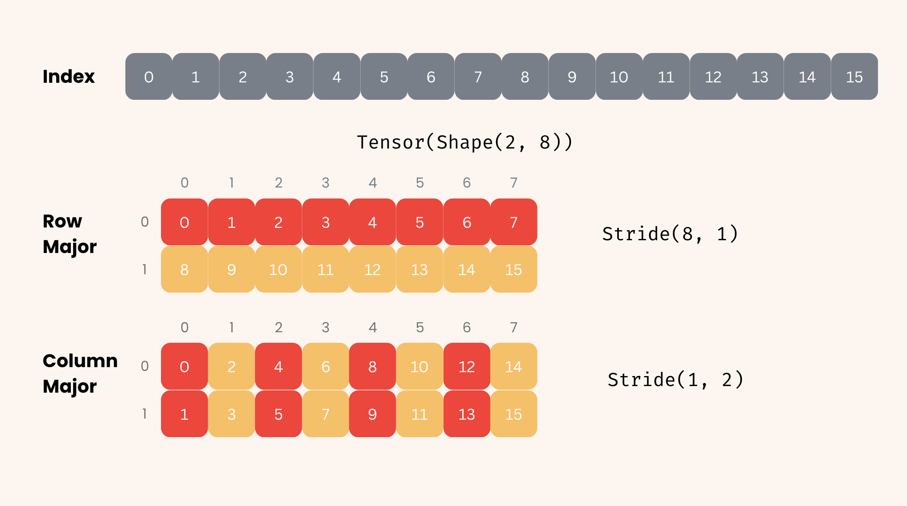
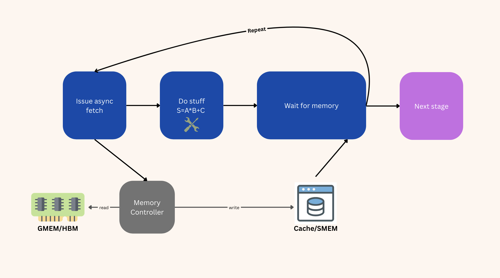
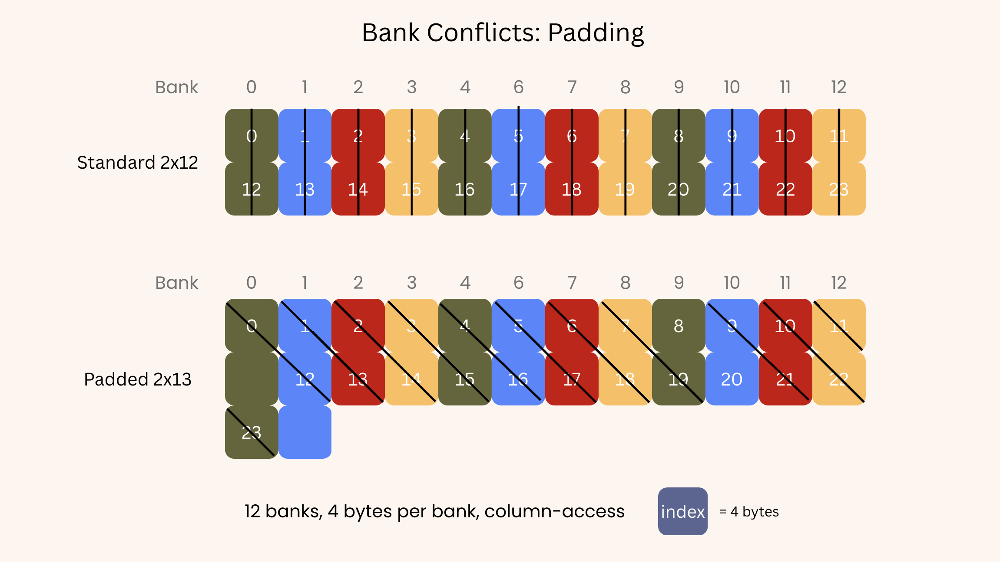
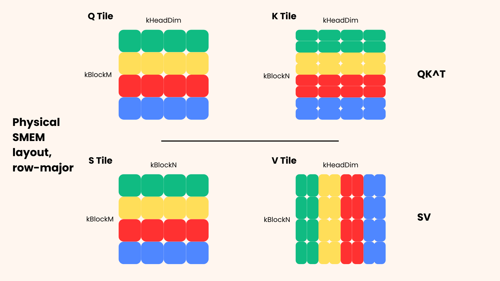
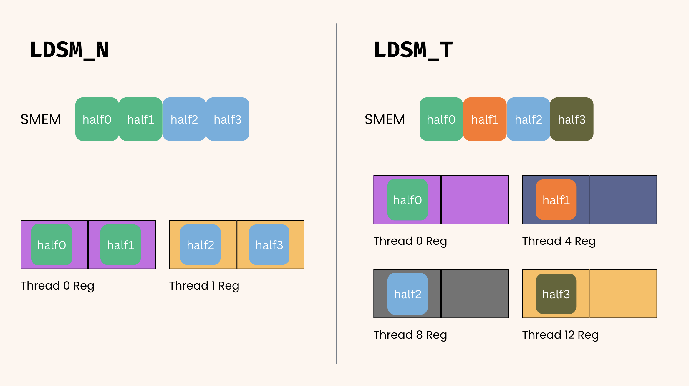
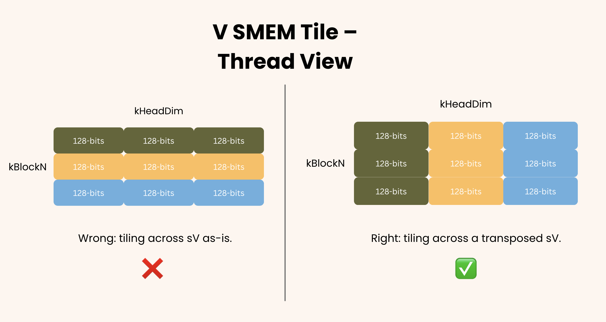
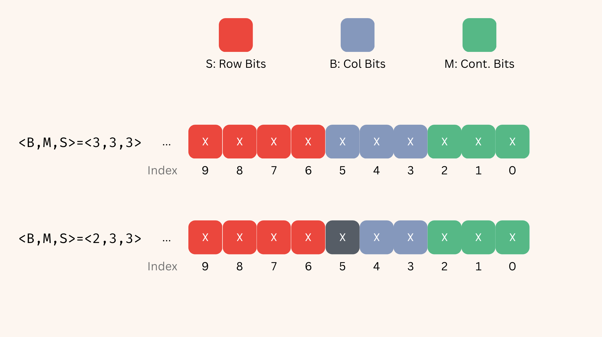
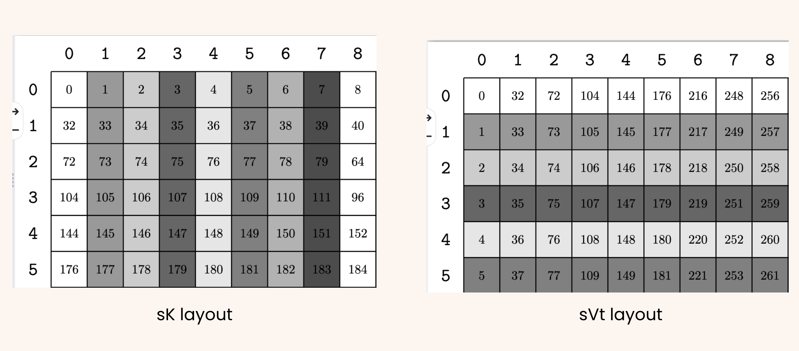
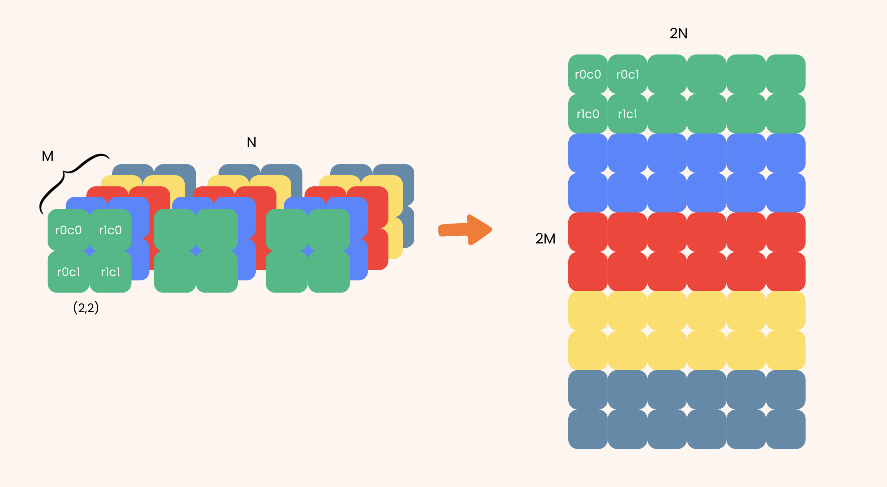

Two days. That's how long it took me to write FlashAttention-2 in Triton. I had never touched a GPU kernel before and somehow replicated a revolutionary algorithm between sips of coffee. I was looking to learn something new and somehow finished before I really got started. I knew the original source was written in CUDA, made by my Bay Area buddy who turned rocks into trillion-ade. Riding on my hubris from my recent success, I decided to translate my pièce de résistance to the native dialect of the rock-whisperers themselves.

Three hundred cups of not-Java later, I raised the blood-soaked script in triumph. I spent many moons deciphering the barren scriptures and getting led by astray stochastic parrots and silicon oracles. That month was not a party with the rocks but a bad trip I barely came down from.

Every kernel developer has to walk this path eventually. I've seen the fear in the eyes of the avoiders and the bodies along the way. This post is for whoever's next.

<hr>

We'll walk through FlashAttention-2 end-to-end on an A100, implemented in C++ CuTe: GMEM/SMEM async copies, tiled MMAs, swizzling, online softmax, and the epilogue store. We'll cover every detail in the source code, every decision, and every throwaway line that ruined an evening.

A quick note on what this blog is supposed to be -- CuTe's documentation is a reference, not a tutorial. You can read it cover to cover and walk away still not knowing CuTe; it's only really worth consulting once you're already trying to do something specific and have hit a wall. This post attempts to be that something specific, and we're going to run straight into those walls together. Most public CuTe writing covers one layer at a time: a layout here, a swizzle there, an MMA atom over there. Tying them into a real kernel is where the difficulty actually lies, and that's the gap this post is trying to fill.

The code we'll walk through is a stripped-down mirror of Tri Dao's production FA-2: same idioms, same building blocks, often the same lines, but with the causal/RoPE/dropout/KV-cache/QK-smem-sharing template branches removed. The core logic is visible instead of buried under config flags that bloat up the repo. Where it matters, our kernel reaches close to parity with the source -- on an A100, **88-105% of production FA-2's throughput** across hdim=64/128 and seq lengths up to 64K, peaking at 63% of fp16 tensor-core utilization ([full benchmark table](https://github.com/cloudui/cuda-triton#cute-flashattention-2-cuda-batch4-heads8)).

The point is not novelty -- it's just to show that our simplications do not break performance. We are rewriting one production case of many, albeit the simplest and least common one. Where our code diverges, that's usually because I found something -- an inconsistency, a copy-paste from a CuTe example that nobody really understands, a one-line simplification, a choice that turns out to be critical for a non-obvious reason. Those moments are flagged in-line throughout the post, and at least one of them ([the `sVtNoSwizzle` line](#svtnoswizzle-the-no-op-nobody-caught)) appears to be a no-op holdover that nobody in the lineage of this code understood. Make of that what you will.

What this isn't: a summary of the FA-2 paper, a Hopper/Blackwell post (the algorithm is meaningfully different on newer hardware), or a CuTe guide. This is Ampere-specific, code-level, and committed to the bit that we don't move on from a line until we fully understand why it's there.

# FlashAttention-2
If you're reading this, I'll assume you already have a solid understanding of the attention mechanism and at least the basics of the FlashAttention-2 algorithm itself. If not, I recommend reading the original flash attention paper[^1] before coming back. Or, you could just read the article as-is, because you'll probably piece it together through the struggle of trying to understand. It would be helpful to at least know the pseudocode/baseline algorithm for FA2, and even better if you've tried simulating it in PyTorch (or your framework of choice) or maybe even wrote it in Triton.

If you've never touched CUDA, you should at least try to understand its SIMT programming nature and maybe implement a few basic kernels using this thread-level view. Try to build a solid understanding of how CUDA works and of NVIDIA's GPU architecture, from threads to warps to thread blocks to SMs and beyond. I'll talk about a lot of these concepts in detail, but I still assume a basic understanding of GPU or hardware paradigms. I will be as comprehensive as I can, but it will be an uphill battle should you try to read this blog in its entirety without *some* background knowledge.

Most of this blog concerns how high-level concepts like "online softmax" or "GEMM" actually translate to production-grade code. The algorithm itself is not particularly difficult in theory, but the implementation details at the CUDA level can become a nightmare, particularly for beginners. Tri Dao originally wrote FA2 using **CuTe** (CUDA Templates), a core component within NVIDIA's CUTLASS library that abstracts away tensor layouts and thread-data mapping for high-performance GPU computing. Although this may seem nicer than doing it from scratch, there are a lot of intricacies and difficult-to-understand design choices that make reading CuTe code a nightmare. The core API is higher-level than your typical C program with for-loops and variables, but it's still about as close to bare metal as you can get without writing the ASM yourself. So even though you'll understand CUDA and FlashAttention much better, you will end up learning a lot about the hardware underneath the abstractions, and why NVIDIA built CuTe in the first place.

Since the release of Blackwell (B200), NVIDIA released CuTe's Python DSL--a Python library you can use to write the same code without all the annoying templating that comes baggaged with C++. The use case and methodology is pretty much unchanged, but debugging and templating become more palatable, and the compile times are enormously faster due to just-in-time (JIT) compilation. Moving forward, the CuTe 3.X in C++ we use today will probably be somewhat of a relic, but as a learning exercise, nothing beats the absolute struggle of working with the most annoying and explicit version of whatever you're trying to learn.

# Overview
## Design Choices
We're going to make some basic design choices to make this learning exercise simpler on the implementation side. A lot of the source code involves edge cases and optional configuration settings (RoPE, QK smem sharing, etc.) that aren't practical for learning the fundamentals of FA2 and CuTe. Our choices are as follows:

- A100: the GPU I had access to and the industry standard when FA2 was released. Newer architecture generations like Hopper (H100) and Blackwell (B200) have even more complicated algorithms (e.g. FA3, FA4) due to hardware improvements and optimizations.
- fp16: supported on A100 tensor cores, pretty basic default for most kernel ops during training
  - fp32 accumulation, reduces precision drift, more accurate FLOPs for softmax and scale
- Clean basic out-of-the-box attention mechanism: no causal masking, RoPE, dropout, etc.
- head_dim: focus on 32, 64 and 128 block sizes
- Assume the sequence length is a power of two, or more specifically, a multiple of the Q block size.
- Expect $Q, K, V$ to be contiguous along `head_dim`, i.e. all of shape `(seqlen, head_dim)` in PyTorch/JAX.

## Some Naming Conventions
If you look at the FA2 source code, you might notice they have some weird naming conventions. Some of them are standard CuTe/CUTLASS, some carry over from other things. Here are some patterns:
- Starts with k: compile-time constant, e.g. `kBlockM`, `kHeadDim`
- $M, N, K$: All of general matrix-multiply (GEMM) parameters are in this order for a $(M, K) \times (K, N)$ matrix-multiply. Hence, the shape of Q is `(kBlockM, kHeadDim)` and the shape of K, V is `(kBlockN, kHeadDim)`.
- FA2 and CuTe have a weird but relatively consistent variable naming scheme for tensors. I'm just going to give one example to give you an idea: `tSrQ`. t=thread, S=QK softmax result, r=registers, Q=query matrix. They use `s` for SMEM and `g` for GMEM. Non thread-owned tensors have no leading `t`.
  - Technically S is post-softmax of $P=QK^T$, but FA2 consistently calls the intermediate accumulator S.

## Basic Structure
First, attention itself:

$$\begin{aligned}
P &= \frac{QK^T}{\sqrt{d_h}} \\\\
S &= \text{softmax}(P) \\\\
O &= S \cdot V
\end{aligned}$$

Or in pytorch for those who haven't read a math equation in a while:
```python
P = Q@K.T/torch.sqrt(d_h)
S = torch.nn.functional.softmax(P, dim=-1)
O = S@V
```

### High-Level Details
Let's establish the specifics of the FA2 algorithm at a high level.
- Our grid is `batch/head` x `q_tile`. The batch/head dimensions are independent and can be grouped. The `q_tile` determines which tile of Q we get, and we make it the last dimension for better cache locality between thread blocks.
- Q is of shape `(kBlockM, kHeadDim)`. The main computation on any thread block revolves around the Q tile. This Q tile does not change for the duration of the thread block. We iterate over the relevant K, V tile per thread block to get an output tile. Each q tile maps to exactly the same size output tile, which is necessary as we need to manifest a whole row of P to do the softmax.
- We load each tile from global memory (GMEM) to shared memory (SMEM) for staging. When we need to do our GEMM, we load from SMEM to the register file as we loop over K and V.
- Our GMEM->SMEM copying are all async (`cp.async` on Ampere). Q technically doesn't really have to be since it stays constant throughout the thread block. Its singular GMEM load doesn't overlap that much compute but we make the optimization nonetheless.
- **Warps tile along M, not N.** This is *the* defining layout decision of the kernel. We arrange our tensor-core warps so that each warp owns entire rows of the $QK^T$ output, never a slice across the row. The reason is the online softmax: row max and row sum reductions stay *inside a warp* and resolve via warp-shuffle primitives (`__shfl_xor_sync`) -- no shared-memory staging, no `__syncthreads`. This is a huge performance decision that turns softmax from a bottleneck to nearly free. Most subsequent design choices, such as `Tiled_MMA` shape, fragment partitioning, `Softmax` struct, and the rescale loop falls out of this one decision.

### The Kernel Outline

1. Define GMEM, SMEM, register files, hardware copy/GEMM instructions, and mappings
2. Load Q tile from global memory to SMEM. This is only done once, as Q tile doesn't change.
3. Prefetch 0th K-tile.
4. Loop start: Wait for K-tile to arrive. Then, prefetch the next V-tile.
5. Issue GEMM for $P = QK^T$ tile.
6. Wait for V-tile to arrive. Then, issue next K-tile prefetch if we're not on the last iteration.
7. Compute $S=\text{softmax}(P)$ and softmax statistics and update accumulator/output tile.
8. Issue GEMM for $O = SV$ tile.
9. Loop back to 4 until row is complete.
10. Scale final output by $l=\text{expsum(P)}$
11. Copy output from SMEM back to GMEM. Ampere doesn't have any direct SMEM->GMEM instructions so we stage this copy through registers.

Only 11 steps and they're all pretty simple in concept...Let's take a deeper look into the implementation details.

# Code Layout: The Repo

All of the code in this post lives in [`@github:cloudui/cuda-triton`](https://github.com/cloudui/cuda-triton). This is the broader kernel-learning project I've been building up over the last few months as I worked through Triton, CUDA, then CuTe. The two-day Triton FA2 from the intro is in [`kernels/flash_attention_full.py`](https://github.com/cloudui/cuda-triton/blob/main/kernels/flash_attention_full.py); the intermediate WMMA CUDA FA2 (the bridge between Triton and CuTe) is in [`cuda/flash_attn/`](https://github.com/cloudui/cuda-triton/tree/main/cuda/flash_attn); the [`cute/`](https://github.com/cloudui/cuda-triton/tree/main/cute) directory is an in-progress port of this kernel to NVIDIA's new Python CuTe DSL. The post itself walks through [`cuda/flash_attn_cutlass/`](https://github.com/cloudui/cuda-triton/tree/main/cuda/flash_attn_cutlass) -- the C++ CuTe implementation. Everything has tests, benchmarks, and a top-level [`README.md`](https://github.com/cloudui/cuda-triton/blob/main/README.md) you can browse that are mostly up-to-date.

> Please refer to Tri Dao's repo as well. It contains much more edge case handling and templating that I do not touch on at all: [@github:Dao-AILab/flash-attention](https://github.com/Dao-AILab/flash-attention/tree/main).
>
> Specifically, their implementation lives in [csrc/flash_attn](https://github.com/Dao-AILab/flash-attention/tree/main/csrc/flash_attn/src)

Before we dive into the implementation, here's the file map for the kernel we're walking through. The snippets in the blog are simplified versions of what's in the repo. I'll cite specific files as we go, but the up-front overview is:

| File | What's in it |
|---|---|
| [`flash.h`](https://github.com/cloudui/cuda-triton/blob/main/cuda/flash_attn_cutlass/flash.h) | The `Flash_fwd_params` struct -- pointers, batch/head strides, sizes. The runtime side of the kernel API. |
| [`kernel_traits.cuh`](https://github.com/cloudui/cuda-triton/blob/main/cuda/flash_attn_cutlass/kernel_traits.cuh) | Compile-time type composition: SMEM Layouts with `Swizzle`, `TiledMma`, `Copy_Atom`s, and block sizes. Any `using` C++ declarations in this blog live here. |
| [`flash_fwd_kernel.h`](https://github.com/cloudui/cuda-triton/blob/main/cuda/flash_attn_cutlass/flash_fwd_kernel.h) | The kernel body: Q load, KV main loop, softmax, epilogue. This is where most of the blog's code snippets come from. |
| [`flash_fwd_launch_template.h`](https://github.com/cloudui/cuda-triton/blob/main/cuda/flash_attn_cutlass/flash_fwd_launch_template.h) | Grid/block sizing, `cudaFuncSetAttribute` for extended SMEM, kernel launch. |
| [`flash_fwd_hdim{32,64,128}_*.cu`](https://github.com/cloudui/cuda-triton/tree/main/cuda/flash_attn_cutlass) | Per-config explicit instantiations so we don't have to JIT. |
| [`flash_api.cu`](https://github.com/cloudui/cuda-triton/blob/main/cuda/flash_attn_cutlass/flash_api.cu) | PyTorch extension entry point and runtime dispatch by `head_dim`. |
| [`softmax.cuh`](https://github.com/cloudui/cuda-triton/blob/main/cuda/flash_attn_cutlass/softmax.cuh) | The `Softmax<kNRows>` struct, `softmax_rescale_o`, warp/quad reductions. |
| [`utils.cuh`](https://github.com/cloudui/cuda-triton/blob/main/cuda/flash_attn_cutlass/utils.cuh) | Layout-rewrite helpers (`convert_layout_rowcol`, `convert_layout_acc_Aregs`), `convert_type`, copy helpers. |
| [`setup.py`](https://github.com/cloudui/cuda-triton/blob/main/cuda/flash_attn_cutlass/setup.py) | Build script with the CUTLASS include path. |

**Where the blog's snippets live.** Most of the `cpp` blocks in the post are stripped-down versions of the production code:
- `kernel_traits.cuh` -- everything in [Tiled MMA](#tiled-mma), [Copy Atoms](#copy-atoms), [Swizzling FA2](#swizzling-fa2), and the V-copy SMEM layouts.
- `flash_fwd_kernel.h` -- everything in [GMEM and SMEM Tensors](#gmem-and-smem-tensors), [Q,K SMEM->Register Tiled Copy](#q-k-smem-register-tiled-copy), [MMA Loop: QK^T GEMM](#mma-loop-qkt-gemm), [The Actual Async Copy Strategy](#the-actual-async-copy-strategy), and the [Epilogue](#epilogue-output-gmem).
- `softmax.cuh` -- everything in [Online Softmax](#online-softmax).
- `utils.cuh` -- the `convert_layout_rowcol` reshape in [Fragment Reshape](#fragment-reshape).

> **Note**: I often combine the `kernel_traits` declarations and the `flash_fwd_kernel` code to keep them in one block, and I sometimes leave out function declarations that wrap certain blocks of code for brevity. If you ever become confused, all important sections link to their source at the top of their subsections for reference.

**A note on parallel scratch.** Alongside the production kernel, [`scratch/`](https://github.com/cloudui/cuda-triton/tree/main/scratch) contains the small standalone CuTe demos I wrote while losing my mind in confusion. The [scratch README](https://github.com/cloudui/cuda-triton/blob/main/scratch/README.md) maps each file to a blog section. If a concept ever feels too abstract on the page, run corresponding scratch file and stare at its output for a while. It might help. The instructions to run are in the repos READMEs.

**A note on simplification.** As called out in the [intro](#flashattention-but-the-actual-details), this blog walks through a stripped-down mirror of [Tri Dao's production FA-2](https://github.com/Dao-AILab/flash-attention/tree/main/csrc/flash_attn/src). Where the source has branches for causal masking, RoPE, KV-cache, dropout, QK SMEM sharing, etc., this kernel doesn't -- the load-bearing FA2 logic is what's left. Wherever this kernel diverges from the source in a non-trivial way, I flag it inline.

# CuTe, the Basics
As established in the intro, the CuTe docs are a reference; this section is the tutorial that doesn't exist. I won't cover all the APIs -- you can intuit 90% of them from context and the FA2 code. However, the concepts that turn your evenings into late nights will be waiting for you here. It's hard to internalize the motivations for certain CuTe features until you've encountered the problem they're meant to solve, so if a section feels abstract, skip ahead to the FA2 implementation and come back when you hit the wall it was written for. The official docs live at https://docs.nvidia.com/cutlass/latest/media/docs/cpp/cute/00_quickstart.html and are worth keeping open in another tab.

## Background
CuTe is essentially a templating engine that lets you manipulate memory using tensors, shapes, layouts, data types, and strides--quite similar to PyTorch's `torch.Tensor` object. Unfortunately, it's not nearly as friendly, but it is much more powerful. If you're familiar with any deep learning library, these concepts should click pretty quickly. It lets you declare a general "shape" once, and if you template it with fp32 vs fp16, you can just pass the relevant parameters to your kernel template.

In CuTe, you are still responsible for all the sizes. The code may be able to extract fp16 from a 128-bit load, but you'll have to figure out that 128 bits is 8 fp16 numbers. It just handles the typing on your behalf and lets you index things with some nicer code. It certainly is not "easier" and is often a nightmare to read. You'll see why pretty soon.

## Layouts, Shapes, and Strides

> **Play:** [`scratch/01_layouts.cu`](https://github.com/cloudui/cuda-triton/blob/main/scratch/01_layouts.cu)

Ah yes, back to tensor school. Shape and stride are precisely the same concepts as in PyTorch. A layout is just a composition of a shape and a stride.

```cpp
#include <cute/tensor.hpp>
// runnable just like this without GPU
auto layout = Layout<Shape<_2, _8>, Stride<_8, _1>>{};
auto layout_1 = make_layout(make_shape(Int<2>{}, Int<8>{}),
        make_stride(_8{}, _1{}));
print_layout(layout);
// this is the shape of a torch.tensor([[0]*8 for _ in range(16)]).T

// stdout
(_2,_8):(_8,_1)
      0    1    2    3    4    5    6    7
  +----+----+----+----+----+----+----+----+
0  |  0 |  1 |  2 |  3 |  4 |  5 |  6 |  7 |
  +----+----+----+----+----+----+----+----+
1  |  8 |  9 | 10 | 11 | 12 | 13 | 14 | 15 |
  +----+----+----+----+----+----+----+----+
```

A shape of (2, 8) with stride (8, 1), and CuTe provides us with a nice `print_layout` function to see the shape and indexing. Pretty simple. Both declarations are identical. So what's with the freaky underscores?

## Statically vs. Dynamically Typed
Any standard C++ integer passed into a layout, shape, or stride is dynamically typed, i.e. its value is only known at runtime (e.g. int, const int, static int). Even CUDA's `constexpr int` is treated as such by CuTe. Any time you index into a tensor, the library will compute

```cpp
A[i][j] = i*stride_row + j*stride_col
```

Each index operation is a multiply-and-add, which can be quite costly. Instead, when we can, we opt to use statics: type wrappers used by CUTLASS to allow the value to be known at compile time. It's just a C++ compiler trick that allows CuTe to compute all indexing during compilation rather than at runtime, saving the GPU from having to do so while it's running. Obviously, you can only do this if the sizes are predetermined--either definite, templated, or constant. So instead of passing in `make_stride(2, 4)`, we can pass in `make_stride(Int<2>{}, _4{})`. Functionally, these are the same, but any subsequent indexing will be done at compile time for the latter.

Layouts *do* take in dynamic integers as well. They should be used *if they are only known at runtime*.

Some syntax quirks:
```cpp
// identical, CuTe provides most power of twos by default as shorthand
Int<8>{};
_8{};

// Functions take in objects, types only use types
auto l1 = Layout<Shape<_8, _4>, Stride<_1, _4>>;
auto l2 = make_layout(make_shape(_8{}, _4{}), make_stride(_1{}, _4{}));
// type
Int<8>;
// object/struct
Int<8>{};

// can have both dynamics and statics in same layout
auto shape = make_shape(2, _4{});
auto stride = make_stride(Int<256>, 64);
```

Read more here:

## Tensors

> **Play:** [`scratch/02_tensor.cu`](https://github.com/cloudui/cuda-triton/blob/main/scratch/02_tensor.cu)

A tensor is just a pointer wrapped in a layout. The underlying data is just a pointer, usually to contiguous data, and the layout determines how we interact with it. Pretty much exactly the same as a `torch.Tensor`. The difference is that we manage the layout: we can change it to whatever we want, however we want, but we are ultimately responsible for the tensor's integrity.

```cpp
static int x[] = {1, 2, ..., 32};
auto l_row_major = make_layout(make_shape(_8{}, _4{}),
    make_stride(_4{}, _1{}));
// row-major view
auto t_row_major = make_tensor(x, l_row_major);

// column major view
auto l_col_major = make_layout(make_shape(_8{}, _4{}),
    make_stride(_1{}, _4{}));
auto t_col_major = make_tensor(x, l_col_major);

// tensor indexing: we'll cover the "why" next
// i, j = 2, 3
int n_row = t_row_major(2, 3); // 12
int n_col = t_col_major(2, 3); // 15
```

## Registers Aren't Memory
One critical clarification before we go further. CuTe gives you `Tensor` objects backed by GMEM, SMEM, *and* registers, and they all look identical in the code. You index them, you read layouts, and pass them to different functions. However, the register tensor is lying to you in a benign way: **registers are not addressable memory**. They are hardcoded slots wired into the cores. There is no "register address." The "layout" on a register tensor is purely a compiler-side mapping from a logical index (e.g. `frag(0, 1)`) to a specific physical register name (e.g. `%r17`). You should treat it like a 1-1 lookup table, not as something with strides you can do pointer arithmetic on.

This matters because:
- A register tensor "stride" is a code abstraction. A "column-major" register fragment doesn't have any physical column-major memory underneath it -- there is no memory underneath at all.
- You cannot vectorize across register layout the way you can across SMEM. Vectorization on registers depends on what values a thread holds and what hardware store/load instructions exist for that combination -- not what the layout looks like.
- A register tensor is implicitly *per-thread*. Every thread in the warp has its own copy of the same `Tensor` object referring to its own physical registers. There is no shared register pool like SMEM.

We'll lean on this every time we touch fragments. If a fragment-related thing seems impossible to reconcile with the layout you're staring at, the answer is almost always "the layout is a fiction, the registers are real." As simple as this sounds, you'll see how this can be a huge point of confusion later.

## Layout Hell: Row and Column Major

Welcome to layout hell. The layout intro from earlier probably seemed easy enough, but you'll realize that 90% of the difficulty in understanding CuTe comes from layout algebra. You might think you understand easy concepts like row-major or column-major, but I'm here to tell you that unless you've sat down and drawn these stupid squares over and over again, you probably don't.

### Row-Major: The First Layer of Hell
A standard human math matrix follows a row-major paradigm. There are M rows and N columns, and element $(i, j)$ points to the element in the `i-th` row along M and `j-th` column along N. If you've made arrays in most programming languages like C, Go, or numpy/torch, it's precisely the same. Here's a 4x6 row-major matrix, zero-indexed. We'll call this the **logical view**.

$$
\begin{bmatrix}
a_{00} & a_{01} & a_{02} & a_{03} & a_{04} & a_{05} \\\\
a_{10} & a_{11} & a_{12} & a_{13} & a_{14} & a_{15} \\\\
a_{20} & a_{21} & a_{22} & a_{23} & a_{24} & a_{25} \\\\
a_{30} & a_{31} & a_{32} & a_{33} & a_{34} & a_{35}
\end{bmatrix}
$$

> Math majors might find this zero-indexing sacrilegious, but I'd imagine they're not reading this blog anyway.

In the context of programming languages and memory, row-major also means that the items in each row are contiguous in memory--i.e. contiguous *along* the columns. This means $a_{i,j}$ is NEXT TO $a_{i,j+1}$ in memory. For a 2D row-major tensor (M, N), the N-stride is the *innermost* dimension--the one where elements are adjacent in memory. The N-stride is always $1$. The M-stride is simply the number of columns N; to get to the next row, you offset by the N adjacent elements in the current row.

```cpp
// for row-major of shape 2,8
auto shape = Shape<_2, _8>{};
// the N-stride is always 1.
// With 8 columns per row, the m-stride is 8
auto row_major_stride = Stride<_8, _1>{};
```

Extrapolating to an N-D row-major tensor of shape $(d_{n-1}, d_{n-2}, \dots, d_0)$: the 0th dim stride is 1, the 1st dim stride is $d_{0}$. For each subsequent dimension, we have to step by the number of elements in the entire block inside--the second dim has $d_{1}\cdot d_{0}$ values for each of its "columns." Therefore:

$$\text{stride}(x) = \Pi_{i=0}^{x-1} d_i$$

```cpp
auto shape = Shape<3, 5, 7, 9, 2>{};
auto row_major_stride = Stride<630, 126, 18, 2, 1>{};
```

Each stride is just the size of the next dimension. Easy enough.

### Column-Major: One Bigger Step into the Pit

Column-major paradigms are far less common (e.g. Fortran, MATLAB) and assume that columns are adjacent in memory. Before things become more confusing, let's compare PyTorch and MATLAB using a 2x4 example tensor:

```python
# python
A = torch.tensor([[9, 2, 4, 6], [-1, 3, 7, 0]])
```

```matlab
% MATLAB
A = [9, 2, 4, 6; -1, 3, 7, 0]
```

When you create `A` in torch, it allocates an 8-int memory chunk that stores the values in the order we gave them: `[9,2,4,6,-1,3,7,0]`. On the other hand, MATLAB allocates the same 8-int memory chunk but stores the values along the columns instead: `[9,-1,2,3,4,7,6,0]`. When we index `(i, j)` into torch and MATLAB (bless their souls for being 1-indexed), we obtain the same value:

```matlab
% some MATLAB version that's 0-indexed, technically A(2, 3)
A(1, 2) = 7
```

```python
A[1, 2] = 7
```

But now we realize the strides *cannot* be the same. We know our row-major stride must be `Stride<4, 1>`. Following our formula:

```python
# i*stride_row + j*stride_col
offset = 1 * 4 + 2 * 1 = 6

# torch: 6th index of [9,2,4,6,-1,3,7,0] is 7
# matlab: 6th index of [9,-1,2,3,4,7,6,0] is 6
```

The stride cannot be the same because the underlying memory is not the same. In torch, values in each *row* are adjacent (9 is next to 2), but in MATLAB, values in each *column* are adjacent in memory (9 is next to -1). So in our column-major view, to get to the next row we just step along the column, which we established is contiguous. Therefore, the innermost stride is now the *leftmost* index. To get to the next column, we step by the number of values in a full column, which is the size of the rows. Let's redo our example from [above](#row-major-the-first-layer-of-hell):

```cpp
auto shape = Shape<_2, _8>{};
auto row_major_stride = Stride<_8, _1>{};
// new innnermost stride is 1, full column is size _2
auto col_major_stride = Stride<_1, _2>{};

//////////////////////////////////////////////
auto shape = Shape<3, 5, 7, 9, 2>{};
auto row_major_stride = Stride<630, 126, 18, 2, 1>{};
auto col_major_stride = Stride<1, 3, 15, 105, 945>{};
```

> **Tip**: Telling row-major vs col-major apart is easy. Any matrix with leftmost stride 1 (e.g. `(1, 8)`) is column-major and any matrix with rightmost stride 1 (e.g. `(8, 1)`) is row-major.

## Indexing Hell: In What Context?

When we toggle between row- and column-major, we expect the indices to have the same meaning. For some 2D matrix `A[i][j]`, we want the ith index to refer to the ith row and the jth index to refer to the jth column. When we iterate through the row-major or col-major version of A, we should get the exact same numbers because `A_row_major[i][j] == A_col_major[i][j]`.

> **Note**: Although they return the same numbers, depending on the order of iteration, one way will be more inefficient as it jumps from address to address instead of iterating contiguously. For example, `for i...for j` is great for row-major but potentially a cache disaster for col-major. This only applies to tensors stored in memory. In the register file, indexing is purely an abstraction.

So what do I mean by "in what context?" So far, we've been aiming to create an equivalent representation of A via a row- or column-major format. But for CUDA kernels, there is no equivalence--we are given some tensors in a predefined row- or column-major format. FA2 expects Q, K, V to be contiguous *along* `head_dim`, i.e. `(seqlen, head_dim)`. This means they are *row-major* with respect to each *token*--each token is one row in the matrix. In this case, there is only one valid way to load the data--the row-major way, since the underlying data is *already fixed*.

### Interpreting Fixed Data
In our new view, we are reading some predefined data like we did in the [tensor section](#tensors), so now let's make some sense of it. Let's take a look at row-major vs. col-major indexing for the shape (2, 8).

> You can leverage the `print_layout()` function from [earlier](#layouts-shapes-and-strides) to view this in your shell.



In this graphic, we index into the tensors via `(i, j)` labels, where the number inside the square refers to the *original index in the underlying memory* (it is not the linear ordering). In the row-major view, element 1 is in the same row as element 0. In the column-major view, element 1 is in the same column as element 0. When it comes to indexing, it's often in your best interest to separate the ideas of contiguity, indexing, and reality. It's often best to think in terms of the strides and offsets for your expected memory layout, since applying a row-major layout to column-major memory (and vice versa) no longer makes any physical sense. We'll really have to grapple with this later.

> For example, if you read column-major memory using a row-major format, what does a "column" even mean? You might drive yourself mad trying to figure out what a "row" and "column" mean because they mean different things with respect to different memory views, tensors, and layouts.

### CuTe Default is Column-Major
By default, CuTe resolves to column-major layouts. This was a choice NVIDIA made for whatever reason, and you should just accept it. If you create a layout with a shape but no stride, it will default to the column-major stride. When dealing with your data layout, always specify the stride for clarity. CuTe provides two primitives that make this slightly easier: `GenRowMajor{}` and `GenColMajor{}`.

```cpp
// Stride(8, 1)
auto layout = make_layout(Shape<_4, _8>{}, GenRowMajor{});
// Stride(1, 4)
auto layout1 = make_layout(Shape<_4, _8>{}, GenColMajor{});
```

Even if you specify all your layouts properly, there are some internal workings where you might see column-major layouts pop up (e.g. tiling, Atoms, etc.). You should specify strides as much as possible to avoid confusing yourself when you start to get weird errors.

> **Note**: The column-major default has **nothing to do with your underlying data**. It's just a consistent indexing pattern CuTe chose.

For FA2, Q, K, and V are all **row-major** along the sequence (`(seq_len, head_dim)`). This means each row represents a token. Most consumer applications and libraries like PyTorch or JAX are row-major by default, so this is the most natural configuration for consistency. Furthermore, Ampere tensor ops seem to be oriented around row-major instructions, so it's also a choice for simplicity.

### Linear Indexing: Colex Indexing
With our (2,8) shape layout from earlier, CuTe allows us to index it with just one index-value, essentially treating `(2, 3)` as a flat 6-element array--we refer to this as **linear indexing**. A programming language like C allows you to do the same:

```cpp
int arr[2][3] = {
  {9, 2, -1},
  {3, 0, 6}
};
int val = arr[4]; // val = 0
```

However, the way C and CuTe handle this internally is very different. C just treats the index `[4]` as a memory offset; using its row-major memory layout, the 4th index grabs the 4th offset in memory, which lands in the second row and second element. In this system, the value at `(1, 0)` is "further along" than `(0, 1)`--i.e. as you move from left to right and top to bottom, you increase in the order of access. We call this *lexicographical order*. In lexicographical ordering, the index `arr[4]` on shape (2,3) maps to `arr[1][1]`.

> In English, we read from left to right, top to bottom--that's where this ordering gets its name. You can think of it as simply row-major indexing. Since C just works with offsets rather than linearly mapping index `[4]` to `[1][1]`, we typically refer to it as **flat indexing**.

On the other hand, CuTe uses **colexicographical indexing** (i.e. colex indexing), which is the opposite--order increases first from top to bottom, and then left to right. In this transposed view, index `(1, 0)` is adjacent to `(0, 0)` and is "before" the index `(0, 1)`. As before, it's pretty much just column-major order. It's CuTe's way of consistently enforcing 1D->N-dimensional indexing across layout algebra.

The difference in CuTe is it is intentional about this order, unlike C. In C, the order is a side effect of the memory offset. In CuTe, the compiler actually performs the conversion between 1D and 2D. For example, if we index tensor `t(idx)` for a tensor of shape `(M, N)`, the index split becomes:

```python
# Example, shape (2, 3), idx 4
# [[9, 2, -1],[3, 0, 6]]

# intentional colex indexing
i = idx % M # 4 % 2 = 0
j = idx / M # 4 / 2 = 2
# a[0][2] = -1

# typical lex indexing
# C just uses memory offset, which is functionally
# the same for its row-major mem layout
i = idx % N # 4 % 3 = 1
j = idx / N # 4 / 3 = 1
# a[1][1] = 0
```

The default colex indexing goes hand-in-hand with the column-major layout standard. It's for consistency and has no practical meaning outside of this. But it does mean that if you're working with row-major layouts, *you still have to use colex indexing if you're indexing linearly into a multidimensional tensor*. Indexing it like you would in C or torch will simply produce wrong results, and you might sit there twiddling your thumbs wondering why your code isn't working. Don't worry, it happens to the best of us.

```cpp
// linear printing colex example: it's weird

int *data = {1, 2, 3, 4, 5, 6, 7, 8, 9, 10, 11, 12, 13, 14, 15, 16};
auto layout = Layout<Shape<_2, _8>, Stride<_8, _1>>{};
auto tensor = make_tensor(x, layout);

for (int i = 0; i < 16; ++i) {
  print(tensor(i));
  printf(", ");
}
// output: 1, 9, 2, 10, 3, 11, 4, 12, 5, 13, 6, 14, 7, 15, 8, 16
```

## Composed/Hierarchical Layouts
Where you might run into colex indexing issues is if you're dealing with **hierarchical layouts**. CuTe lets us nest layouts for more granular layout interpretations that wouldn't be possible with non-nested layouts. For example, we can easily reinterpret a flat tensor of shape `(8, )` as `(2, 4)` or `(4, 2)` in CuTe, but let's take this a step further:

```cpp

// (_8, _4): (_1, _8)
auto l1 = make_layout(make_shape(_8{}, _4{}));
// ((_2, _4), _4):((_1, _2), _8)
auto l2 = make_layout(Shape<Shape<_2, _4>, _4>{});

// Toy example
int *a = {0, ..., 31};
// [0, 1, 2, 3, ..., 7]
// [8, 9, 10, 11, ..., 15]
// [16, 17, 18, 19, ..., 23]
// [24, 25, 26, 27, ..., 31]
Tensor t1 = make_tensor(a, l1);
Tensor t2 = make_tensor(a, l2);

int v1 = t1(3, 2); // 19
int v2 = t2(3, 2); // 19
int v3 = t2(make_coord(1, 1), 2); // 19
```

In `l2`, we iterate through the inner (left) shape in groups of 2, column-major by default. In this case, the composed layout is purely decorative. We can still address a tensor with layout `l1` or `l2` with two coordinates `(i, j)`, and CuTe maps the translation underneath. However, we are now also grouping the inner dimension as four groups of two. We'll see nested layouts become a powerful tool during the [MMA tiling reshape](#fragment-reshape), where we cannot simply flatten a 3D tensor into a non-nested 2D tensor for our specific access pattern.

# The Beginning: CuTe, Copy, then Cry
Okay, with the CuTe vomit over, let's get started with FA2!

Much of the learning path from here is nonlinear -- some things will click immediately and somethings will only make sense in hindsight. You have to be comfortable accepting certain things early before the full understanding comes raging back once you've hit a snag. I'll tackle some concepts up front and gloss over some others, but these choices are intentional -- you won't always have the full context up-front when you are trying to do something. I spent hours thinking I understood something only to realize I didn't understand a week later, and sometimes, it would take five of these I understand/I definitely don't understand cycles before everything fell into place. Let's dive in before you have time to reconsider 😇.

## A100 (Ampere) Specs
The entire point of FA2 or even GPU optimization in general is to maximize compute by overlapping it with memory loads. Here are the memory and card specs of A100 GPU (Ampere):

| Storage Level | Latency (Clock Cycles) | Magnitude Slower than Registers |
| :--- | :--- | :--- |
| **Registers** | ~1 cycle | — |
| **Shared Memory (SMEM) / L1** | ~20–30 cycles | ~25x |
| **L2 Cache** | ~200 cycles | ~200x |
| **HBM2e (Main Memory)** | ~400–600+ cycles | **~500x+** |

| Feature | Specification |
| :--- | :--- |
| **Total SMs** | 108 (SXM4) / 128 (Full Die) |
| **CUDA Cores per SM** | 64 (FP32) |
| **Max Threads per SM** | 2048 |
| **Max Warps per SM** | 64 |
| **Max Blocks per SM** | 32 |
| **Registers per SM** | 65,536 (32-bit) |
| **Max Registers per Thread** | 255 |
| **Max Shared Memory per SM** | 164 KB |
| **Max Shared Memory per Block** | 163 KB |
| **L1 Cache (Combined with SMEM)** | 192 KB total pool per SM |
| **L2 Cache** | 40 MB or 80 MB |

## GMEM->SMEM (Async Copying)
A rule of thumb is to have approximately **150-200 FLOPs per byte loaded from HBM**. Although this particular number is quite arbitrary depending on your kernel or GPU, the universal theme is to overlap loads/stores with your actual compute.

Since NVIDIA introduced the Ampere architecture, we can take advantage of asynchronous copying from GMEM->SMEM to help us overlap our tile fetches with compute. Before, you might have had to wait hundreds or thousands of cycles for your bytes to hit SMEM; on Ampere, we can issue some loads and immediately begin doing useful work while the memory loads in the background.

The async design pattern is quite simple:



We'll cover how we apply this pattern to Q, K, V later on. There are some small CuTe details to be aware of, but the overall idea is exactly the same.

Although you might think we can kind of async set-and-forget, there are two important concepts we need to be aware of that could potentially crush our performance if we're not careful:

### Vectorized and Coalesced Loads

These two concepts are **vectorized loads** and **coalesced loads**. They are very similar in meaning and are often a point of confusion, so let's break them down here:

- **Vectorized Loads**: A *thread* loading as much data as it can in one *instruction*. Since we're working with fp16, we could naively load one 16-bit number at a time. However, all NVIDIA chips today support a 128-bit load instruction *per-thread*: `LDG.E.128` (and its SMEM counterpart `LDS.E.128`), which can load 8 fp16 numbers in one go. Memory transactions are funny in that a 16-bit load and a 128-bit load take the same amount of time, so if we load 16 bits at a time, we immediately slash our performance by 8x. So instead, when we can, we load 128 bits at a time and decompose it into 8 halfs (1 fp16 = 1 half).
- **Coalesced Loads**: A *group of threads* loading as much data as it can in one *transaction*. GPUs never fetch from HBM just one byte at a time; they can fetch a whole 32, 64, or 128-byte chunk in one go (i.e. the **transaction size**). When this thread group loads a contiguous 128-byte chunk, the memory controller clears the entire block of data at once. Furthermore, this block fully saturates an L2 cache line, making any subsequent cache accesses more efficient. If all 32 threads in the warp are each fetching some random chunk scattered across memory, then the memory controller has to issue 32 separate transactions, immediately crushing your performance, hopes, and dreams. Note: coalescing is about the maximum bandwidth of the memory controller itself--it has no relation to instructions or how many threads are participating in a load or store. It simply means whether or not we ask for a 128-byte chunk at once. You might notice that 32 threads and 128-bit *instruction* loads is 512 bytes, four times the bandwidth. We'll cover how this works in the next section.

> **Tip**: Here's how you can figure out which one fits your scenario:
>
> | Question / Scenario | -- |
> | :--- | :--- |
> | Can each thread load 128-bits at one time with my data layout? | **Vectorization** |
> | Can I load 128 bytes from HBM at a time? | **Coalescing** |


Both vectorized and coalesced loads expect the data to be contiguous (e.g. 128 bits and 128 bytes, respectively). If your data is scattered, you might not be able to leverage the full benefit of vectorization and coalescing. However, it's possible that loading 64 bytes or 64 bits at a time could be good enough for your purpose. If memory becomes a bottleneck, you can always consider reformatting the data or loading out of order, as long as your downstream compute handles the data correctly.

> **Note: Memory coalescing only applies to GMEM/HBM**, while vectorization applies to both GMEM and SMEM, although in slightly different ways. In both cases, we're reducing instruction pressure and increasing our instruction-level parallelism (ILP). We'll cover more details about bank conflicts and swizzling in our [SMEM->register section](#smem-registers) later.

> **Note**: Don't get confused between *vectorized loads* and *compute vectorization*. Although they have the same name, vectorized loads are about memory throughput while vectorized compute is about parallel computation. For example, numpy compute vectorization leverages SIMD CPU instructions to add matrices in one clock cycle. A GPU thread bundles a bunch of data into one load instruction to leverage higher memory bandwidth. Similar concept, different meanings depending on context.

### Copy Atoms
Every NVIDIA GPU has a boatload of copy instructions--you can fetch 32 bytes, 64 bytes, one byte, synchronously or asynchronously. CuTe neatly packages these copy instructions into a core piece called an `Atom`. These "atomic" pieces are the core hardware instructions that you eventually pass to the `copy` function so it knows which instruction to use to copy your data.

Ampere has a specific asynchronous `Copy_Atom` with the architecture name `SM_80`: `SM80_CP_ASYNC_CACHEGLOBAL<bit_size>` or `SM80_CP_ASYNC_CACHEALWAYS<bit_size>`. The `cache_global` and `cache_always` map to the PTX[^2] instructions `ld.global.cg.u32` and `ld.global.ca.u32`; `cache_global` loads straight from L2 to the destination, skipping over L1 cache, while `cache_always` also loads the data into L1. Most kernels use `cache_always` by default because of improved spatial and temporal locality across threads. But in FA2, we never reference Q, K, or V again once they're loaded into SMEM--therefore, we can bypass the L1 cache, which is slightly faster. It also reduces thrashing at the L1 level and allows more important data to stay in-cache. In practice, this is a micro-optimization and not that important.

The `bit_size` supports up to 128-bit loads. **Bits**, not bytes, since these atoms are viewed through the **thread perspective**. Hence, our atom loads a total of $128 \text{ bits} \cdot 32 / 8 = 512 \text{ bytes}$. This means each 128-bit fetch across the 32 threads in a warp takes $512/128 = 4$ memory transactions in four "phases" (more on this later). For our purposes, we want that full coalesced 128-bit power using `cache_global`. We can define the `Copy_Atom` with the following code:

```cpp
#include <cute/atom/copy_atom.hpp>
using GmemCopyAtom = Copy_Atom<SM80_CP_ASYNC_CACHEGLOBAL<cute::uint128_t>,
    cute::half_t>;
```
We use the cute namespace types for robustness, and our source data type is fp16 (`cute::half_t`). Each thread therefore loads $128/16=8$ halfs.

#### How do 32 threads load 128 bits each?

We have 32 threads in each warp loading 32 128-bit chunks in tandem, which is 512 total bytes, or 128 words[^3], or 4x32 bank accesses (see the [bank conflicts section](#bank-conflicts-and-smem-layout) below). The GPU cannot physically load 512 bytes in one go, so the async proxy issues the load/store in **four phases**, 8 threads at a time (called a quarter-warp).[^4] In phase 1, threads 0-7 load the first 8 128-bit chunks. In phase 2, threads 8-15 do the next 8, and so on. In each phase, each quarter warp issues a contiguous 8x128-bit (128-byte) coalesced copy, which targets all 32 banks without any conflicts. So by design, our async copies perfectly copy our data using the full HBM bandwidth.

### Tiled Copy
Even though each thread copies 128 bits, each thread block is usually working with a variable number of threads/warps. Given the 4 tensor cores per SM, 4 warps per block is typically a good choice for FA2. This means we have to determine how to copy each Q, K, V tile using these 128-bit async copies.

CuTe uses `Tiled_Copy`, which "tiles" the memory you are trying to copy (in this case, GMEM) in a structured way over your entire memory region. It outlines the "tiling strategy" that your threads will follow.

> Note that the "tiling" here is not the same as the Q, K, V tile. It's tiling the memory layout, while our Q, K, V are tiles of our algorithm. Unfortunately in our case, it's tiling...our tiles.

```cpp
// layouts are not filled in yet
using MyTiledCopy = decltype(make_tiled_copy(
    Copy_Atom<Atom, T>{}, // Atom
    Layout<Shape<>, Stride<>>{}, // Thread layout (who)
    Layout<Shape<>>{} // Value layout (what per thread)
));
```

The tiled copy function `make_tiled_copy` takes in the atom, the thread layout, and the values given to each thread. Our `Copy_Atom` is a 128-bit wide chunk of 8 fp16 numbers, which is 8 values per thread. Given our row-major inputs, the value layout has to be `Layout<Shape<_1, _8>>{}`. The other layout is the *thread layout*, i.e. how you want to distribute your threads per tile. Assuming `kNThreads=128`, we have to give each thread a 128-bit chunk. The stride determines which 128-thread tile of memory comes next. The easiest strategy is to simply spread the tiles across the columns and then the rows, essentially filling from the top (see image below).

> This gets slightly tricky here because of bank conflict optimization. Dao uses the same tiled copy setup for Q, K, V despite them having slightly different dimensions. We'll revisit this when we talk about bank conflicts, but for now, assume our SMEM block is of shape `(_, kBlockKSmem)`, where `kBlockKSmem` is the column width for all 3 tensors. We can compute the layout as:

```cpp
// pseudocode; assume static constexpr ints
int halfs_per_128bit_load = sizeof(uint128_t) / sizeof(half_t);
int threads_per_row = kBlockKSmem / halfs_per_128bit_load;
int num_thread_rows = kNThreads / threads_per_row;
int num_thread_cols = threads_per_row;
```

For `kBlockKSmem=64`, each row is 64 halfs or 8 128-bit loads, so 8 threads per row. With 128 threads, we cover $128/8=16$ rows per tile. The stride is simple: the column stride should move by static `_1{}` for the next 128-bit load. The row stride should move by the entire `num_thread_cols` chunk to reach the next row. Hence, our `Tiled_Copy` is:

```cpp
// Since these are constexpr, we use statics!
using TiledCopyQKV = decltype(make_tiled_copy(
    GmemCopyAtom{},
    Layout<Shape<Int<num_thread_rows>, Int<num_thread_cols>>,
            Stride<num_thread_cols, _1>>{},
    Layout<Shape<_1, _8>>{}
));
```


The way to think about this is that this `Tiled_Copy` is the tiling strategy for your source memory (GMEM in this case). All 128 threads load the first 128 contiguous 128-bit chunks, finish, then move onto the next 128 chunks until the entire GMEM section is copied. Even though this example is for a GMEM source, `Tiled_Copy` works between GMEM, SMEM, and per-thread registers. It doesn't know what anything is--it's just the floorplan, and we're responsible for providing the expected input.

### Tiled Copy, Source and Destination
Our `Tiled_Copy` determines how our source is tiled, but we now have to configure the destination. The destination layout is determined by the destination tensor itself. The `Tiled_Copy` simply places each thread's data in the "same place" it was loaded from. The destination layout can essentially be anything as long as it is compatible with the `Copy_Atom`. Since we have 128-bit loads/stores, the destination tensor layout must accept aligned 8-half blocks (more on this in swizzling). For now, we can ignore what the output tensor is. `Tiled_Copy` has a specific pattern for copying between a source and a destination: a thread view, a partitioning step, and finally the copy.

```cpp
// defining tiled copy
typename Traits::GmemTiledCopyQKV gmem_tiled_copy_QKV;
// what thread are we? let's get the slice of the data
// that belongs to thread tid
auto gmem_thr_copy_QKV = gmem_tiled_copy_QKV.get_thread_slice(tid);
// partition thread Q gmem SOURCE tensor
Tensor tQgQ = gmem_thr_copy_QKV.partition_S(gQ);
// partition thread Q smem DEST tensor
Tensor tQsQ = gmem_thr_copy_QKV.partition_D(sQ);
// copy op: (tiled_copy, source, dest)
cute::copy(gmem_tiled_copy_QKV, tQgQ, tQsQ);
```

In this example, assume `gQ` and `sQ` are correctly-defined GMEM and SMEM tensors. We first define our tiled copy blueprint. Then we get the thread slice of this tiled copy, which translates our global tiled copy object into the values this thread actually fetches. Then we partition the source and the destination, laying the thread blueprint on the source and destination tensors. Finally, we issue the copy operation.

> Example: Thread 0 takes the 0th (first) 128 bits, halfs 0-7. Then it takes the 128th 128-bit chunk, then the 256th, 384th, until the source is tiled. The intermediate thread tensor has shape `((1, 8), M, N)` where M, N represent the tile and 1, 8 is the value layout. It may not be exactly this, but it doesn't really matter as we don't usually have to work with the intermediate partition.

### GMEM and SMEM Tensors
Saved the easiest step for last. Let's define the `gX` and `sX` tensors for GMEM and SMEM.

CuTe provides a convenient API to retrieve the proper tensor tile from the source. It has the unfortunate side effect of being somewhat convoluted and ugly, but hey, it works.

```cpp
// Assume we have a params struct that contains our source parameters
// like pointers, dims, and strides

// gmem
Tensor mQ = make_tensor(
    make_gmem_ptr(reinterpret_cast<const cute::half_t *>(params.q_ptr) +
        batch_idx * params.q_batch_stride +
        head_idx * params.q_head_stride),
    make_shape(params.seqlen_q, params.head_dim),
    make_stride(params.q_row_stride, _1{}));
Tensor gQ = local_tile(mQ, make_shape(Int<kBlockM>{}, Int<kHeadDim>{}),
                        make_coord(m_block, 0));
// smem
Tensor sQ = make_tensor(reinterpret_cast<cute::half_t *>(smem),
    SmemLayoutQ{});
Tensor sK =
    make_tensor(sQ.data() + size(sQ), SmemLayoutKV{});
```

This looks awful, but the mechanism is quite simple. Each thread block operates on a unique block of Q for some unique batch/head. We compute the batch and head index and offset into the Q tensor by the batch and head strides, arriving at that particular batch/head's Q tensor. CuTe has primitives like `make_gmem_ptr` and `make_smem_ptr` to tell the underlying engine to issue the correct PTX instructions for copying between GMEM, SMEM, and the register file. We provide it a layout so we can easily call `local_tile(tensor, tile_layout, coord)` to retrieve the tile of interest, in this case the `m`-th block of Q. It takes in a `Coord` which is the `(i, j)`-th tile according to `tile_layout`.

We could just as easily have made the `mQ` pointer point to the start of the batch/head dimension and local-tiled into BH as well as `m_block`. The output PTX would be exactly the same--it's simply a matter of personal preference. The K and V GMEM tensors iterate over all blocks along the seqlen dimension, so their coord uses an underscore `_` to signal this to the compiler.

```cpp
Tensor gK = local_tile(mK, make_shape(Int<kBlockN>{}, Int<kHeadDim>{}),
    make_coord(_, 0));
```

## SMEM->Registers

> **Read this first: thread view vs. tile view.** From here on out, we're working with tensor-core fragments, and CuTe will start lying to you in a productive way. When CuTe shows you a fragment with shape `((2,2), MMA_M, MMA_N)`, that is **not the shape of a tile** — it's the shape of *one thread's slice of every tile*. The `(2,2)` is the 4 elements that thread holds in a single 16x8 atom; the `MMA_M, MMA_N` count how many atoms tile across the full block. Every operation on a fragment tensor — every `for r in size<0>(frag)`, every `frag(i, j)` — is implicitly executed by all 32 threads of a warp in lock-step, each on its own values. CuTe abstractions (`partition_fragment`, `cute::gemm`, `cute::copy`) make this look like normal tensor code, which is the exact source of confusion: the only place the thread view is *visible* in code is the ~5 lines around `get_thread_slice(tid)`. Whenever a layout stops making sense, ask "is this a tile shape or a thread-slice shape?" — it's almost always the second.

We'll issue a second `Tiled_Copy` to copy from SMEM to the registers. The copy pattern is mostly the same, but instead of simply transferring memory from SMEM to the registers, we must format the SMEM and registers for the tensor core matrix multiply-add (MMA) instructions.

Our first MMA GEMM is between Q and K. Since they are both in row-major format, the copy works quite easily without much overhead. We'll get into the tensor core instructions shortly, but for now, all we need to know is that Ampere natively supports 16x8x16 (MxNxK) MMAs out of the box. Each tensor op has shape $(16\times 16) \times (16\times 8) = (16\times 8)$.

$$C = A\times B + C$$

Each warp does one MMA in one tensor core cycle, and the warps synchronize with one another to produce the final accumulated output. Each MMA is mapped to one warp, where A, B, and C are stored in **fragments** across all 32 threads in registers. NVIDIA selects the register mapping for each architecture, which is conveniently defined in CuTe via the `MMA_Atom` (more on this later). For now, all we know is that each thread must hold its share of A, B, and C (Q, K, accumulator) via the `Tiled_Copy`.

```cpp
using SmemCopyAtom = Copy_Atom<SM75_U32x4_LDSM_N, cute::half_t>;
```

Our copy atom this time leverages the `LDSM_N` SASS[^2] instruction: Load from Shared Memory with the "N"ormal row-major/no-transpose layout. It moves 4x32-bit words = 128 bits per instruction, similar to our async load from before. However, this instruction is quite special--it is *specifically made for tensor core MMAs*. As we'll see in the next section, the tensor cores require specific threads to have specific pieces of each fragment. Although each thread issues a 128-bit transfer, it *does not necessarily end up with that data*. Instead, `LDSM` performs a specialized hardware warp shuffle so that each thread ends up with the correct data.

This instruction is also commonly referred to by its PTX counterpart, `ldmatrix`:

```sass
ldmatrix.sync.aligned.shape.num{.trans}{.ss}.type r, [p];

.shape  = {.m8n8};
.num    = {.x1, .x2, .x4};
.ss     = {.shared{::cta}};
.type   = {.b16};
```

Our specific copy atom maps to the `ldmatrix...x4` variant, which loads an entire $4\times(8\times 8)=16\times 16$ fragment in one go. Just like our GMEM async copy, the `ldmatrix` is issued in four phases of 128-byte 8-threaded loads, 512 bytes in total. However, unlike our GMEM copy, the `LDSM` tiled copy has to be aware of the downstream MMA thread layout, which differs between fragments A, B, and C.

> We'll cover more `LDSM` details later when we use `LDSM_T` for the [V-copy](#ldsm-copy-atom).

### Tiled MMA

> **Source:** [`kernel_traits.cuh`](https://github.com/cloudui/cuda-triton/blob/main/cuda/flash_attn_cutlass/kernel_traits.cuh)
>
> **Play:** [`scratch/03_mma.cu`](https://github.com/cloudui/cuda-triton/blob/main/scratch/03_mma.cu) (single MMA, no SMEM), [`scratch/04_mma.cu`](https://github.com/cloudui/cuda-triton/blob/main/scratch/04_mma.cu) (full pipeline, verified)

Getting deja vu yet? This time, we define the tiling for the MMA GEMM. We define the following tiled MMA atom:

```cpp
// TN means transposed-normal for AxB. It's a historical convention
// that you can search up.
// Practically, it means both A and B are row-major across M, N
// i.e. K-dim is contiguous
// (M, K), (N, K)
using TiledMmaAtom = MMA_Atom<SM80_16x8x16_F32F16F16F32_TN>
```

You might wonder why 16x8x16 and not 16x16x16. Again, it's a hardware design choice made by NVIDIA engineers. There are a few reasons:
1. Less register pressure: B and C fragments are both 16x8, reducing the total register footprint compared to a 16x16 per warp.
2. More register re-use. Each A tile is used twice per B and C tile, reducing the number of simultaneous register reads.
3. Best "area of efficiency". NVIDIA certainly tested many combos and found this size to be optimal.

This is by no means an exhaustive list, and tensor core shapes change generation-to-generation for a multitude of reasons. It's best to just use it as-is instead of wondering all day why it is the way it is. The TiledMMA atom conveniently defines which threads get which chunks and which registers are used for the MMA, which we can see below:


With this info, let's define the full `Tiled_MMA`:

```cpp
using TiledMma = TiledMMA<MMA_Atom<SM80_16x8x16_F32F16F16F32_TN>,
    Layout<Shape<Int<kNWarps>, _1, _1>>,
    Tile<Int<16 * kNWarps>, _16, _16>>;
```


We chose 128 threads (4 warps) because each SM has 4 resident tensor cores--a sensible choice to maximize MMA throughput. For the layout, we tile across the M-dimension (taking a slice from the left column of Q) and move across the K dimension. Each tile is `kNWarps` stacked on top of each other; for a 16x8x16 MMA atom, our tile shape becomes $(M, N, K) = (16\cdot\text{kNWarps}, 16, 16)$.

We flagged this M-tiling design choice in the [Basic Structure section](#basic-structure). The `Layout<Shape<Int<kNWarps>, _1, _1>>` puts all the warps along M with `_1` along N and K, which means **every warp owns whole rows of the output, never a horizontal slice of one**. When we compute the per-row max and per-row sum during softmax, the values to be reduced live in registers within a single warp, so the reduction is a `__shfl_xor_sync()` away — no SMEM staging, no thread-block sync. If we had tiled warps along N instead, that same reduction would have to cross warps and we'd be staging through SMEM with `__syncthreads()` on every iteration, crushing our performance. This staging was a forced sticking point on original FlashAttention-1.

> **Note**: $N=16$, not 8, because we must aggregate across adjacent N-atoms to produce one 16x16 output tile due to the 16x8 asymmetry. That also means our `LDSM` copy atom loads two K, V tiles per instruction. This works because our N-tiles are index-adjacent.


### Tiled Copy A, B, and C

#### What is a Fragment?
SMEM->register copies operate on fragments. As mentioned earlier, a fragment is simply each thread's share of the A, B, or C matrix used in the tensor core. We can see which piece each thread gets from the layout in the previous section, although this will become clearer in your head once we begin to work with it in detail. Since we are tiling our Q, K, and V with these MMA atoms, each thread gets multiple fragments (see [MMA shape](#mma-shape) later) based on the number of atoms it takes to tile our SMEM. As a result, CuTe provides `partition_fragment_A/B/C()` functions to partition our SMEM depending on whether the tensor is A, B, or C in the MMA, since each role has a different thread layout.

> **Note**: We explore a huge caveat with `partition_fragment()` when we discuss [the fragment shape for V](#svtnoswizzle-the-no-op-nobody-caught).

As covered in [Registers Aren't Memory](#registers-arent-memory), the register fragment looks like a tensor but it's a 1-1 mapping into the register file, not addressable memory. Keep that in mind in this section.

#### Q, K SMEM->Register Tiled Copy
The code pattern is mostly the same as our GMEM->SMEM copy, with some SMEM->register specifics. Mainly, the tiled copy interacts with our tiled MMA. So first, we have to declare our tiled MMA and the destination fragment registers:

```cpp
// create tiled MMA
auto tiled_mma = TiledMma{};

// partition the fragments
auto thr_mma = tiled_mma.get_thread_slice(tid);
Tensor tSrQ = thr_mma.partition_fragment_A(sQ);
Tensor tSrK = thr_mma.partition_fragment_B(sK);

// C does not need a slice of memory since
// it is write-only. We can skip all the thread slicing
// and partitioning and just get the fragments in
// one go
Tensor acc_s = partition_fragment_C(
    tiled_mma, make_shape(Int<kBlockM>{}, Int<kBlockN>{}));
```

Next, we create the tiled copy and partition SMEM for the copy transaction.

```cpp
// create Q, K tiled copy
auto smem_tiled_copy_Q = make_tiled_copy_A(SmemCopyAtom{}, tiled_mma);
auto smem_tiled_copy_K = make_tiled_copy_B(SmemCopyAtom{}, tiled_mma);

// thread slice of MMA
auto smem_thr_copy_Q = smem_tiled_copy_Q.get_thread_slice(tid);
auto smem_thr_copy_K = smem_tiled_copy_K.get_thread_slice(tid);

// partition SMEM
// tSsQ = thread Score-smem Q
auto tSsQ = smem_thr_copy_Q.partition_S(sQ);
auto tSsK = smem_thr_copy_K.partition_S(sK);
```

Notice we don't partition the destination registers here -- only the SMEM source. We *do* call `retile_D` on the register fragment though. The full rule is explained in the next subsection.

```cpp
Tensor tXrQ = smem_thr_copy_Q.retile_D(tSrQ);
Tensor tXrK = smem_thr_copy_K.retile_D(tSrK);
```

### Partition vs. Retile

> **Play:** [`scratch/retile_viz.cu`](https://github.com/cloudui/cuda-triton/blob/main/scratch/retile_viz.cu) (visualize how `retile_D`/`retile_S` rebind register layouts)

Every tiled copy in this kernel boils down to one decision: do I `partition` the source/destination, or `retile` it? The answer depends entirely on whether the tensor is in shared/global memory or in registers, and whether it's the source or destination of the copy.

| Source/Dest | Mem Type | Function |
| :--- | :--- | :--- |
| Source | GMEM/SMEM | `partition_S()` |
| Dest | GMEM/SMEM | `partition_D()` |
| Source | Registers | `retile_S()` |
| Dest | Registers | `retile_D()` |

Why the asymmetry? **GMEM and SMEM are shared across threads, so they need to be sliced. The partitioner hands each thread its piece of the source/destination region.** Registers are the opposite: each thread already owns its own set, there's no shared pool ([Registers Aren't Memory](#registers-arent-memory)). So you don't *partition* a register tensor -- there's nothing to slice. But, you do still need to *retile* it, because the register fragment was originally laid out for the MMA atom, and the copy atom may want a different layout in the same set of physical registers. `retile_D/S` rebinds the layout without moving anything; it tells the copy atom which logical register goes where.

> **Note**: You'll see this rule apply everywhere: Q/K SMEM->register (above), V SMEM->register, the output register->SMEM and SMEM->register staging.

## Register Copy and MMA
Unlike the GMEM->SMEM transaction where we copy the whole tile in one go, we can pseudo-pipeline the fragment loads while performing the GEMM loop across dimension K. For the tiled MMA, we MMA over dim-K, loading the next tile fragment every iteration. This interleaves the `ldmatrix` load with some compute and might save a bit of time due to memory controller and tensor core overlap (functional units can execute independently). But mainly, by explicitly telling the compiler when certain fragments need to be ready, we can conserve register pressure by only having them available when they are needed. In our case, if we prefetch the next block every iteration, we only really need two register fragments available at any time.

### MMA Shape

The tiled MMA register tensors (`tSsQ`, `tSsK`) have shape `(MMA, MMA_X, MMA_Y)` for a row-major tiling of shape `(X, Y)` (see visualization in the [fragment reshape section](#fragment-reshape)).
- `MMA`: shape/number of elements per thread. For our tiled MMA, it's 8 elements per thread for Q and 4 elements per thread for K, V, and the accumulator. The output of our SM80 16x8x16 atom has `MMA=(2,2)`, which means each thread holds 4 values in the shape (2, 2).
- `MMA_X` is the number of tiles along X and
- `MMA_Y` is the number of tiles along Y. In this case, `X=kBlockM` and `Y=kHeadDim` for `tSsQ`. By explicitly constructing the loop ourselves, we ensure the GEMM tiles across K for each output tile and that each warp holds all of the values of its output row tile.

### MMA Loop: QK^T GEMM
We index these K-tiles via `register(_, _, i)` to grab the relevant K-fragment per loop iteration. The TiledMMA handles the M and N dimensions.


Here's the full GEMM block:

```cpp
// load initial Q, K fragments (0)
cute::copy(smem_tiled_copy_Q, tSsQ(_, _, _0{}), tXrQ(_, _, _0{}));
cute::copy(smem_tiled_copy_K, tSsK(_, _, _0{}), tXrK(_, _, _0{}));
// compile-time static, registers only live per iteration
#pragma unroll
for (int i = 0; i < size<2>(tSrQ); i++) {
  // prefetch next Q, K block
  if (i < size<2>(tSrQ) - 1) {
    cute::copy(smem_tiled_copy_Q, tSsQ(_, _, i + 1), tXrQ(_, _, i + 1));
    cute::copy(smem_tiled_copy_K, tSsK(_, _, i + 1), tXrK(_, _, i + 1));
  }
  // MMA on frags
  cute::gemm(tiled_mma, tSrQ(_, _, i), tSrK(_, _, i), acc_s);
}
```

## Bank Conflicts and SMEM Layout
Ok, we have to address the elephant in the room. I've gone this far without talking about the SMEM layout, which is critical if we don't want to kill all of our performance with suboptimal SMEM access patterns. If we simply stored data in SMEM in the same format as GMEM, we would quickly run into serious memory-bound issues due to **bank conflicts.** If you've made it this far, you hopefully know what these are already. However, if you don't:

> Bank Conflict: when **multiple threads in the same warp** simultaneously request memory within the same bank in shared memory but across distinct addresses, we say there is a bank conflict. [Source](https://modal.com/gpu-glossary/perf/bank-conflict)

In order to enable highly parallel bandwidth in shared memory, NVIDIA stores the underlying data across 32 banks. For each warp, only one thread can ask for a value from the same bank per cycle. If two or more threads try to access the same bank at the same time, the memory controller has no choice but to serialize the transactions--each thread takes its turn reading from memory. If 5 threads access bank 13 at the same time, the memory transaction will take *5 times as long* as if they read 5 different banks.

 It's a hardware design choice influenced by power consumption, wiring, latency, and speed. If you somehow figured out how to access any piece of data in SMEM concurrently for free, then you should be instantly nominated for the Turing Prize or sent straight to a psychiatric ward. Unfortunately, dealing with bank conflicts is just a part of GPU programming.

Each of these 32 banks is 4 bytes wide--consecutive 4-byte chunks are stored in consecutive banks. For example, in an fp32 array `float x[] = [0.f, 1.f, 2.f, 3.f]`, 0 would be in bank 0, 1 in bank 1, etc. If you had 32 threads in a warp simultaneously accessing 32 float32s in tandem, you'd be accessing all 32 banks separately, which is conflict-free. This "ideal" use case is by design.

```cpp
int bank = (byte_address / 4) % 32;
```

However, much of the time, we aren't just linearly traversing our data. Sometimes threads work across rows, columns, or both. Let's go back to our fp32 example. Imagine we have a 32x32 row-major float matrix and we want to add 1 to each element. One reasonable approach is to have one warp traverse the columns in lock-step:

```cpp
#pragma unroll
for (int j = 0; j < 32; j++) {
    // each thread traverses one row
    // each warp is hence one column per cycle
    smem[thread_idx][j] += 1.0f;
}
```

In this example, at `j=0`, thread 0 accesses `(0, 0)`, thread 1 accesses `(1, 0)`, ..., and thread 31 accesses `(31, 0)`. Since our SMEM array is 32x32, the row stride increments by 32 floats--32 words/4-byte numbers, or 32 banks. This means all 32 threads access bank 0 on the same cycle, for all 32 elements in the column. This is the ultimate 32-way bank conflict that causes a 32x slowdown. It doesn't matter how optimized the rest of your kernel is--this access pattern will absolutely destroy your performance.

In this case, the fix is simple. We can have the warp iterate over one row per cycle, which is 32 contiguous elements = 32 consecutive banks--no conflict, no problems.

```cpp
#pragma unroll
for (int i = 0; i < 32; i++) {
    smem[i][thread_idx] += 1.0f;
}
```

If for some reason you cannot simply "traverse the rows", there are two other common patterns.

### Padding
If you've ever worked with an image processing pipeline or CNNs, this kind of padding is precisely the same concept. If you've ever worked with non-power-of-two shapes in deep learning, I'm sure you've padded your weights or inputs because powers of two are nicer to the kernels.

Funnily enough, with SMEM padding we often try to *break* these power-of-two symmetries to improve our bank access patterns.

Going back to our example, the reason we end up with bank conflicts is that our row stride is a multiple of our 32-bank, 4-byte cycle. Every address separated by 128 bytes maps to the same bank. So a column-major access pattern for a 32x32 float array is an absolute death sentence. This wouldn't be any better for 32x64, 32x96, or 32x1024 float arrays either, because the column width in each case is a multiple of 128 bytes.

We can break this 128-byte stride pattern simply by padding each row with an extra float. So instead of 32x32, we now force our SMEM to have shape 32x33. Our SMEM chunk occupies 32 more bytes with one dummy float per row, but our column access pattern no longer suffers from bank conflicts. If we look at our column access pattern from before, at `j=0`, thread 0 still accesses (0, 0), thread 1 still accesses (1, 0), ..., and thread 31 still accesses (31, 0). But each row stride is now "33" banks apart, so thread 0 accesses memory address 0, while thread 1 now accesses address 33, not 32. So in one cycle, thread 0 accesses bank 0, thread 1 accesses bank 1, ..., and thread 31 accesses bank 31. On the next iteration, we shift by 1 bank, where thread 0 accesses bank 1 and thread 1 accesses bank 2. We are now conflict-free, at the expense of 32 "empty" floats.



When you aren't constrained by SMEM limits, padding is often a very simple and worthwhile tradeoff. It's easy to implement as long as you match your strides correctly and load/write from SMEM following your new padding rules. However, if you're dealing with complex memory access patterns or different data types (a long is 2 banks wide, 2 halfs fit in one bank), padding might be too complicated or completely insufficient for your use case.

### Swizzling

> **Play:** [`scratch/swizzle_sim.py`](https://github.com/cloudui/cuda-triton/blob/main/scratch/swizzle_sim.py) (pure-Python `Swizzle<B,M,S>` simulator, toy with the bit math)

This is precisely the problem in FA2. We have some copy-atom- and MMA-specific read/write access patterns and we're working with 16-bit halfs, which make padding unattractive if not impossible. Swizzling comes to the rescue.

Swizzling is your answer to the brilliant thought: "what if our access patterns magically happened to use different banks?" Using some bit magic, swizzling rearranges the mapping of data elements in shared memory to avoid bank conflicts.

Back to our example. For our column access pattern on the 32x32 array, we "reinterpret" our SMEM so that address 0 is bank 0, address 32 is bank 1, ..., and address 31*32 is bank 31. It's a scrambler (or swizzler, if you will) that maps your (i, j) to a true address under the hood such that your bank conflicts magically disappear. Before each write and read to SMEM, we swizzle the incoming access (i, j) and translate it to a physical address (or vice versa), so that even though we think we're writing (1, 3) to memory location $32\cdot 1 + 3$, we're actually writing it to some swizzled address under the hood. The writer and consumer are none the wiser. As long as it writes (1, 3) and gets back the same (1, 3), it doesn't care.

> Think of it like a valet attendant. You give your keys to the guy up front, and he parks your car somewhere in the garage. When you come back from your day of disappointing your family, you simply ask for your car back. They fetch it, you get in, and you leave. You don't care whether it was on floor 1 or floor 9001--you just care that you got your car back.

There are likely an infinite number of ways to scramble addresses, but we have to meet a few criteria:
1. Addresses or indices must have a 1-1 mapping. Each (i, j) has to have a unique physical location in memory.
2. It must be fast and deterministic.
3. If you are reading or writing N bytes, those N bytes still have to be contiguous in memory. Your data might be fp16, but you might be reading 8 fp16s at once. Those 128 bits/addresses must still be contiguous in the swizzled domain. Even though you could technically split those 128 bits into 4-byte bank chunks and distribute them throughout memory, the logic becomes way more convoluted and you likely lose vectorization or cache performance.

Swizzling accomplishes this with a bit of clever bit arithmetic. It uses the XOR operation, which satisfies the three conditions above in the following way:
1. `a xor b` is bijective. For any `a xor b`, changing either `a` or `b` changes the output.
2. XOR bit instructions are as fast as you can get and are fully deterministic. XOR also preserves cardinality, so any a and b of n-bits cannot give an output greater than n-bits.
3. We can ignore the LSB bits that hold the contiguous chunks and XOR the "contiguous addresses" on top. For example, if we're loading 8 fp16s, we can treat bytes 0-15 as address 0, since we copy those bytes in one go.

| Input A | Input B | Output (A ⊕ B) |
| :---: | :---: | :---: |
| 0 | 0 | 0 |
| 0 | 1 | 1 |
| 1 | 0 | 1 |
| 1 | 1 | 0 |

So how do we actually apply this XOR? It's miraculously simple:

```python
Swizzle(row, col) = (row, row ^ col)
```

Why does this work? Let's examine our float example. We access `(0...31, 0)` then `(0...31, 1)` and so on. For column 0, `n ^ 0 = n`. This means our outputs map to (0...31, 0...31). Since each row starts at a different bank, we adequately diversify across all 32 banks. For the other columns, we've shown that `a ^ b` is unique for any fixed `b=col`, so we are guaranteed to hit all 32 banks for all 32 threads. Neat! If you're unconvinced, try a few column examples yourself.

Let's visualize where each float ends up. The number of each square represents the column it originally belonged to. The color points to where it was originally.


Ok, this is kind of hard to look at. Let's look at an 8x8 example for more clarity on where each column ends up:


We can now see that each element of each column ends up in a different bank. XOR interleaves our elements with this beautiful diagonal butterfly pattern, which you can see the best in the 32x32 grid.

> This XOR technique works great, but it's not exactly trivial as to why it is the default option. Part of it seems like divine benevolence, which is probably true, but the short answer is that it's fast, it works, and it's an access pattern no normal kernel engineer would use in almost any situation. It isn't foolproof and may need to be combined with padding or different access patterns; more complex multidimensional kernels typically employ even more complex swizzling patterns. This article shows in more detail why XOR works: https://leimao.github.io/blog/CuTe-Swizzle/

### Swizzling FA2

> **Source:** [`kernel_traits.cuh`](https://github.com/cloudui/cuda-triton/blob/main/cuda/flash_attn_cutlass/kernel_traits.cuh)
>
> **Play:** [`scratch/bench_swizzle_writes.cu`](https://github.com/cloudui/cuda-triton/blob/main/scratch/bench_swizzle_writes.cu) (benchmark cp.async / STS.128 with vs. without swizzle), [`scratch/swizzle_layouts.cu`](https://github.com/cloudui/cuda-triton/blob/main/scratch/swizzle_layouts.cu) (print FA2 SMEM layouts)

The fp32 example was quite trivial. Our FA2 pattern is slightly more complex, as we have to deal with tiled copy patterns, MMA atom layouts, and vectorized loads. As a result, we have to redefine what "row" and "column" mean via the Swizzle Atom in CuTe.

We have two interactions with SMEM: GMEM->SMEM write and SMEM->register read.

#### GMEM->SMEM Write Requirements
As mentioned before, the GMEM->SMEM copy issues 4 128-byte transactions over 4 phases. Each phase writes 128 bytes (32 bank accesses) and must hit all 32 banks for optimal performance. Since the vectorized write of this 128-byte contiguous chunk is conflict-free by default, any swizzle must happen on top of the 128-byte contiguous chunks (8 halfs). Everything else is fair game.

Since we have the flexibility to load 128-byte contiguous chunks, we don't even need to swizzle this transaction. We just have to make sure that if we do swizzle SMEM, we keep each 8-half block contiguous in memory.

#### SMEM->Registers Read Requirements
Our SMEM->register transaction occurs during our SMEM tiled copy. Each thread is still loading 32-bits x 4 = 128 bits, like in our GMEM atom. For the GMEM load, all we had to do was load the entire tile, so we could choose 128-byte contiguous chunks to avoid bank conflicts. We can't do this for SMEM, since the read pattern depends on the shape of the MMA fragments.

```cpp
using SmemCopyAtom = Copy_Atom<SM75_U32x4_LDSM_N, cute::half_t>;
using TiledMmaAtom = MMA_Atom<SM80_16x8x16_F32F16F16F32_TN>
```

If we don't swizzle the SMEM layout, we'd simply have the layout `(kBlockM, kHeadDim)`. Each `MMA_Atom` would tile using a 16x16 chunk out of our SMEM per A-fragment (or 16x8 for B- or C-fragments). Let's examine the bank conflict:

As before, banks cycle every 128 bytes, which is 32 consecutive floats or 64 halfs. If we have `kHeadDim=64`, then we have conflicts for any threads that touch the same column in one load cycle. For a 16x16 fragment (per warp) load using a 32x4 copy atom (per thread), we notice that these byte sizes are equal, so each copy atom loads one 16x16 A-fragment. Similar to our vectorized GMEM load, it loads 512 bytes in four phases, this time over a 16x16 region instead of one contiguous block. In this case, threads 0-7 load the first 128 bytes. For 16 halfs per row and 8 halfs per thread per load, that's 2 threads per row, so 4 rows per 8-thread load. For 16x8, we have half the columns, so it becomes 8 rows per 8-thread load. This means fragment A has a 4-way bank conflict, and fragments B and C have an 8-way bank conflict.

We could use padding, but we'll see how that becomes infeasible with our constraints. For the A fragment, we'd need to shift each row's banks by 16 floats or 32 halfs, so row 0 accesses 0-15, row 1 accesses 16-31, and so on. This increases our memory footprint by `32*kBlockM` halfs, which is a 50% increase over `kHeadDim=64`.

So our best option is to swizzle. We need to keep the bottom 8 halfs intact, which means for some fp16 address A, we mask out the bottom 3 bits since they must be contiguous for an aligned fp16 swizzle block. What are our row and column? The row is simply the row of SMEM. In our example, each row is 64 halfs, so for fp16 address A the row is all the bits beyond the first six, i.e. `A >> 6`. The column is the bits in between our contiguous chunk and our row. With 64 columns and 8 halfs per chunk, we have 8 8-half columns, which become the 3 bits sitting between the row bits and the bottom 3 chunk bits.

CuTe defines this parameterization with the Swizzle struct:

```cpp
Swizzle<B, M, S> swizzle;
```

- B: column bits; after we've removed the mask bits, how many bits represent the columns? For us, it's 3.
- M: mask of LSB bits you want to keep contiguous. We want 8 contiguous halfs, so 3 LSB bits.
- S: shift bits; how many bits to the "left" of the mask represent which row we're at? For our case, the row bits sit beyond bit 6, so `S=6-M=6-3=3`.

> For our 32x32 float example, let's compute B, M, S. We only look at one float at a time, so `M=0`. We have 32 columns/floats per row, so `B=log2(32)=5`. Finally, our row bits are just all the bits above the columns, so `S=B=5`. Since we only have 32 rows, we'll only ever have 5 row bits as well, but Swizzle doesn't need to know that--our swizzle pattern just computes the translation, and we're responsible for providing it the relevant SMEM pointers.

Notice that the B and S bits can actually overlap. In most scenarios, they don't. There may be some behavior you can exploit with this overlap, but more often, the B and S bits don't need to be adjacent. In our case, our row and column bits *are* adjacent, so `B=S`. For different strides or certain layouts, this split gives us flexibility to ensure our swizzles point to the correct bits.

So our swizzle atom is simply `Swizzle<3, 3, 3>{}`.

#### kBlockSmem
You'll see this swizzle pattern a lot for fp16, since the bank-conflict repeat cycle occurs at 64-half intervals, so it often makes sense to structure your SMEM such that each row covers all 32 banks. For FA2, most kernels opt for `hdim=32, 64, 128`. For `hdim=128` we'd have to redo all of the swizzling math for this new column size, so instead we can set a `kBlockSmem` capped at 64, which lets us use one swizzle atom for everything. This means less templating for kernel-size definitions, nothing more. If you wanted to recompute the shapes and swizzling for larger hdims, you're perfectly welcome to.

```cpp
static constexpr int kBlockKSmem = (kHeadDim % 64 == 0) ? 64 : 32;
```

> For `hdim=32`, you still have to redeclare some things, for example `B=2` for the swizzle atom. I bring this stipulation up because it's the path the FA2 source code took. It's not the only implementation and not necessarily the best one--it just might be a point of confusion when reading their `kernel_traits.h` definition. We'll cover another huge stipulation in our [V-fragment section](#svtnoswizzle-the-no-op-nobody-caught).

#### Swizzle Composition
Now let's actually make the SMEM layout. Since we have a swizzle and the actual SMEM dimensions, our resulting `SmemLayout` is a tiled layout--we have to tile the swizzle on top of the underlying memory. We first create our tile atom and then tile the atom to our SMEM shape.

The swizzle atom relies on a composition of a swizzle and the layout underneath. The layout provides the raw coordinates/address to the swizzler, so that B, M, S actually mean something. Our swizzle atom is `Swizzle<3, 3, 3>`, and our layout underneath is the SMEM subsection we're actually scrambling. From our analysis earlier, it has 8 rows and spans the entire column width, so that each 32x4 `LDSM_N`/16x8x16 MMA tile load becomes bank-conflict-free. Therefore, the layout has shape `(8, kBlockSmem)` and stride `(kBlockSmem, 1)`.

We use the `composition(f1, f2)` function, which composes the layouts as `f1(f2(x))`. The raw coordinates are translated into the unswizzled address, which gets fed to the swizzler--therefore `f1=Swizzle` and `f2=Layout`. We apply this atom to our overall SMEM shape; for Q, this is `(kBlockM, kBlockSmem)`.

```cpp
using SmemLayoutAtomQ = decltype(composition(
    Swizzle<3, 3, 3>{},
    Layout<Shape<_8, Int<kBlockKSmem>>, Stride<Int<kBlockKSmem>, _1>>{})
);
auto SmemLayoutQ = tile_to_shape(SmemLayoutAtomQ{},
    Shape<Int<kBlockM>, Int<kBlockSmem>>{}
);
```

We can finally replace the layout we used to make `sQ` above. `sK` and `sV` are an exercise left to the reader.

## Dealing with V Copies
V is a slightly different beast, since it doesn't follow the row-major loading pattern of Q and K during `O=S@V`. When we compute our attention scores S, the resulting shape is `(kBlockM, kBlockN)`. Since V is of shape `(kBlockN, kHeadDim)`, we have to transpose V, since our original copy/MMA pattern expects the concatenation dim to be the second shape dimension. As a result, we have to make transpose-view tensors for V's SMEM layouts to make sure the copies and fragments are correct.

### V: GMEM->SMEM
To get maximum coalesced-vectorized load performance, we can simply copy V in its row-major form from GMEM to SMEM. We need to eventually transpose V before it hits the register fragments, and Ampere and Turing (SM75+) fortunately provide some transposed `ldmatrix` instructions that do so for us. As a result, we only have to worry about the transpose once we hit the SMEM->register stage. The GMEM->SMEM copy fully mirrors the tiled copy for K from earlier:

```cpp
Tensor mV = make_tensor(
    make_gmem_ptr(reinterpret_cast<const cute::half_t *>(params.v_ptr) +
                batch_idx * params.v_batch_stride +
                head_idx * params.v_head_stride),
    make_shape(params.seqlen_k, params.head_dim),
    make_stride(params.v_row_stride, _1{}));
Tensor gV = local_tile(mV, make_shape(Int<kBlockN>{}, Int<kHeadDim>{}),
                        make_coord(_, 0));
Tensor sV =
    make_tensor(sK.data() + size(sK), typename Traits::SmemLayoutKV{});
// (VCPY, VCPY_N, VCPY_K, nblocksN)
Tensor tVgV = gmem_thr_copy_QKV.partition_S(gV);
Tensor tVsV = gmem_thr_copy_QKV.partition_D(sV);
```

### V: SMEM->Register
This is the step where we have to tread a bit carefully. V is sitting in SMEM in the same format as Q and K--contiguous along `kHeadDim`--so we can't just copy our SMEM->register pipeline from earlier. This part is a bit confusing, so let's visualize the problem first:



> **Note**: The tiled MMA visualization in our [tiled MMA section](#tiled-mma) was a human-friendly view that's actually what `sV` looks like here--it doesn't represent the physical SMEM layout we have.

As we can see, Q and K are both row-contiguous along `kHeadDim`, which they matmul across. S and V matmul across `kBlockN`, not `kHeadDim`, so V is not row-contiguous along the concatenation dimension. As a result, we have to tile it "vertically" along the columns for the tiled MMA.

But what does "vertically" even mean? We were pretty hand-wavy about the `SM75_U32x4_LDSM_N` atom earlier, so let's clarify it now:

#### LDSM Copy Atom
When we issue the `LDSM_N` instruction, we load the entire 16x16 fragment in one go. Since we have 8-half contiguous blocks for the 128-bit load (which is also our SMEM layout), each 16x16 `ldmatrix` load takes in exactly 32 SMEM addresses--one from each thread. For the `U32x4` denomination, we treat each one as a 4x32-bit register load, which is perfect since the MMA Atom underneath understands that each 32-bit register holds two fp16s.

> **Note**: Ampere tensor cores support `INT4`, `INT8`, `FP16`, `BF16`, and `TF32` (19 bits). The `U32x4` modifier can be confusing because it only describes the source data/register size, not the actual data type underneath. The `LDSM` instructions are purpose-made for tensor core MMAs and don't support standard 32-bit floats.

The `LDSM_T` instruction is slightly different because the contiguous data is meant to be transposed before hitting the registers. In the [thread layout diagram](#tiled-mma) from earlier, we see how each thread holds its data in two halfs, each packed into one 32-bit register. During the `LDSM_N` instruction, it can split the 128 bits (8 halfs) into 4 32-bit chunks directly, since the two fp16s are contiguous. However, for the transposed view, two contiguous fp16s no longer belong to the same thread's register. One fp16 in a 32-bit chunk goes to half of one register and the other goes to the half of another's to fit the MMA Atom's expectation:



In SMEM for Q and K, contiguous fp16s end up in the same thread's register since they're contiguous in memory. In SMEM for V, the data is transposed relative to what the MMA expects, so contiguous fp16s belong to the column. `LDSM_T` must move them to different destination registers. We use the `SM75_U16x8_LDSM_T` atom to load the V fragments. This instruction reinterprets 4x32-bits as 8x16-bits, so the atom knows that each 128-bit chunk is 8 fp16s that need to be transposed into the registers. Since SMEM for V is still stored contiguously in 8-half chunks, we can still vectorize across the entire 128 bits.

```cpp
using SmemCopyAtomTransposed = Copy_Atom<SM75_U16x8_LDSM_T, cute::half_t>;
```

#### V SMEM Partition
The tiled MMA already handles the tiling strategy for our SMEM copy, but we have to transpose the `sV` layout to match our new transposed atom and fit our tiling strategy from the [visualization](#v-smem-register). If we tiled `sV` as-is, the atom tile and each thread tile would grab the wrong "next block" of SMEM:



Remember, we want our SMEM to "look like" `(kHeadDim, kBlockN)`, so we can simply do a layout transpose to reinterpret V SMEM's underlying data. The easiest way to do this is to compose another layout on top of our swizzled KV atom from before. Since the `composition()` function goes right to left, we want the most surface addressing on the very right.

```cpp
using SmemLayoutVt = decltype(composition(
  SmemLayoutKV{},
  make_layout(Shape<Int<kHeadDim>, Int<kBlockN>>{},
              Stride<Int<kBlockN>, _1>{}
)));
// FA2 source code uses GenRowMajor{} for stride
// They're not consistent with their stride defs haha
```

Our stride is row-major because in this layout interpretation we want our `LDSM` tile and layout tile to move along the concat dim `kBlockN` the fastest. Our full layout is therefore:

```
composition([tile_to_shape(Swizzle->Layout), (kBlockN, kHeadDim)],
            (kHeadDim, kBlockN))
```

The reason we add a composition on top of `SmemLayoutKV` instead of calling `tile_to_shape` directly on our `(kHeadDim, kBlockN)` shape is that our swizzle pattern is specifically configured around `kHeadDim`. We could configure a swizzle for `kBlockN` similarly, but it would require more swizzle tiling math for this transposed view. Instead, we can just apply the composition, which does all of the translation for us with no extra work. It's the most efficient way to use what we've already derived and takes advantage of the fact that K and V have the same tile dimensions in memory.

Let's apply this layout view to a new transposed `sV` and finalize our copy:

```cpp
...
Tensor sV =
  make_tensor(sK.data() + size(sK), SmemLayoutKV{});
// t for transposed
Tensor sVt = make_tensor(sV.data(), SmemLayoutVt{});

// tiled copy defs
auto smem_tiled_copy_V =
  make_tiled_copy_B(SmemCopyAtomTransposed{}, tiled_mma);
auto smem_thr_copy_V = smem_tiled_copy_V.get_thread_slice(tid);
// partition SMEM via our transposed SMEM
// varname: thread, Output, sVt
auto tOsVt = smem_thr_copy_V.partition_S(sVt);
```

As you can see, we use `sV` for our GMEM tiled copy since we preserve the row-major shape. Only when we copy from SMEM->registers do we transpose the SMEM view for `LDSM_T`.

### sVtNoSwizzle: The No-Op Nobody Caught

> **Source:** [`kernel_traits.cuh`](https://github.com/cloudui/cuda-triton/blob/main/cuda/flash_attn_cutlass/kernel_traits.cuh)
>
> **Play:** [`scratch/v_fragment_test.cu`](https://github.com/cloudui/cuda-triton/blob/main/scratch/v_fragment_test.cu) (minimal repro: swap `sVt` for `sVtNoSwizzle`, see nothing break), [`scratch/swizzle_layouts.cu`](https://github.com/cloudui/cuda-triton/blob/main/scratch/swizzle_layouts.cu) (print the layouts side by side)

> **Tip**: I recommend skipping this section if you're trying to implement a working FA2 first. Come back when you have nothing left to lose.

Oh man, time to deal with the most frustrating line in the entire repo. Frustrating because it's so simply declared, not explained, leads you down multiple rabbit holes, only for you to realize it literally does nothing. I lost my sanity over this, and I'm convinced that the authors of FA2 did not fully understand this line either. Fortunately, my despair is now your enlightenment. Allow me to show you the way.

If you look at the FA2 source code, you'll see that it defines one last V SMEM view:

```cpp
using SmemLayoutVtNoSwizzle =
  decltype(get_nonswizzle_portion(SmemLayoutVt{}));
Tensor sVtNoSwizzle =
  make_tensor(sV.data(), SmemLayoutVtNoSwizzle{});
Tensor tOrV = thr_mma.partition_fragment_B(sVtNoSwizzle);
```

This `sVtNoSwizzle` is only used to derive the fragment shape for `tOrV`. It leads us to assume that *something* breaks if we don't extract the `nonswizzle_portion` of `sVt`'s layout.

When we declared our fragments for Q and K, we simply passed in the swizzled tensors `sQ, sK` to `partition_fragment`. So why don't we do that for `sVt`? You'd imagine it's due to the transpose we apply on top of the swizzle atom. In this case you'd be right, with a few massive caveats.

#### Breaking the Fragment Shapes
If we compile the code for `hdim=64,128` and pass in `sVt` to `partition_fragment_B`, all the layouts are identical to passing in `sVtNoSwizzle`. Seemingly, it makes no difference. However, if we compile the code for `hdim=32,96`, the fragment shapes end up different:

```cpp
========== kHeadDim=32 kBlockN=64 (kBlockKSmem=32 kSwizzle=2) ==========
SmemLayoutKV         : Sw<2,3,3> o _0 o (_64,_32):(_32,_1)
SmemLayoutVt         : Sw<2,3,3> o _0 o (_32,_64):(_1,_32)
SmemLayoutVtNoSwizzle: (_32,_64):(_1,_32)

fragment_B(sVtNoSwizzle) : ((_2,_2),_4,_4):((_1,_2),_4,_16)
fragment_B(sVt)          : ((_2,_2),(_2,_2),_4):((_1,_2),(_16,_32),_4)
// print non-swizzled sQ as well
fragment_A(sQNoSwizzle)  : ((_2,_2,_2),_2,_2):((_1,_2,_4),_16,_8)
fragment_A(sQ)           : ((_2,_2,_2),_2,_2):((_1,_2,_4),_8,_16)
```

A couple of observations:
- The default `print` function on the SMEM layouts prints some pseudo layout that shows the composition of our different pieces. The reason is that there is no homogenous shape/stride combo that can represent the swizzle logic. We'll take a look at the layout visually in a bit.
- Something clearly "breaks" the fragments when we switch to non-multiples of 64. The second dimension of the V-fragment changes from a flat `4` to a nested `(2, 2)` layout. The Q-fragment's outer strides flip as well. However, both shapes are still the same size in total.

To understand what's going on, we have to understand what `partition_fragment` is actually doing. Canonically, we pass in tensors as its argument, e.g. `tiled_mma.partition_fragment_A(sQ)`. However, this is a bit of a red herring, since the partitioning *only needs the layout*. We already saw this with `partition_fragment_C`, which is a standalone function that only takes in the tiled MMA and a shape. In the source code[^7], the function only uses the tensor's layout and nothing else. The tensor argument exists solely to anchor the partitioning to the physical SMEM buffer--a readability convention, not a functional requirement.

We can see how the `nonswizzle` function simply chops off the swizzle component on the left of the layout and leaves us with the raw non-swizzled shape. So using the non-swizzled shape is actually ideal: we only need to partition the SMEM shape to extract the correct fragment tiles--the copy operation is independent of the underlying swizzling pattern. The dumb conclusion is that **we should have passed in a non-swizzled `sQ` and `sK` to the partitioner as well.**

However, the fact that the copy works regardless means there's some deeper reason for why the fragment shapes stay consistent for `hdim=64,128` and break for `hdim=32,96`. If you've gotten to this point, you should just take the above conclusion and run. If you want to continue to lose your sanity, we're going to understand why.

#### Ok, Let's Figure Out Why
The reason `hdim=32` breaks our fragment shapes is due to how the source code handles swizzling for non-multiples of 64:

```cpp
static constexpr int kBlockKSmem = (kHeadDim % 64 == 0) ? 64 : 32;
static constexpr int kSwizzle = (kBlockKSmem == 64) ? 3 : 2;

using SmemLayoutAtomQ = decltype(composition(
  Swizzle<kSwizzle, 3, 3>{},
  Layout<Shape<_8, Int<kBlockKSmem>>, Stride<Int<kBlockKSmem>, _1>>{}));
```

These constants are the same as what we defined in earlier sections, except the source code handles hdims 32 and 96 with a smaller `kBlockKSmem` and `kSwizzle` to fit the tile shapes. Since the SMEM width is only 32 halfs, we only have bank conflicts if we access more than two rows at a time per warp. We now only have $32 / 8 = 4$ columns per 128-bit load, and we only need to permute every group of two rows. Therefore, we can use `Swizzle<2, 3, 3>` as we see above.

However, we now notice that our row and column bits S and B are no longer adjacent:



For the `Swizzle<2, 3, 3>` pattern, two rows $2n, 2n+1$ map to the same "row" since bank conflicts cycle every 64 halfs. It preserves the 5th offset bit so the swizzling only permutes the blocks within each true SMEM row. When we print out the resulting layout for `sQ` and `sVt`, we begin to understand:



> **Tip:** You can print any layout in latex with `print_latex(layout)`. I rendered this in [overleaf](https://overleaf.com).

True to its definition, `sVt`'s layout is a pure transposition of `sK`. Notice something quite peculiar: for `sK`, the index stride alternates between 32 and 40. If we think about our swizzle pattern for a second, this makes sense. Let's look at which offsets end up in column 0:

| SMEM Rows | Shared Bit-Mask Row | Column to XOR to make 0 | Actual Addresses |
| :--- | :--- | :--- | :--- |
| Row 0, 1 | Row 0 | Column 0  | `0=0b0`, `32=0b100000` |
| Row 1, 2 | Row 1 | Column 1  | `0b1001000=72`, `0b1101000=104` |

Since each even-odd SMEM row pair shares a bit row, the only offset bit difference is in the 5th untouched bit position, so the difference is 32. Between even-odd row pairs, the only way $a \oplus b = 0$ is when $a=b$. Therefore, when we increment our row by 1, the column also increments by 1. The offset therefore increments by `0b1010000`, which is 40.

For `Swizzle<3,3,3>`, no SMEM rows share a bit-mask row. Therefore, an offset in the same column as the row before it must increment by `0b1001000`, which is 72. Each index going down each column in `sK` (or row in `sVt`) is a constant 72 stride away. Since hdims that are multiples of 64 use `kBlockKSmem=64`, we have a fully unique set of row and column bits with a constant 72 stride. This is not true for pure multiples of 32. This one- vs. two-way stride inconsistency hints that `partition_fragment` can't extract a simple shape/stride pattern from the 32-hdim swizzled layout.

When I figured this out, I didn't bother looking into how CuTe actually computes the output fragment. The culprit is clearly some inability to extract a flat layout, whatever the reason. Furthermore, even though FA2 non-swizzles `sVt`, it still uses a botched-up version of `sQ`...but the algorithm still works. So I wondered: what if I just replaced `sVtNoSwizzle` with `sVt`, even for `hdim=32`? Something must break, right?

#### Bruh
Yeah, nope. I tested the kernel and it worked perfectly--exact same output as the non-swizzled version, to the decimal. At this point I had spent 6 or 7 hours trying to figure out why this stupid line was there, only to realize it never mattered anyway. Someone at some point must've copied snippets from some CuTe example or other kernel, or got scared that the debug prints for the layouts looked wrong.

This still begs the question: how does the kernel work despite these wonky layouts? The hint actually lies in the CuTe source code.

#### CuTe Source Code
If we do a bit of digging into `partition_fragment`'s source code[^7], we find the call stack eventually calls `make_fragment_like`, which has this cute little comment next to it[^8]:

> `make_fragment_like`: Make a tensor the same shape and (if possible) order as another tensor, with special
> consideration of the 0th mode. The 0th mode is commonly used for MMA_Atoms or Copy_Atoms
> so this allocates the 0th mode with LayoutLeft regardless of the reference layout.

This is the infuriating aha moment. The fragment attempts to copy the layout of the source as-is but strictly maintains the 0th dim shape with a column-major stride. If we look at our [fragment shape prints from earlier](#breaking-the-fragment-shapes), we see the "correct" and botched fragments have the same 0th dim shape with default column-major strides. If you recall, this dim in the tiled MMA represents the value layout within a given tile. Slowly, we realize this is the only register indexing that matters. Although the tile outer dims are different, they only represent a register mapping and no physical memory. Since all the load and store operations to the register fragments are consistent, the copy and MMA ops are mathematically consistent too. Each tile just lives somewhere else, but consistently referenced. Since its value layout is necessarily correct, the kernel is right just the same.

#### A Hilariously Simple Fix
Remember when we simply let FA2 slide with this swizzle declaration?

```cpp
static constexpr int kSwizzle = (kBlockKSmem == 64) ? 3 : 2;
...Swizzle<kSwizzle, 3, 3>{}...;
```

Yeah, me neither. For `kBlockKSmem=32`, we said that `B=2` because there are only four 8-half columns per row (2 bits). But does it have to be? Physical SMEM is just L1 cache and has no concept of a layout--that's purely software. We can simply treat each even-odd row pair as one 64-half row by setting `kSwizzle=3`. Our `B` bitmask just treats the underlying SMEM as if it were 64 wide again. Just like before, each pseudo-row is conflict-free and the tiled layout still extends 8 rows deep for our thread copy. I scratched my head for a while thinking that this would fix all the shape problems from earlier but break some access pattern somewhere else. Like a good engineer, I simply changed `kSwizzle=3` in my code and tested it...and


So it seems that a variable `kSwizzle` pattern isn't necessary, even for smaller hdims. We don't need to replicate our physical SMEM layout--we just need the swizzle to do its job, and it does its job just the same with a constant `Swizzle<3,3,3>`. Honestly, we found a simplification after clawing at our faces for hours on end--a one line change. Worth it.

#### There are Multiple Options
There's technically nothing wrong with the code as-is, but we have a few options to improve the confusion that `sVtNoSwizzle` introduces:

1. Add no-swizzle versions for Q and K as well. This is the most clear about what `partition_fragment` is supposed to care about--the unswizzled shape. It might read as a requirement, which it is not, but it is the most direct with its intention.
2. Remove `sVtNoSwizzle`. It's not strictly necessary, and it introduces the underlying assumptions that we now know don't exist. I assume it was added because a debug print statement showed that the V fragment had a strange shape, which may cause confusion to developers.
3. Change the swizzle pattern to `Swizzle<3,3,3>` for all relevant hdims. We can pair this with 2., which fully removes any shape inconsistencies. The swizzle pattern doesn't match the physical SMEM layout at `hdim=32,96`, but to be fair, neither using `kBlockKSmem=64` for `hdim=128`.

The choice is ultimately up to you. I like number 3 since its the simplest and cause no shape inconsistencies, which is what I will use below. Let's refactor the code snippet we introduced in this subsection:

```cpp
static constexpr int kBlockKSmem = (kHeadDim % 64 == 0) ? 64 : 32;

using SmemLayoutAtomQ = decltype(composition(
  Swizzle<3, 3, 3>{},
  Layout<Shape<_8, Int<kBlockKSmem>>, Stride<Int<kBlockKSmem>, _1>>{}));
  make_tensor(sK.data() + size(sK), SmemLayoutKV{});
...
Tensor sVt = make_tensor(sV.data(), SmemLayoutVt{});
Tensor tOrV = thr_mma.partition_fragment_B(sVt);
```

> Like the Q and K SMEM copy, the V SMEM copy is done inside its GEMM loop. We'll cover this [after we cover softmax](#putting-it-all-together), since we have to compute `S` first.

## The Actual Async Copy Strategy
At this point, we've more than covered *how* to copy. Now, let's explain *when* to copy.

We covered much of the strategy all the way back at the [beginning](#the-kernel-outline), so feel free to take a moment to review.

### First Up: Q-Tile and K-Tile Prefetch
The Q tile remains the same throughout the entire thread block, so it's arguably the one that benefits the least from the async copy. We can still overlap a small amount of compute before our main loop. At the same time, we can fetch our 0th K-tile to prepare for the immediate $QK^T$ once we hit the main loop.

```cpp
cute::copy(gmem_tiled_copy_QKV, tQgQ, tQsQ);
// issue first K copy tile "0"
cute::copy(gmem_tiled_copy_QKV, tKgK(_, _, _, _0{}), tKsK);
cute::cp_async_fence();
```

The QK copies are immediately issued into the background, and we add a `cute::cp_async_fence()` to establish a commit point (i.e. a barrier) that tracks all the async copies before it (in this case, two). This function is used in tandem with `cute::cp_async_wait<N>()`, which blocks the current thread until only N batches of async copies are still outstanding (e.g., `cp_async_wait<0>()` waits until all batches are completely finished).

This fence-wait pattern is extremely common for software pipelining. For example, each loop iteration we could fetch the next 10 K blocks if we had enough compute to overlap the loads. In most production GEMM kernels, each loop typically fetches two or three blocks in advance. At each loop, you might call `wait<1>` to wait for the latest block, allowing you to run multiple loop iterations without stalling instead of waiting for the next block each time.

FA2 only uses a one-block prefetch. At each iteration, we simply prefetch the next block. The three main reasons are register pressure, SMEM limits, and tile sizing. FA2 gets quite close to the register limit per thread since each one has to store Q, K, V, the accumulator fragment, softmax statistics, and giant unrolled loops. Adding more memory address tracking and heavier loops pushes near the register ceiling. Furthermore, each prefetch means adding an extra buffer in SMEM. Our tiles are up to size $128\times 128$, which have a huge SMEM footprint. Doubling or tripling up these buffers would likely crush occupancy. It's reasonable to assume FA2 tested the near-optimal pipelining strategy and block sizes, so we're just going to follow suit.

### Main Loop

In our main loop, we prefetch K and V every iteration to keep the next blocks coming in while we do our MMAs and softmax. We issue the K prefetch during softmax and the $SV$ GEMM, and the V prefetch during the $QK^T$ to maximize our overlap. At the start of each iteration, we wait on our K-tile. Once it's loaded, we issue our V prefetch and immediately begin our MMA so the V-copy overlaps this compute period. Then we wait on the V-tile. Once it's loaded, we issue our K copy and immediately begin our V GEMM.

> TODO: finish main loop section.

# Online Softmax

> **Source:** [`softmax.cuh`](https://github.com/cloudui/cuda-triton/blob/main/cuda/flash_attn_cutlass/softmax.cuh)
>
> **Play:** [`scratch/test_softmax.cu`](https://github.com/cloudui/cuda-triton/blob/main/scratch/test_softmax.cu) (end-to-end `softmax_rescale_o` test against a CPU reference)

After $QK^T$, we now deal with the online softmax. Fortunately, this step isn't terribly difficult because of the way we set up the threads. To review, the softmax portion has a couple of steps:

1. Calculate new per-row max: `m_new = max(scores, dim=-1)`
2. Apply max rescale and exponentiation on scores: `scores_exp = exp(scores - m_new)`
3. Calculate correction factor: `correction = exp(m_old - m_new)`
4. Apply correction to output/accumulator: `acc *= correction`
5. Apply correction and compute new expsum denominator: `l = l*correction + scores_exp.sum(dim=-1)`

To track the softmax state, the source code opts for an organized softmax struct that keeps track of the rolling max and expsum registers per thread:

```cpp
template <int kNRows> struct Softmax {
  using TensorT = decltype(make_tensor<float>(Shape<Int<kNRows>>{}));

  TensorT row_max; // running per-row max (m)
  TensorT row_sum; // running per-row sum (l)
}
```

You can opt for other equally valid approaches, but a softmax struct keeps the code clean and separate.

## Loop: Scale Softmax
At each loop iteration, after we've computed `S = Q@K.T`, we have to compute the online softmax on the resulting tensor S and update our max and sum. We define the method `softmax_rescale_o` that is invoked after `S` is first computed:

```cpp
template <bool Is_first, typename Tensor0, typename Tensor1>
__device__ __forceinline__ void
softmax_rescale_o(Tensor0 &acc_s, // (MMA, MMA_M, MMA_N) score block, fp32
                Tensor1 &acc_o, // (MMA, MMA_M, MMA_K) output acc, fp32
                float softmax_scale_log2) {}
```

So what actually goes into computing the max and the sum?

## Row Reduce
This is the moment where the [warp-per-row tiling](#tiled-mma) pays off. Each warp owns 16 rows of its MMA tile, fully--no row is split across warps. Therefore, the per-row max and sum reductions stay inside a warp and resolve via **warp reduction**, "a highly efficient CUDA parallel reduction technique that aggregates data across 32 threads within a single GPU warp."[^5] CUDA provides warp primitives such as `__shfl_down_sync()` and `__shfl_xor_sync()`, which shuffle data across threads in a warp without any load/stores or shared-memory staging. Zero memory latency, zero `__syncthreads()`, and our max/sum is pretty much free.

> **Note**: Warp reduction is the primary and fastest way to perform intra-warp communication.

However, warp reduction is actually step two--it finds the max/sum *between threads*. We first have to find the max/sum *per-thread*.

### Thread Reduce
Recall that every thread in a 16x8 MMA output fragment holds $16\cdot 8 / 32=4$ output values. To find the thread's row max or row sum, we have to find the max/sum of all the elements the thread owns per row, across all the rows the thread touches. If you're confused, don't worry. It will make sense as we re-examine the [MMA Atom's thread layout](#tiled-mma) from earlier.

Let's look at the bottom right output fragment C this time and zoom in on thread 0's values. We can see it owns output elements `(0, 0), (0, 1), (8, 0), (8, 1)`. If we examine all the other threads, we see that they each own 4 elements across two rows. Let's clarify the math a bit:

Previously, we saw that the tiled MMA fragment has shape `(MMA, MMA_X, MMA_Y)`. For the output tensor, we showed that `MMA = (2, 2)`, which refers to the 2 rows and 2 columns each thread holds per tile. `MMA_X` and `MMA_Y` can be calculated by how many `16x8` tiles fit across the output shape `(kBlockM, kBlockN)`. We can see that `MMA_X = kBlockM / 16` (which we'll call `MMA_M`) and `MMA_Y = kBlockN / 8` (which we'll call `MMA_N`). Each thread's values therefore span `MMA_M * 2` rows and `MMA_N * 2` columns.

As [flagged at the top of SMEM→Registers](#smem-registers), we're squarely in thread-view land here. This `(2, 2)` is each thread's 4 values per tile, not the tile shape. To make computation more straightforward, Dao reshapes the output fragment into a standard row-major layout, which simplifies the thread reduction to a standard 2D array traversal. Since our block sizes are fixed in our template, we can do this layout reinterpretation for free using static dimensions. You can also just iterate over the slightly more convoluted MMA shape--the output PTX is identical. **This reshape is purely a code-quality and readability trick.**

#### Fragment Reshape

> **Source:** [`utils.cuh`](https://github.com/cloudui/cuda-triton/blob/main/cuda/flash_attn_cutlass/utils.cuh) (`convert_layout_rowcol`)
>
> **Play:** [`scratch/fragment_reshape.cu`](https://github.com/cloudui/cuda-triton/blob/main/scratch/fragment_reshape.cu)



We can create an inline function for this reshape. The CuTe methods are not super important to know as long as you understand the mechanism behind them; CuTe provides some out-of-the-box methods that make this layout algebra slightly easier for us. Let's understand some shapes with an example: `kBlockM=kBlockN=128, kNWarps=1`.

```cpp
// acc_s is the accumulator for Q@K.T
print(acc_s.layout());
// ((_2,_2),_8,_16):((_1,_2),_4,_32)

// Target output shape: (16, 32)
```

We want our output shape to be `(2*MMA_M, 2*MMA_N)` to mirror standard 2D row-major format, which means we have to distribute this `(2, 2)` MMA atom shape across our tile dimensions. The Atom standard is actually column-major, which means `(2,2)=(j, i)`. This is a hardware-layout choice and can be an area of confusion. We can verify this by printing the C fragment thread layout:

```cpp
// TV = thread value
print_layout(tiled_mma.get_layoutC_TV());
```


We can see that thread 0's values `(0, 0)` and `(0, 1)` (values 0 and 1) are at memory locations 0 and 16, while `(8, 0)` and `(8, 1)` are at 8 and 24. Since column 0, row 8 is at memory location 8, the thread values are column-major. Therefore, to grab the 2nd row, 1st element (`i=1, j=0`) at tile `(4, 3)`, we'd index `((0, 1), 4, 3)` in the original layout. For our reshaped layout, we cannot simply reinterpret the shape as `(2*MMA_M, 2*MMA_N)` because neither the rows nor columns are contiguous in memory in our tiled fragment. Instead, we rely on our handy-dandy hierarchical layouts. We know each `MMA_M` and `MMA_N` has two values, so we can map them to 2D via a composed 2D layout: `((MMA_M, 2), (MMA_N, 2))`. Since CuTe is column-major, `(MMA_M, 2)` iterates over the `MMA_M` dimension first (every other row, since each M tile is two rows). In our row-major orientation, we want adjacent indices to be adjacent rows, so we remedy this by flipping the dims: `((2, MMA_M), (2, MMA_N))`. Fixing the strides is easy; we just map each old stride to the new location in the new shape, and that's it:

```python
# pseudo code
old_layout = ((2, 2), 8, 16):((1, 2), 4, 32)
new_layout = ((2, 8), (2, 16)):((2, 4), (1, 32))
```

This composed layout can be addressed as shape `(16, 32)` even though it has sub-layouts. We can index it via `(i, j)` and CuTe figures out the math under the hood. The stride math is identical: we match each layout dimension with its original stride but redistribute the dimensions so our final output shape is `(2*MMA_M, 2*MMA_N)`. Let's verify with our example:

```python
# IDX = ((0, 1), 4, 3) = ((col, row), m_tile, n_tile)
# left value is index, right is stride
original_address = (0*1 + 1*2) + 4*4 + 32*3 = 114

# compute i, j for IDX
# m_tile * 2 rows/tile + 1st row
i = 4*2 + 1 = 9
# n_tile * 2 cols/tile + 0th col
j = 3*2 + 0 = 6

# Remember, colex indexing
# convert i=9 to layout (2, 8)
i_tuple = (9 mod 2, 9/2 mod 8) = (1, 4)
# convert i=9 to layout (2, 16)
j_tuple = (6 mod 2, 6/2 mod 16) = (0, 3)

final_address = (1*2 + 4*4) + (0*1 + 3*32) = 114
```

All this row-major/column-major conversion is extremely confusing and was a huge source of unbelievable headache. All this work simply for a reshape in code. You could have kept the column-major ordering or not reshaped at all, but at least you can now understand the FA2 production source code. Dao implements this approach like so:

```cpp
template <typename Layout>
__forceinline__ __device__ auto convert_layout_rowcol(Layout const &in) {
  // (MMA, MMA_M, MMA_N), MMA=4 -> (2,2)
  auto sl = logical_divide(in, Shape<_2>{}); // ((2, MMA/2), MMA_M, MMA_N)
  return make_layout(make_layout(get<0, 1>(sl), get<1>(sl)),
                     make_layout(get<0, 0>(sl), get<2>(sl)));
}
```

In this code, the `logical_divide` is actually a no-op. CuTe already gives us `acc_s` as `((2, 2), MMA_M, MMA_N)`. This bit of code ensures that if we were somehow given `MMA=4` instead of `(2, 2)`, the function would column-divide the shape to give us what we expect. I'm not sure why the `logical_divide` is here, but it doesn't break anything. Since it's a static divide, the compiler optimizes everything to the same PTX regardless.

#### Back to the Actual Reduce
Having the thread's values in row-major format trivializes the loops for the remainder of the softmax functions. Each thread can simply iterate through all its values and compute the max and the sum. This happens at the per-thread register level and is very fast.

We have two reduction operations, `max` and `sum`. It's common to define them as functional structs for portability:

```cpp
struct MaxOp {
  __device__ __forceinline__ float operator()(float a, float b) const {
    return a > b ? a : b;
  }
};

struct SumOp {
  __device__ __forceinline__ float operator()(float a, float b) const {
    return a + b;
  }
};
```

Next, we define the actual thread reduce function. It's just a nested for-loop that keeps track of the per-row max and sum in a register tensor. Like pretty much all other loops in our kernel, this one has kernel-constant iterations and plenty of register reuse, so we can fully unroll it.

```cpp
template <bool zero_init = true, typename Engine0, typename Layout0,
          typename Engine1, typename Layout1, typename Op>
__device__ __forceinline__ void thread_reduce_(
    Tensor<Engine0, Layout0> const &tensor, // (M, N)
    Tensor<Engine1, Layout1> &dst,          // (kNRows,) per-row scratch
    Op op) {
#pragma unroll
  for (int row = 0; row < size<0>(tensor); row++) {
    dst(row) = (zero_init) ? tensor(row, 0) : op(dst(row), tensor(row, 0));
#pragma unroll
    for (int col = 1; col < size<1>(tensor); col++) {
      dst(row) = op(tensor(row, col), dst(row));
    }
  }
}
```

We use the `size<>` declarator to get the row and column sizes, and we add a `zero_init` template variable to initialize the first softmax call. That's it!

### Warp Reduce

> **Source:** [`softmax.cuh`](https://github.com/cloudui/cuda-triton/blob/main/cuda/flash_attn_cutlass/softmax.cuh) (`Allreduce<N>`)
>
> **Play:** [`scratch/test_allreduce.cu`](https://github.com/cloudui/cuda-triton/blob/main/scratch/test_allreduce.cu)

Now, each thread has its max and sum, so we warp-reduce the max and sum across all threads. CUDA and GPUs follow a tree-reduce paradigm: instead of looping over all threads in $O(n)$ time, pairs of threads reduce among each other at each step, single-elimination bracket-style. Each iteration, we reduce half the threads, so at the end we only require $O(\log(n))$ iterations to find the final max.

The simplest strategy is where each thread pairs up with the thread $N/2$ above it. Thread 0 pairs with 16, 1 with 17, until 15 with 31. Threads 0-15 have the max. Then Thread 0 pairs with 8, 1 with 9, until 7 and 15. At each step we halve the step (16->8->4->2->1), until thread 0 has the final max. CUDA calls this reduction `__shfl_down_sync()`, which would be good enough except that only one thread ends up with the final value. However, in our case, each thread needs to know the max/sum to calculate the final softmax. Instead, we use the `__shfl_xor_sync()` primitive. You might tense up at the idea of XOR again, but I'm not going to explain it this time. As with swizzling, the primitive creates a bit-sharing mask such that all threads pair up in a way that lets them all end up with the final value.[^6]

Most shuffle primitives take in a bitmask of all participating threads, a value, and a stride:

```cpp
__shfl_xor_sync(uint b_32bit_mask, T value, uint stride);
```

Most of the time, all 32 threads participate, so the mask is all 1s (`0xffffffff`). The stride is how many threads apart we look. With 32 threads, this starts at 16 and goes down to 1. We loop over all possible strides until the value is fully reduced:

```cpp
template <int N, typename T, typename Op>
__device__ __forceinline__ T allreduce(T x, Op op) {
#pragma unroll
  for (int stride = N / 2; stride > 0; stride /= 2) {
    x = op(x, __shfl_xor_sync(0xffffffff, x, stride));
  }
  return x;
}
```

#### Quad Reduce
The reason we give `allreduce` a template variable `N` is that we're not actually reducing across all 32 threads. We only need to reduce over the number of threads that own each row. In the [MMA Atom Layout image](#thread-reduce) from earlier, we see that four adjacent threads collectively own each row. Therefore, `N=4`--hence, "quad" reduce. The XOR primitive automatically reduces between participating threads, so we don't have to iterate in groups of four--the sync instruction waits for each four-thread group to enter the reduction. Our quad reduce function is therefore quite simple:

```cpp
template <typename Engine0, typename Layout0, typename Engine1,
          typename Layout1, typename Op>
__device__ __forceinline__ void
quad_allreduce_(Tensor<Engine0, Layout0> &dst, // (kNRows,) per-row reduced
        Tensor<Engine1, Layout1> &src, // (kNRows,) per-row local
        Op op) {
#pragma unroll
  for (int row = 0; row < size(src); row++) {
    dst(row) = allreduce<4>(src(row), op);
  }
}
```

Now we can create some functions that wrap the thread and quad reduces to get our max and sum.

#### Reduce Sum and Max
For `reduce_max()`, all we need to do is call thread reduce followed by quad reduce. The sync during `quad_allreduce()` handles the thread sync:

```cpp
template <bool zero_init = true, typename Engine0, typename Layout0,
          typename Engine1, typename Layout1>
__forceinline__ __device__ void
reduce_max(Tensor<Engine0, Layout0> const &tensor,
           Tensor<Engine1, Layout1> &max) {
  thread_reduce_<zero_init>(tensor, max, MaxOp{});
  quad_allreduce_(max, max, MaxOp{});
}
```

For `reduce_sum()`, we don't actually have to quad reduce the final sum until the very end. FA2 brought a slight optimization: the final expsum division only needs to happen after the final softmax rescale. This saves us quite a few sums and multiplications per iteration.

All we need to do is update the thread sums along the way and scale by the correction factor.

```cpp
template <bool zero_init = true, typename Engine0, typename Layout0,
          typename Engine1, typename Layout1>
__forceinline__ __device__ void
reduce_sum(Tensor<Engine0, Layout0> const &tensor,
           Tensor<Engine1, Layout1> &sum) {
  // we defer allreduce until after all iterations are completed
  // so we only do curr_sum * correction + new_sum until the final
  // iteration. Saves unnecessary aggregation/registers
  thread_reduce_<zero_init>(tensor, sum, SumOp{});
}
```

At each step, we have the rowsum per thread. After each rescale, we multiply by the correction factor (covered next): `rowsum *= correction`. Then we call the reduction: `rowsum += sum(v for v in thread_row)`.

> **Note**: We cannot reduce max and sum at the same time. Although it seems like it would be more efficient, we need the full row max to compute the exp2 sum, not just the per-thread max.

## Exp2, and Calculating Exp(Row)
We make a function to compute `exp(Q@K.T)`. CUDA has functional primitives for exponentiation, including `exp`, `expf`, and `__expf`, but we won't use any of them. Since LLMs can tolerate a decent error margin, we can use the faster `exp2f` primitive instead. Most NVIDIA GPUs have native hardware support for power-of-two exponentiation, which is often 10-15% faster than `expf`.

> `__expf()` is a lower-precision and significantly faster version of `expf()`, and might even use `exp2f` under the hood. But since the FA2 source code uses `exp2f` directly, we'll do the same.

To use `exp2f(x)`, we have to scale `x` by `log2(e)`, since $2^{\log_2(e)x} = \exp(x)$.

### `softmax_scale_log2`: Don't Forget the Scaling Factor!
Instead of computing $\log_2(e)$, we can store it as a float constant. This saves us from computing it again and again, which would erode our performance gain. Furthermore, we've completely neglected the denominator scale factor $1/\sqrt{d_h}$. Since this applies at any point we compute $QK^T$, we can simply fold it into this scale factor, since it's constant for the entire kernel. During kernel dispatch, we just pass in this precomputed scale factor as an argument.

### Exp Loop
For the exp loop, we iterate over the rows again, scaling the max and each value by the log2 scale factor before `exp2f`:

```cpp
template <typename Engine0, typename Layout0, typename Engine1,
          typename Layout1>
__forceinline__ __device__ void
scale_apply_exp2(Tensor<Engine0, Layout0> &tensor,
                 Tensor<Engine1, Layout1> const &max,
                 const float softmax_scale_log2) {
#pragma unroll
  for (int r = 0; r < size<0>(tensor); r++) {
    float adj_max = max(r) * softmax_scale_log2;
#pragma unroll
    for (int c = 0; c < size<1>(tensor); c++) {
      // compiler often does a*b + c in one instruction
      // called FMA (fused multiply-add)
      tensor(r, c) = exp2f(tensor(r, c) * softmax_scale_log2 - adj_max);
    }
  }
}
```

## Full Softmax Call: Rescale
It's time to piece all our previous functions together in one function call that each main loop iteration will invoke after computing $QK^T$. It does the following steps:
- Reshape our accumulators to the expected layout
- Compute the `max`
- Apply the correction to the previous output and expsum
- Call `scale_apply_exp2`
- Reduce the sum

In the `Softmax{}` struct we declared at the beginning of [this section](#online-softmax), we add the following function:

```cpp
template <bool Is_first, typename Tensor0, typename Tensor1>
__device__ __forceinline__ void
softmax_rescale_o(Tensor0 &acc_s, // (MMA, MMA_M, MMA_N) score block, fp32
        Tensor1 &acc_o, // (MMA, MMA_M, MMA_K) output acc, fp32
        float softmax_scale_log2) {}
```

We first reshape `acc_s` to our row/column view. If this is the first rescale call, we don't have to do any rescaling, so we template this call on the boolean `Is_first`.

```cpp
softmax_rescale_o(...) {
  Tensor scores =
  make_tensor(acc_s.data(),
        convert_layout_rowcol(acc_s.layout()));
  if (Is_first) { // first block, no prevs
    FLASH::reduce_max<true>(scores, row_max);
    FLASH::scale_apply_exp2(scores, row_max, softmax_scale_log2);
    FLASH::reduce_sum<true>(scores, row_sum);
  }
...
}
```

For the standard call, we first reduce the max and apply the correction on the previous output (which we reshape as well). Then we call `scale_apply_exp2` and reduce the sum.

```cpp
softmax_rescale_o(...) {
  ...
  else {
    FLASH::reduce_max<false>(scores, row_max);
    Tensor output = make_tensor(acc_o.data(),
        FLASH::convert_layout_rowcol(acc_o.layout()));
// apply correction to output
#pragma unroll
    for (int r = 0; r < size<0>(output); r++) {
      // exp(m_old-m_new)
      float correction =
        exp2f((row_max_old(r) - row_max(r)) * softmax_scale_log2);
      row_sum(r) *= correction;
#pragma unroll
      for (int c = 0; c < size<1>(output); c++) {
        output(r, c) *= correction;
      }
    }
    // exp2(scores-m_new)
    FLASH::scale_apply_exp2(scores, row_max, softmax_scale_log2);
    // sum(scores_exp), per thread, full reduce at end of main kernel
    FLASH::reduce_sum<false>(scores, row_sum);
  }
}
```

Everything is coming together nicely now. One simple reshape, and everything is what you always imagined CUDA coding to be. If only it could always be this easy. All we need now is the final normalization at the end, where we compute our final expsum denominator and perform one last output scale.

```cpp
template <typename Tensor0>
__device__ __forceinline__ void normalize_softmax(Tensor0 &acc_o) {
  // final expsum reduce
  quad_allreduce_(row_sum, row_sum, SumOp{});
  Tensor output =
    make_tensor(acc_o.data(), FLASH::convert_layout_rowcol(acc_o.layout()));
  for (int r = 0; r < size<0>(output); r++) {
    float row_sum_i = 1.f / row_sum(r);
    for (int c = 0; c < size<1>(output); c++) {
      output(r, c) *= row_sum_i;
    }
  }
}
```

This function is called in the epilogue after the main loop, before we store the output back to GMEM. Overall, the softmax step is not particularly complicated. There's some funky, confusing layout reshaping and learning warp-reduce primitives, but everything else pieces together nicely once you understand the MMA thread layout.

# Putting It All Together
## Softmax Rescale Call

## MMA Loop: SV GEMM
This GEMM is almost exactly the same as the one before, except that S is already in the registers. This means we only need to deal with V SMEM copies.


# Epilogue: Output->GMEM
We now have our output stored in fragments across all the warps, and we want to write them back to `o_ptr` in GMEM. The optimal way to perform the write-back is:

```
Registers->SMEM->Registers->GMEM
```

You might be wondering: if we're going to go from SMEM back to registers anyway, why don't we just write back directly from the fragments? The answer is threefold:

1. **No SMEM->GMEM instructions**: Ampere has the nice async GMEM->SMEM pipeline, but no direct SMEM->GMEM pipeline. Therefore, we have to stage the SMEM blocks in registers before writing back to HBM.
2. **Vectorization**: The fragments are stored as per-thread shapes, scattered as halfs across all the registers. To write back to GMEM directly, each thread would have to write one fp32 at a time across a bunch of scattered memory addresses. Given what we know about the memory bus and vectorization, this is excruciatingly inefficient and slow. By staging through SMEM, each thread can write a full 128-bit block in one instruction, like before.
3. **Coalescing**: Furthermore, we can group all 32 threads into a contiguous block to coalesce the store into a 512-byte memory transaction, like before.

> **Note**: Vectorization is per-thread; coalescing is across threads (per-warp).

Compared to a terrible amount of uncoalesced and unvectorized stores, the SMEM staging is pretty much free relative to the efficiency gains from the optimized stores. As before, the Registers->SMEM and SMEM->Registers->GMEM steps each require their own `Tiled_Copy`, but it should be quicker to figure out what they should be this time around. Before we begin the copy, we should convert the output back to fp16 using the same `convert_type()` we used for `acc_s` before the `O = SV` MMA.

```cpp
// Epilogue

// final output scale
softmax.normalize_softmax(acc_o);

// convert o from float back to fp16
Tensor o_fp16 = FLASH::convert_type<cute::half_t>(acc_o);
```

## Registers->SMEM
We can now begin our register->SMEM write. Since we never sliced a portion of SMEM for O, we can simply reuse Q's SMEM portion; it has the exact same shape and size as O, and it isn't being used for anything anymore. We can also reuse its layout, since the write access pattern has the same bank-conflict problem as the read, so our swizzled layout from before is perfect.

```cpp
Tensor sO = make_tensor(sQ.data(), SmemLayoutQ{});
```

The next step is to define the tiled copy. Even though Ampere supports the `SM75` (Turing) `LDSM` instructions for loading MMA fragments, there is no analogous store instruction. The `STSM` instructions were introduced for the H100 Hopper architecture (`SM90`), but only God knows why they weren't introduced earlier. Instead, we can just do a typical vectorized copy back to SMEM.

The FA2 source code takes the lazy route and uses:

```cpp
using SmemCopyAtomO =
    Copy_Atom<AutoVectorizingCopyWithAssumedAlignment<128>, cute::half_t>;
```

Why is this lazy? Because `AutoVectorizing...` just tells the compiler to find the largest vectorized chunk it can store in one go according to the tiled MMA and fragment layouts. Since 128-bit loads/stores are the maximum size, we're essentially telling the kernel: hey, you optimize it for me. Reading this bit of FA2 source code can lead you to think a 128-bit vectorized store is possible here, but it unfortunately is not. Let's examine why:

Recall that in the output fragment, each thread holds 4 values per tile -- thread 0 holds `(0, 0), (0, 1), (8, 0), (8, 1)` (see [thread reduce](#thread-reduce)). And as we established in [Registers Aren't Memory](#registers-arent-memory), the fragment's "column-major" layout is fiction; there is no physical column-major memory underneath. So the vectorization here is bounded by what each thread can write contiguously to the *output SMEM*, not by what the fragment layout looks like. The hardware PTX `st.shared.v2.b16` takes any two registers with fp16s and stores them at one fp32 address. Each thread holds 2 contiguous halfs, so the max vectorization is 32 bits. This is a hardware limit, and we can't optimize further. Since the SMEM->GMEM step is fully vectorized, this isn't a meaningful bottleneck.

If you want to be exact, you can replace the copy atom above with the one below for superior clarity:

```cpp
using SmemCopyAtomO =
  Copy_Atom<UniversalCopy<cute::uint32_t>, cute::half_t>;
```

This is technically more accurate than what the source code specifies. You can check by compiling the full kernel with fixed-size universal copies until it compiles--if it's not compatible, it'll throw an error. Other ways to verify include printing the per-thread shapes to see the strides, looking at the raw PTX instructions, or, unfortunately, using your brain.

### Tiled Copy
Let's make our tiled copy object. To let CuTe know we're working with an output MMA thread layout, we can use `make_tiled_copy_C()`--the `C` version instead of the `A/B` we used for Q, K, and V.

```cpp
auto smem_tiled_copy_O =
    make_tiled_copy_C(SmemCopyAtomO{}, tiled_mma);
auto smem_thr_copy_O = smem_tiled_copy_O.get_thread_slice(tid);
```

This time we have to retile the registers (now the source) to fit this new copy atom, and partition the SMEM destination -- per the [partition vs. retile rule](#partition-vs-retile), it's `retile_S` for the register source and `partition_D` for the SMEM destination. Then, we can issue our copy.

```cpp
// retile_S this time, since it's the source
auto trO = smem_thr_copy_O.retile_S(o_fp16);
auto tsO = smem_thr_copy_O.partition_D(sO);
// copy, and we're done!
cute::copy(smem_tiled_copy_O, trO, tsO);
```

## SMEM->Register->GMEM

We create the GMEM output tile the same way we created the Q, K, V source tiles. It has exactly the same layout as Q. The only difference is that it's not `const`, since we're modifying its contents:

```cpp
Tensor mO =
    make_tensor(make_gmem_ptr(reinterpret_cast<cute::half_t *>(params.o_ptr) +
                batch_idx * params.o_batch_stride +
                head_idx * params.o_head_stride),
        make_shape(params.seqlen_q, params.head_dim),
        make_stride(params.q_row_stride, _1{}));
Tensor gO = local_tile(mO, make_shape(Int<kBlockM>{}, Int<kHeadDim>{}),
                make_coord(m_block, 0));
```

### SMEM->GMEM Tiled Copy

Our tiled copy atom is pretty much exactly the same as the one for Q, except we use a standard synchronous 128-bit copy atom instead of the `cp.async` we used for GMEM->SMEM copies. This time, our 128-bit `AutoVectorizing` cheat is fine, since we're doing full 128-bit vectorized loads, although you can explicitly declare a 128-bit `UniversalCopy` for clarity. As with the GMEM->SMEM load, we still benefit from memory coalescing because the blocks written *TO* GMEM are contiguous in memory. Even though blocks may not be contiguous in SMEM, they are when we store to GMEM.

> **Note**: Remember, memory coalescing is a *GMEM optimization*. The swizzle is our valet attendant--it stores and retrieves our car on the thread's behalf, and we don't really care *where* it puts it. Once each thread retrieves its "car", they each park them contiguously in GMEM, which is all that matters for coalescing.

```cpp
// can reuse the 128-bit auto vectorized SMEM copy
// if you used 32-bit universal, then you'll have to redefine it here
using SmemCopyAtomO =
    Copy_Atom<UniversalCopy<cute::uint128_t>, cute::half_t>;
// Copy_Atom<AutoVectorizingCopyWithAssumedAlignment<128>, cute::half_t>;

// same gmem layout as QKV
auto gmem_tiled_copy_O = make_tiled_copy(
    SmemCopyAtomO{}, GmemLayout{}, Layout<Shape<_1, _8>>{});
```

Now we can create our thread slice and partition our source and destination memory.

```cpp
// thread Output _ Output
auto gmem_thr_copy_O = gmem_tiled_copy_O.get_thread_slice(tid);
Tensor tOsO = gmem_thr_copy_O.partition_S(sO);
Tensor tOgO = gmem_thr_copy_O.partition_D(gO);
```

Since there is no direct SMEM->GMEM instruction, we cannot simply `copy(..., tOsO, tOgO)`. Instead, we stage through a register of the same shape. This is pretty much free since we aren't using any registers at this stage. The tiled copy doesn't know or care whether our source/dest is GMEM, SMEM, or a register, so we just make a `tOgO` clone and issue two copies using the same `Tiled_Copy`:

```cpp
// register buffer
Tensor tOrO = make_fragment_like(tOgO);
// smem->registers
cute::copy(gmem_tiled_copy_O, tOsO, tOrO);
// registers->gmem
cute::copy(gmem_tiled_copy_O, tOrO, tOgO);
```

Voila! El Fin.

### Sync Threads

Haha, not quite yet. There's a slight bug in our epilogue as-is. Between the register->SMEM and SMEM->GMEM copy, threads control different parts of SMEM. We set up async waits earlier, but since we're synchronous for the O store, we simply have to call `__syncthreads()` sometime between the two copy stages. The FA2 production code opts to put it right before the final two `copy()` invocations to overlap the GMEM tiled copy setup with the register->SMEM copy, but practically it probably doesn't make much of a difference--you can just put the sync right after the r->S copy.

# Wrapping up

> **Source:** [`flash_fwd_kernel.h`](https://github.com/cloudui/cuda-triton/blob/main/cuda/flash_attn_cutlass/flash_fwd_kernel.h), [`flash_api.cu`](https://github.com/cloudui/cuda-triton/blob/main/cuda/flash_attn_cutlass/flash_api.cu)
>
> **Play:** [`scratch/fa_test.cu`](https://github.com/cloudui/cuda-triton/blob/main/scratch/fa_test.cu) (full kernel vs. CPU reference), [`scratch/bench.py`](https://github.com/cloudui/cuda-triton/blob/main/scratch/bench.py)

My AI learning guide had led me astray more times than I could count, but somehow I still had faith that it wouldn't disappoint me this time.

# Appendix
[^1]: Tri Dao original FA2 paper: https://arxiv.org/pdf/2307.08691
[^2]: PTX (Parallel Thread Execution) and SASS (Streaming Assembler) are two different levels of NVIDIA's GPU instructions. PTX is a set of virtual instructions that map to hardware-level SASS instructions based on the underlying architecture.
[^3]: A word is 4 bytes (32-bits). This term is slightly ambiguous based on architecture or context, e.g. a word for a n-bit CPU processor means n-bits. But in CUDA, it almost always means 32-bits. Other alternatives include scalars, floats, or bank-widths, but we will stick to the word "word" when discussing bank conflicts.
[^4]: https://docs.nvidia.com/cuda/cuda-programming-guide/04-special-topics/async-copies.html
[^5]: https://developer.nvidia.com/blog/using-cuda-warp-level-primitives/
[^6]: Oxford shuffle lecture notes, p.6 for XOR warp shuffle: https://people.maths.ox.ac.uk/gilesm/cuda/lecs/lec4.pdf
[^7]: CuTe `partition_fragment()` source: https://github.com/NVIDIA/cutlass/blob/e406c186f510a15091cce01f782020ceb7ba8eb5/include/cute/atom/mma_atom.hpp#L508
[^8]: CuTe `make_fragment_like()` source: https://github.com/NVIDIA/cutlass/blob/e406c186f510a15091cce01f782020ceb7ba8eb5/include/cute/tensor_impl.hpp#L463
