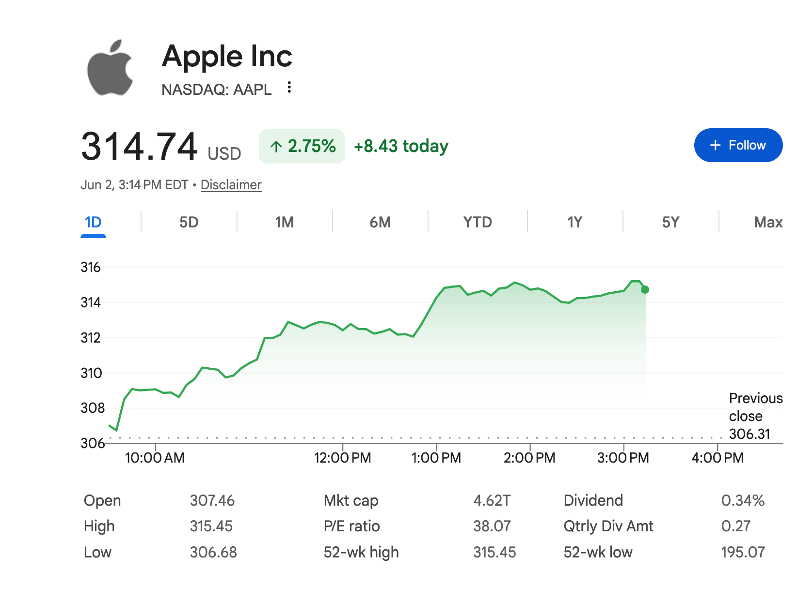

Today, let's talk stonks. It might be the source of your pride or your misery, the beer of celebration one day and a beer to forget the next. 

Now that I've entered adulthood, everyone is talking stocks. Tech bros are waiting or complaining about their vests. My friend's dad's uncle just lost a hundred grand shorting Apple. The S&P just dropped 10% in a day. My Google homepage shows me the daily stock trends that flash greener and redder than my Christmas tree. 

It's like I can't get away from it. More than half of my friends ended up working at some quant or trading firm at some point. I knew almost nothing of these ooh-ahh trading positions other than that they commanded salaries higher than your dad's mortgage. Every time we met up for the holidays, every dinner conversation was rife of chitter chatter about triple-leverage oil ETFs, tulip options, and betting it all on red. My brain would just tune out because frankly, I had never spent a single second thinking about my non-existent portfolio.

I just saw a stock as worth some money based on how "good" a company was. I could press some big "buy" button on Robinhood or Fidelity with some fat number attached to it and hope it increases before the hairs on my head turn grey. I had some notion that this number was correlated with earnings or clout or market conditions or something, but I always thought all of this was just part of complicated economics machine I'd have to sit down for days to truly understand. 

However, I was bored the other day and kind of just answered all the big questions I had in an hour -- the funny thing is that understanding the *idea* of a stock is not that complicated. Making money fast or consistently? That's hard. But understanding what a stock *is*? You probably figured out the entire NASDAQ stock exchange by trading pokemon cards as a kid.

# Stocks, What Are They?
Stocks -- also called equities or shares -- are financial instruments that represent fractional ownership of a company. You owning a share of Tesla or Apple means you *own* a part of those two companies. Unfortunately for you, owning one share means you own one of a gazillion shares so you're less important to the company than a fart at Apple HQ. 

This is the part of stocks that everyone kind of understands. This stock is usually associated with a dollar-amount called the stock **price**, which is that big green/red number you might find on Google, Robinhood, or your iPhone.

> As a owner of one Apple stock, *you* are an investor. Being an investor isn't reserved to Wall Street losers in suits who track prices on Excel all day -- anyone who owns a stock of any company automatically becomes one. 

Most individual investors use a stock as an investment vehicle, usually in one of two ways:
1. **Share Appreciation**: You bought 100 `$AAPL` stocks in 2020 for `$125`. You sell all of them today for `$314`. You just made $100\cdot(314-125)=\\$18,900$ in profit -- at least until Uncle Sam finds out. 
2. **Dividends**: Every quarter, the big bad board of directors can decide to give you a lil crumb of the company's profits. Apple could invest its 5 billion-dollar surplus into a new factory or perhaps, distribute that money back to the shareholders to keep them happy. If they choose the latter, you'll get your crumbs in the form of a **dividend**. Say there are 10 billion shares in circulation. You would get $100 / 14\text{B} \cdot \\$5\text{B}=\\$35$.

Depending on the company and how many shares you have, the dividends can provide you a decent chunk of change over time. But, most of the massive gains or losses you'll get is from stock appreciation/depreciation, which heavily depends on what the price is.

So, who decides that price?

## The Price is All Vibes
I always thought a stock's price followed some sort of formula based on supply and demand. Maybe it's some fancy pricing equation based on earnings, buys, and sells in a certain period. I assuemd some centralized authority or exchange would log that price, and that's the number we see on the stock ticker on Google. 

However, it's honestly a lot simpler than that. A stock's price is pretty much just vibes. 

A stock's price is literally the last price that someone paid for it. When you click into your favorite stock app, that `$314` next to `$AAPL` is pretty much the price that some Joe Schmoe just paid for it. **There is no centralized authority that determines the price**. There is no God or tooth fairy that gets to say how much Apple is worth -- it's fully determined by how much someone is willing to pay or sell it for. 

> **Note**: The apps usually have a delay, maybe ~15 minutes or so. They obviously don't update it for every purchase, just some aggregate over some time window. 

If this feels unconfortable, that's because it *is*. The entire idea of a stock is that it's a floating number completely determined based on public opinion. The price can literally be **anything**. If everyone suddenly decides that Apple stock is worth a million dollars and people begin to sell and buy it for a million dollars, then it will be worth a million dollars.

Practically, this is impossible. And you might be screaming at the computer that this crappy explanation creates more questions than it answers, such as:
- If there is no centralized price, how come Robinhood says I can buy `$AAPL` for its "market price"?
- If a company has a terrible quarter, why does the stock price go down if it technically can be anything?
- Are you saying a company that's about to go bankrupt could be worth a quadrillion dollars?

These are all great questions and have an answer. However, before we can fully understand the pricing dynamics, we first have to understand the stock exchange: how buying and selling stocks actually works, and the actual limitations of what is theoretically possible. 

## The Stock Exchange: A Giant Auction
The stock exchange is the marketplace where stocks are traded between buyers and sellers. 

Apple's price is not directly anchored to its earnings report or its latest scandal

